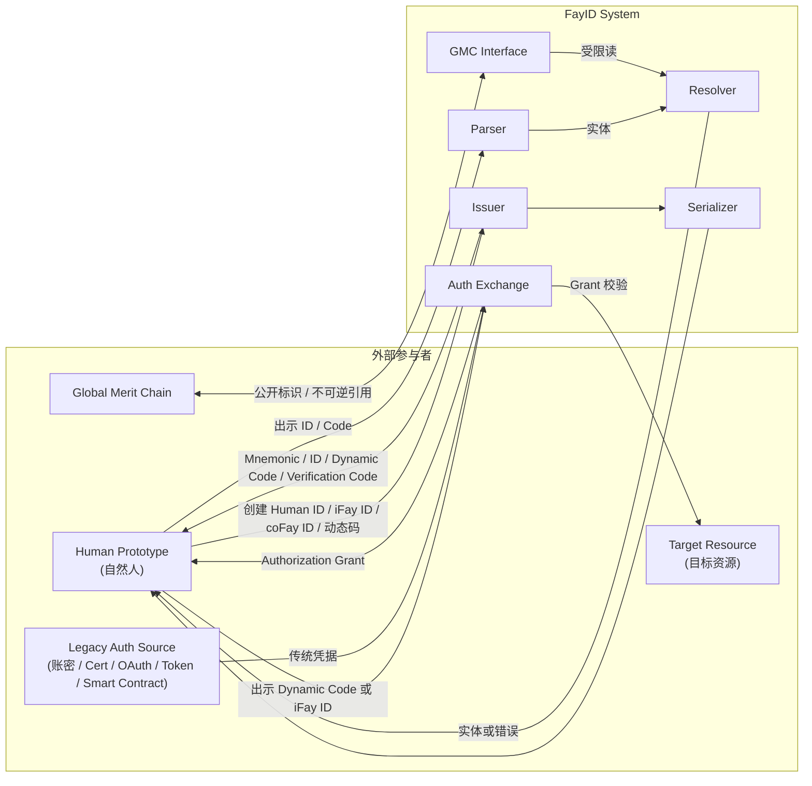
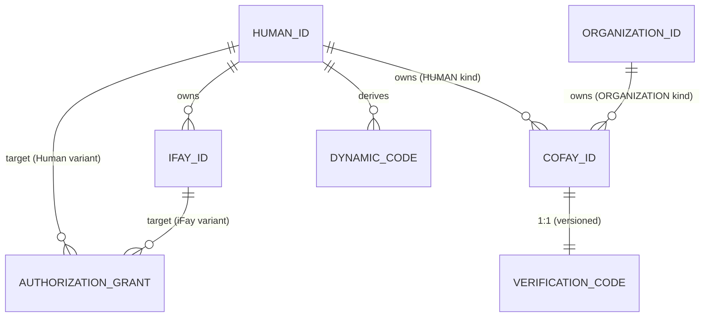
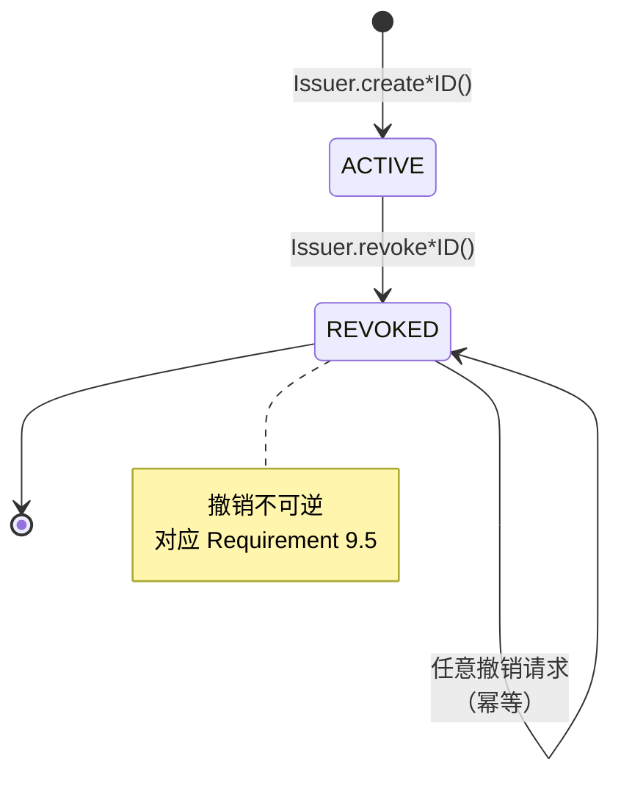
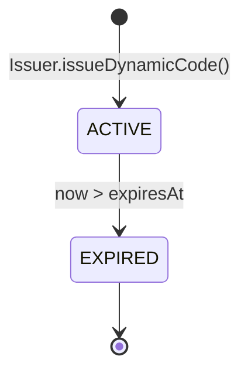
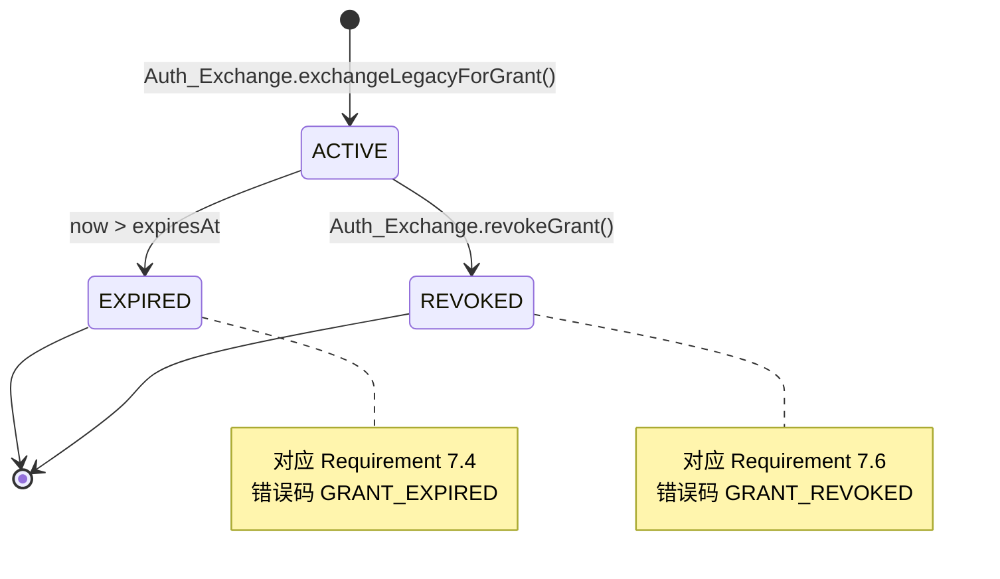
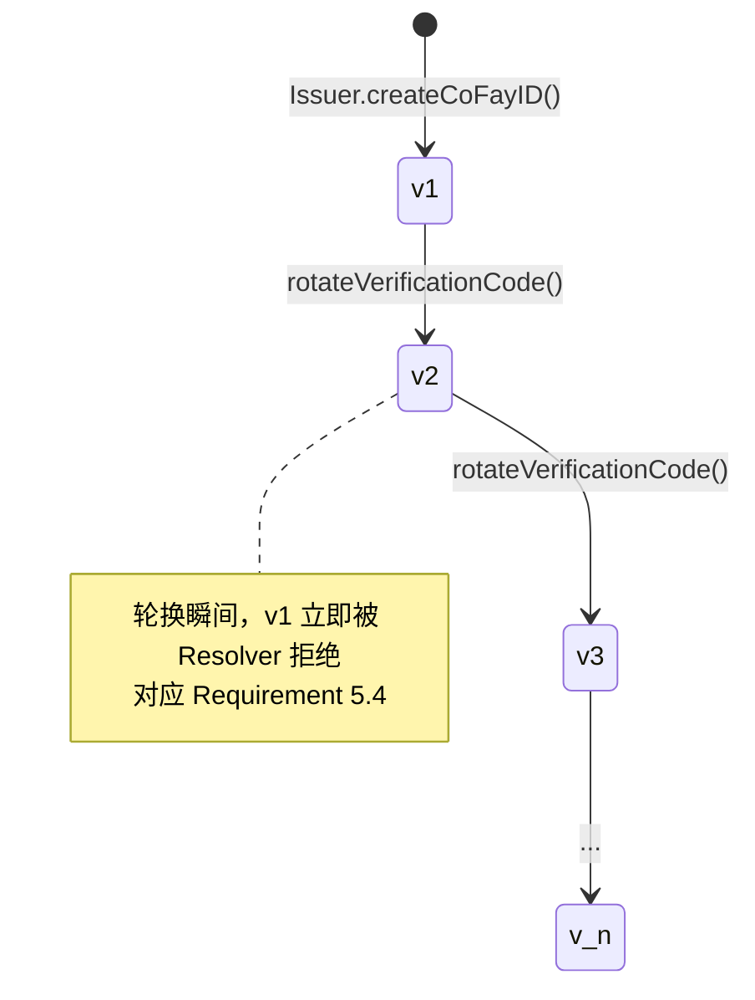
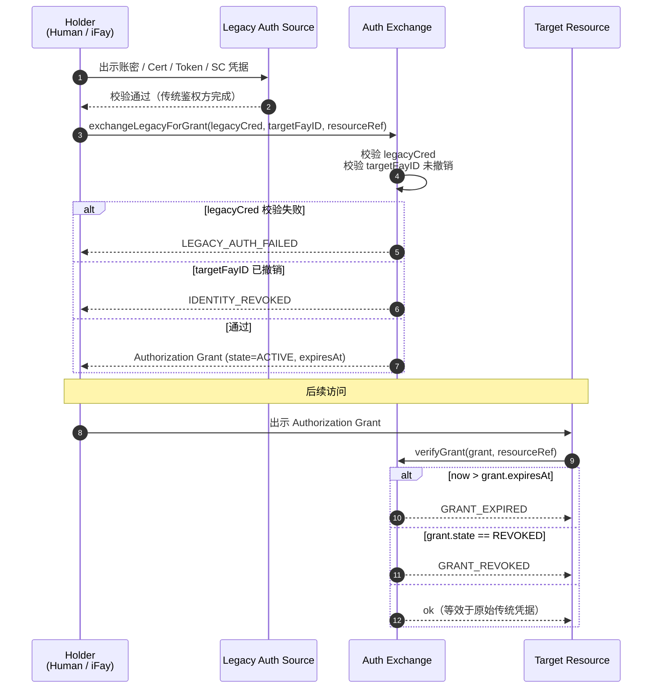
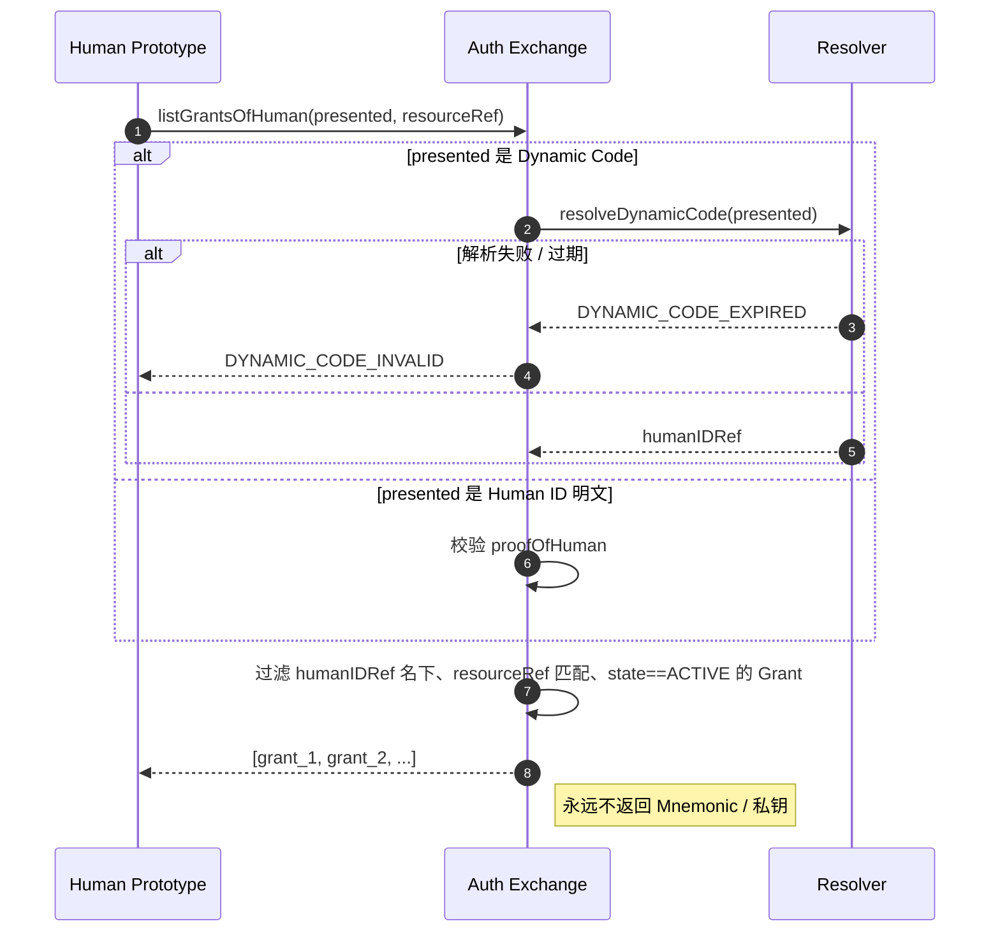
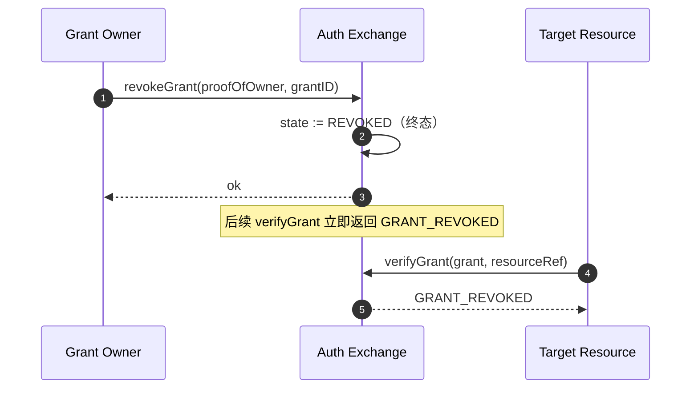

# Design Document — FayID 身份体系

## Overview

本设计文档基于 `requirements.md` 中已定型的 12 项需求，定义 FayID 身份体系作为协议层规范的完整设计：组件分层、核心实体的数据模型与字符串表示、密码学原语候选、生命周期与状态机、与传统鉴权的兑换协议、隐私边界、与 Global Merit Chain 的接口契约，以及全部需可证明性质（correctness properties）。

设计原则：

- **协议优先**：定义"什么"（数据形状、状态、不变量、错误码），不锁死"如何实现"（具体曲线、哈希、传输协议）。
- **隐私默认**：Human ID 与 Mnemonic 在协议层被强约束为不可在出站载荷与日志中明文出现，所有第三方可见的载荷只能是衍生凭证或非根身份。
- **类型可分辨**：所有实体的字符串表示都带有类型前缀，使 Parser 在不依赖上下文的情况下做到无歧义解码。
- **撤销不可逆**：撤销是一个单调操作；任何"恢复"都必须通过新签发实体完成。
- **可验证**：每条业务规则要么映射到一条可机器验证的属性，要么明确归类为不可属性化的边界事项（如限速、隐私）。

非目标：

- 不规定具体加密曲线、哈希算法、KDF 参数（在密码学原语小节给出**候选**而非强制要求）。
- 不规定动态码的具体时间窗长度、限速阈值、Authorization Grant 的默认 TTL。
- 不规定底层传输协议、存储介质、签名格式；这些在实现侧 spec 中决定。
- 不定义 Global Merit Chain 的内部结构，只定义 GMC Interface 的对外契约。

---

## Architecture

### 逻辑分层

FayID System 由以下逻辑组件组成，互相之间通过接口（而非具体实现）耦合：

| 组件 | 角色 | 输入 | 输出 |
| --- | --- | --- | --- |
| **Issuer** | 生成、轮换、撤销标识与凭证 | 创建/轮换/撤销请求 | 标识、凭证、Mnemonic（一次性）、撤销回执 |
| **Resolver** | 反向解析明文凭证到内部实体 | Dynamic Code / iFay ID / coFay ID / Organization ID / (coFay ID, Verification Code) | 实体或错误码 |
| **Auth Exchange** | FayID ↔ 传统鉴权凭据相互兑换 | 传统凭据 + 目标 FayID / Authorization Grant | Authorization Grant / 校验结果 |
| **GMC Interface** | 与 Global Merit Chain 交互的边界 | 来自 GMC 的查询 | 公开标识 + 不可逆引用 |
| **Serializer** | 实体 → 规范化字符串 | 内部实体 | 带类型前缀的字符串 |
| **Parser** | 规范化字符串 → 实体 | 任意字符串 | 实体或 `MALFORMED_FAYID_STRING` |

### 组件交互图



### 信任边界

- **强信任内部**：Issuer 与 Mnemonic / 私钥派生材料之间。Mnemonic 仅在 Issuer 生成时刻沿一次性出站路径返回给 Human Prototype，不进入持久层。
- **半信任**：Resolver、Auth Exchange、GMC Interface 之间。它们共享内部标识与归属图，但不共享 Mnemonic / 私钥。
- **零信任外部**：第三方资源、Global Merit Chain、传统鉴权来源。所有跨边界载荷必须经过 Serializer 规范化、且不得包含 Human ID 明文（除非该交互明确以 Human ID 自证为目的）。

---

## Components and Interfaces

下述接口签名以伪 IDL 给出，仅描述输入输出形状与错误码，不绑定具体语言。

### Issuer

```text
createHumanID() -> { humanID, mnemonic }                       // 一次性返回 mnemonic
deriveHumanIDFromMnemonic(mnemonic) -> humanID
createIFayID(proofOfHuman) -> ifayID                            // 错误：HUMAN_ID_OWNERSHIP_NOT_PROVEN
createCoFayID(proofOfOwner, ownerKind) -> { cofayID, verificationCode }
                                                                // 错误：OWNERSHIP_NOT_PROVEN
issueDynamicCode(proofOfHuman) -> dynamicCode                   // 不要求 mnemonic 明文
rotateVerificationCode(proofOfOwner, cofayID) -> newVerificationCode
revokeIFayID(proofOfHuman, ifayID) -> ()
revokeCoFayID(proofOfOwner, cofayID) -> ()
```

实现约束：

- `createHumanID` 必须使用满足实现侧最低熵阈值的随机源；不足时返回 `INSUFFICIENT_ENTROPY`。
- `deriveHumanIDFromMnemonic` 必须是确定性的（同一 Mnemonic ⇒ 同一 Human ID）。
- `proofOfHuman` 与 `proofOfOwner` 是抽象的所有权证明（实现侧通常是签名挑战），协议层只要求其可被验证且不要求 Mnemonic 明文。

### Resolver

```text
resolveDynamicCode(dynamicCode) -> humanIDOpaqueRef             // 错误：DYNAMIC_CODE_EXPIRED
resolveIFayID(ifayID) -> { ownerHumanIDOpaqueRef, revoked }
resolveCoFayID(cofayID) -> { ownerKind, ownerOpaqueRef, revoked }
verifyCoFayCode(cofayID, verificationCode) -> bool              // 错误：VERIFICATION_RATE_LIMITED
resolveOrganizationID(organizationID) -> organizationEntity
listIFayIDsOfHuman(proofOfHuman) -> [ifayID]                    // 仅在所有权证明通过后
```

注意：Resolver 对外永远只返回 `humanIDOpaqueRef`（Dynamic Code 或不可逆引用），从不返回 Human ID 明文给非持有者调用方。

### Auth Exchange

```text
exchangeLegacyForGrant(legacyCred, targetFayID) -> grant        // 错误：LEGACY_AUTH_FAILED / IDENTITY_REVOKED
verifyGrant(grant, resourceRef) -> bool                          // 错误：GRANT_EXPIRED / GRANT_REVOKED
revokeGrant(proofOfOwner, grantID) -> ()
listGrantsOfHuman(proofOfHumanOrDynamicCode, resourceRef) -> [grant]
                                                                // 错误：DYNAMIC_CODE_INVALID
```

### GMC Interface

```text
gmcLookupOwnership(ifayIDOrCofayID) -> { ownerKind, ownerOpaqueRef }
gmcDeriveOpaqueRef(humanID) -> opaqueRef                         // 内部调用，不暴露给 GMC
// 不存在: gmcWriteHumanID / gmcWriteMnemonic — 反向写入禁止
```

### Serializer / Parser

```text
serialize(entity) -> string
parse(string) -> entity                                          // 错误：MALFORMED_FAYID_STRING
```

Round-trip：`parse(serialize(e)) == e` 且 `serialize(parse(s)) == normalize(s)`（详见 Correctness Properties）。

---

## Core Entities & Data Models

下述字段是协议层最小契约。实现可扩展更多内部字段，但不得删减或语义改变下表所列字段。

### Human ID

| 字段 | 类型 | 说明 |
| --- | --- | --- |
| `id` | 不透明字节串 | 由 Mnemonic 派生的公开标识值；理论上可作为字符串出现，但被隐私层禁止 |
| `publicKey` | 字节串 | 与 Human ID 一一对应，用于所有权挑战 |
| `createdAt` | 时间戳 | 协议层只要求单调可比较 |
| `revoked` | 布尔 | Human ID 在本协议层不支持显式撤销（参见 Open Questions） |

唯一性：`id` 全局唯一；同一 Mnemonic 派生的 `id` 必须稳定。

### iFay ID

| 字段 | 类型 | 说明 |
| --- | --- | --- |
| `id` | 不透明字节串 | 全局唯一 |
| `ownerHumanID` | Human ID 引用 | 多对一：多个 iFay ID 可指向同一 Human ID |
| `createdAt` | 时间戳 | |
| `revoked` | 布尔 | 撤销不可逆 |

约束：每个 iFay ID 在任意时刻有且仅有一个 `ownerHumanID`。

### coFay ID

| 字段 | 类型 | 说明 |
| --- | --- | --- |
| `id` | 不透明字节串 | 全局唯一 |
| `ownerKind` | 枚举 | `HUMAN` 或 `ORGANIZATION` |
| `ownerRef` | Human ID 或 Organization ID 引用 | 由 `ownerKind` 决定指向 |
| `verificationCode` | 字节串 | 与 coFay ID 一一对应；可被轮换 |
| `verificationCodeVersion` | 单调递增整数 | 每次轮换递增，旧版本立即失效 |
| `createdAt` | 时间戳 | |
| `revoked` | 布尔 | 撤销不可逆 |

约束：每个 coFay ID 在任意时刻恰好有一个归属主体；`ownerKind` 与 `ownerRef` 保持一致。

### Organization ID

| 字段 | 类型 | 说明 |
| --- | --- | --- |
| `id` | 明文字符串 | 全局唯一，公开使用 |
| `displayName` | 字符串 | 可选元数据 |
| `createdAt` | 时间戳 | |

约束：Organization ID 不派生 Dynamic Code；可同时归属多个 coFay ID。

### Dynamic Code

| 字段 | 类型 | 说明 |
| --- | --- | --- |
| `code` | 字节串 / 字符串 | 派生自 Human ID，可在出站载荷中明文传输 |
| `humanIDRef` | 内部引用 | 仅 Resolver 内部可见，不下发给调用方 |
| `issuedAt` | 时间戳 | |
| `expiresAt` | 时间戳 | 协议层要求显式存在；具体长度不规定 |
| `nonce` | 字节串 | 用于不可关联性 |

约束：

- 同一 Human ID 不同次生成的 Dynamic Code 字面量两两不相等（高概率不可碰撞）。
- 仅依赖 Dynamic Code 字面量不可推断它们是否出自同一 Human ID（不可关联性，详见隐私小节）。
- 不可从 Dynamic Code 字面量反推 Human ID 私钥或 Mnemonic。

### Verification Code

| 字段 | 类型 | 说明 |
| --- | --- | --- |
| `code` | 字节串 | 与 coFay ID 一一对应 |
| `cofayIDRef` | 内部引用 | |
| `version` | 整数 | 单调递增；轮换后旧版本立即失效 |
| `issuedAt` | 时间戳 | |

### Authorization Grant

| 字段 | 类型 | 说明 |
| --- | --- | --- |
| `grantID` | 不透明字节串 | 全局唯一 |
| `targetFayID` | iFay ID 或 Human ID 引用 | 协议层允许两种 target |
| `legacySourceKind` | 枚举 | `PASSWORD` / `CERTIFICATE` / `AUTHORIZATION` / `ACCESS_TOKEN` / `SMART_CONTRACT` |
| `resourceRef` | 字符串 | 资源命名空间（详见 Auth Exchange 小节） |
| `issuedAt` | 时间戳 | |
| `expiresAt` | 时间戳 | 显式存在 |
| `state` | 枚举 | `ACTIVE` / `EXPIRED` / `REVOKED` |

约束：同一 `targetFayID` 可同时持有多份不同 `legacySourceKind` / `resourceRef` 的 Grant。

### 实体关系图



---

## Identifier Format & Encoding

### 通用规则

- 所有 FayID 字符串采用 ASCII 安全字符集（建议 base32 或 base58，避免易混字符 `0`/`O`/`I`/`l`），具体由实现决定但必须满足下表的前缀与边界要求。
- 字符串采用大小写规范化（建议小写）；Parser 在比较时按规范化形式比较。
- 字符串长度上下界以位数（bits）为单位约束实体熵，不以字符数为唯一约束。

### 类型前缀表

| 实体 | 前缀 | 总长度（建议） | 字符集 | 备注 |
| --- | --- | --- | --- | --- |
| Human ID | `hid_` | ≥ 256 bit 编码后 | base32-no-pad | **隐私层禁止出站**，仅在持有者本地或 Issuer 内部出现 |
| iFay ID | `ifay_` | ≥ 192 bit | base32-no-pad | 可公开出现 |
| coFay ID | `cofay_` | ≥ 192 bit | base32-no-pad | 可公开出现 |
| Organization ID | `org_` | 可变（≤ 64 字符） | base32 + 受限符号 | 明文使用 |
| Dynamic Code | `dyn_` | ≥ 128 bit + 时间窗 | base32-no-pad | 公开出现，附带 `exp` 字段 |
| Verification Code | `vrf_` | ≥ 128 bit | base32-no-pad | 仅在 (coFay ID, Verification Code) 对中出现 |
| Authorization Grant | `grt_` | ≥ 128 bit | base32-no-pad | 公开出现，附带 `exp` |

### 不可混淆约束

Parser 必须保证：

- `hid_…` 与 `dyn_…` 的前缀严格不同，使二者在字面量层面不可互相误认（对应 Requirement 12.7）。
- 任意非空字符串若其前缀不属于上表，Parser 返回 `MALFORMED_FAYID_STRING`。
- 同一字符串不可同时被解析为两种不同类型实体。

### 规范化（normalize）

```text
normalize(s) =
  lowercase(s) 后，
  按类型前缀匹配，
  对该前缀允许的字符集进行白名单过滤，
  非白名单字符 → MALFORMED_FAYID_STRING
```

`Parser ∘ Serializer = id`（实体上）；`Serializer ∘ Parser = normalize`（字符串上）。

---

## Cryptographic Primitives

本节给出**候选**密码学原语，所有候选均可被实现侧替换为同等安全级别的替代品。协议层只要求满足列出的抽象性质。

### Human ID 派生

```text
mnemonic := BIP-39 助记词（256 bit 熵或更高）            // 候选
seed     := PBKDF2-HMAC-SHA512(mnemonic, "fayid", 2048)   // 候选；任何强 KDF 均可
keypair  := Ed25519.from_seed(seed)                       // 候选；任何抗碰撞签名曲线均可
humanID  := H_pub(keypair.public)                         // H_pub 是抗碰撞哈希，输出 ≥ 256 bit
```

抽象性质（必须满足）：

- **确定性**：同一 mnemonic ⇒ 同一 humanID（对应 Requirement 1.4）。
- **不可反推**：仅给定 humanID 不能在多项式时间内恢复 mnemonic 或 private key。
- **熵阈值**：低于实现阈值时拒绝创建并返回 `INSUFFICIENT_ENTROPY`。

### Dynamic Code 派生

```text
dynamicCode := encode(prefix="dyn_",
  payload  = HKDF(
    ikm    = derive_secret(humanID),       // Issuer 私有的派生密钥，不暴露
    salt   = nonce,                         // 每次新生成
    info   = "fayid/dyn/v1" || timeWindow,
    length = 128 bit
  ),
  meta     = { issuedAt, expiresAt, nonce }
)
```

抽象性质（必须满足）：

- **不可关联性（unlinkability）**：对外部观察者，给定两个 Dynamic Code 字面量，无法在不持有 `derive_secret(humanID)` 的前提下判定二者是否出自同一 Human ID。这通过每次使用新 nonce 与受密钥保护的 HKDF 实现（对应 Requirement 10.4）。
- **可解析性**：Resolver（持有 `derive_secret(humanID)` 索引）可从 Dynamic Code 反查 Human ID 引用（对应 Requirement 3.2）。
- **时窗约束**：当前时间 > `expiresAt` ⇒ Resolver 拒绝并返回 `DYNAMIC_CODE_EXPIRED`（对应 Requirement 3.4）。
- **不要求 Mnemonic**：派生过程仅依赖 Issuer 内部秘密 + Human ID 公开标识，调用者无需出示 Mnemonic 明文（对应 Requirement 3.7）。

### Verification Code 签发与轮换

```text
verificationCode_v := encode(prefix="vrf_",
  payload = HKDF(
    ikm    = issuer_master_secret,
    salt   = cofayID || version,
    info   = "fayid/vrf/v1",
    length = 128 bit
  )
)
```

每次轮换 `version := version + 1`，旧版本被 Resolver 直接拒绝（对应 Requirement 5.4）。

### Authorization Grant 的完整性

Grant 必须由 Auth Exchange 用其私钥签名，Resolver 与目标资源校验签名。具体签名算法不在协议层规定。

---

## Lifecycle & State Transitions

### Identity 生命周期（iFay ID / coFay ID）



Human ID 在协议层不进入 `REVOKED` 状态（实现可在更高层叠加，参见 Open Questions）。

### Dynamic Code 生命周期



任何时刻只要 `now > expiresAt`，Dynamic Code 就被 Resolver 拒绝；`ACTIVE` 与 `EXPIRED` 之间不存在反向迁移。

### Authorization Grant 生命周期



`EXPIRED` 与 `REVOKED` 都是终态，且 `verifyGrant` 必须在到达终态后立即拒绝。

### Verification Code 版本演化



---

## Auth Exchange Protocol

### 资源命名空间

`resourceRef` 是一个分层字符串，用于在 Grant 中唯一指代一个目标资源。建议形式：

```text
resourceRef := "<scheme>://<authority>/<path>"
scheme      := "http" | "https" | "smartcontract" | "rpc" | "fayid" | <impl-defined>
```

协议层只要求 `resourceRef` 是可比较的不透明字符串；具体语法由实现决定。`resourceRef` 不可包含 Human ID 明文。

### 兑换流程



### Human ID 单点持票



### 撤销协议



---

## Privacy & Observability Boundary

### 出站载荷规则

定义"出站载荷"为：FayID System 之外（包括第三方资源、传统鉴权来源、Global Merit Chain、可观测性后端）所能观察到的任意字节流。

| 实体 | 是否允许在出站载荷中以明文出现 |
| --- | --- |
| Human ID | **禁止**，除非该次通信明确以 Human ID 自证为目的（如 Mnemonic 持有者向 Issuer 完成挑战） |
| Mnemonic | **禁止**，无任何例外 |
| Private Key | **禁止**，无任何例外 |
| iFay ID / coFay ID / Organization ID | 允许 |
| Dynamic Code | 允许 |
| Verification Code | 仅与 coFay ID 配对出现，不单独广播 |
| Authorization Grant | 允许 |

### 日志与可观测性

```text
log_allow  := { dynamicCode, ifayID, cofayID, organizationID, grantID, errorCode }
log_deny   := { humanID(明文), mnemonic, privateKey, verificationCode(明文) }
```

实现侧的日志器必须以白名单方式过滤，任何序列化路径在写入日志前必须经过 redact 步骤。

### 不可关联性的设计依据

Dynamic Code 的 HKDF 派生使用了：

- **每次新 nonce**：使两次输出在统计意义上独立。
- **Issuer 私有 ikm**：使外部观察者无法本地复现派生函数。
- **类型前缀 + 时间窗**：使 Dynamic Code 与其他实体在字面量上不混淆，但不引入额外的可关联标记。

由此，外部观察者拿到两个 Dynamic Code 字面量，所能做的最强统计推断不超过随机猜测——这正是 Requirement 10.4 所约束的不可关联性。

### 所有权列表查询

`listIFayIDsOfHuman` 必须在 `proofOfHuman` 通过后才返回；未通过时返回 `HUMAN_ID_OWNERSHIP_NOT_PROVEN`。Resolver 不提供"按 Human ID 反查 iFay ID 列表"的匿名接口。

---

## GMC Interface Contract

### 暴露给 Global Merit Chain 的方法签名

```text
// 只读
gmcLookupOwnership(ifayIDOrCofayID: string)
  -> { ownerKind: "HUMAN" | "ORGANIZATION",
       ownerOpaqueRef: string }   // HUMAN 时为不可逆引用；ORGANIZATION 时为 organizationID 明文

gmcResolvePublicEntity(idString: string)
  -> { kind: "IFAY" | "COFAY" | "ORGANIZATION",
       revoked: bool,
       displayMetadata: opaque }   // 仅公开元数据，不含 humanID 明文

// 显式禁止的方向
// gmcWriteHumanID(humanID)        // 不存在
// gmcWriteMnemonic(mnemonic)      // 不存在
// gmcWritePrivateKey(...)         // 不存在
```

### 不可逆引用派生

```text
opaqueRef := encode(prefix="gmcref_",
  payload = HKDF(
    ikm    = gmc_namespace_secret,         // FayID System 持有的命名空间密钥
    salt   = humanID,                       // 仅在 FayID 内部出现
    info   = "fayid/gmc/v1",
    length = 256 bit
  )
)
```

性质：

- 同一 Human ID 派生的 `opaqueRef` 稳定（GMC 上的信誉记录可长期累积）。
- 不同 Human ID 派生的 `opaqueRef` 几乎处处不同（HKDF 抗碰撞）。
- 仅持有 `opaqueRef` 不可在多项式时间内反推 Human ID。
- `opaqueRef` 不参与 Dynamic Code 派生，二者在外部观察者视角不可关联。

### 写入方向约束

GMC Interface 必须在协议层拒绝任何形如 `writeHumanID` / `writeMnemonic` / `writePrivateKey` 的入站请求；这通过"该方法在 IDL 中不存在"实现，而不是运行期校验（对应 Requirement 11.5）。


---

## Correctness Properties

*属性（property）是一个跨所有合法执行都应当成立的特征或行为陈述——一个关于"系统应当做什么"的形式化声明。属性是连接人类可读规范与机器可验证正确性保证的桥梁。*

下列属性来自对 Requirements 12 章 50 余条验收准则的归类与去重（详见 prework 分析），每条属性均覆盖一组语义同型的需求，并以"For all / For any"全称量化形式表达。各属性的伪代码使用类似 TypeScript / Haskell 的混合签名，仅供说明用途。

### Property 1：标识创建——唯一性 + 归属一致性

*For any* 合法的 Human Prototype / Organization 主体序列与其触发的标识创建操作序列，所产生的 Human ID / iFay ID / coFay ID 应在全局唯一，且 `Resolver` 解析每个 ID 得到的归属主体应与创建时声明的请求方一致；同时每个 coFay ID 与一个 Verification Code 一一对应签发。

```text
∀ ops : List<CreateOp>,
  let ids = run(ops).createdIDs in
  isUnique(ids) ∧
  ∀ ifayID ∈ ids.ifay.   resolveIFayID(ifayID).ownerRef ≡ ops.requesterOf(ifayID).asHuman ∧
  ∀ cofayID ∈ ids.cofay. resolveCoFayID(cofayID).ownerRef ≡ ops.requesterOf(cofayID).owner ∧
  ∀ cofayID ∈ ids.cofay. ∃! vc. issuedTogetherWith(cofayID, vc)
```

**Validates: Requirements 1.1, 2.1, 2.2, 2.3, 2.4, 4.1, 4.2, 4.3, 4.4, 5.1**

### Property 2：Mnemonic 确定性派生 Human ID

*For any* 合法的 Mnemonic m，由其派生 Human ID 是确定性的——任意次重复派生结果都相同。

```text
∀ m : Mnemonic.
  ∀ k ≥ 1.  iterate(deriveHumanIDFromMnemonic, k, m) is constant
```

**Validates: Requirements 1.4**

### Property 3：Dynamic Code 解析与时窗

*For any* 合法 Human ID h 与基于 h 派生的 Dynamic Code dc：在 dc 的有效期内，`Resolver` 解析 dc 必须得到指向 h 的 humanIDRef；超过有效期后，必须返回 `DYNAMIC_CODE_EXPIRED`。

```text
∀ h : HumanID, ∀ dc = issueDynamicCode(h).
  ∀ t ∈ [dc.issuedAt, dc.expiresAt].
    underClock(t, resolveDynamicCode(dc)) ≡ Ok(refOf(h))
∀ h : HumanID, ∀ dc = issueDynamicCode(h).
  ∀ t > dc.expiresAt.
    underClock(t, resolveDynamicCode(dc)) ≡ Err(DYNAMIC_CODE_EXPIRED)
```

**Validates: Requirements 3.1, 3.2, 3.3, 3.4**

### Property 4：Dynamic Code 不可碰撞

*For any* Human ID h 与任意正整数 N，对 h 连续生成 N 个 Dynamic Code，所得字面量两两不等（除可忽略碰撞概率外）。

```text
∀ h : HumanID, ∀ N ≥ 2.
  let dcs = [issueDynamicCode(h) for _ in 1..N] in
  ∀ i ≠ j.  dcs[i].code ≠ dcs[j].code
```

**Validates: Requirements 3.5**

### Property 5：Verification Code 单版本有效

*For any* coFay ID c 及其 Verification Code 历史版本序列 \[v1, v2, …, vk\]，`Resolver` 仅对最新版本返回校验通过；对所有更早版本返回校验失败。

```text
∀ c : CoFayID, ∀ rotations ≥ 0,
  let versions = historyOfVerificationCodes(c) in
  let latest = versions.last in
  ∀ v ∈ versions.
    verifyCoFayCode(c, v.code) ≡ (v ≡ latest)
```

**Validates: Requirements 5.2, 5.4**

### Property 6：Authorization Grant 状态机一致性

*For any* 合法的操作序列（包含 `exchangeLegacyForGrant` / `revokeGrant` / 时间推进 / 目标 ID 撤销），任意 Authorization Grant g 的 `verifyGrant(g, g.resourceRef)` 返回真当且仅当：当前时间不超过 g.expiresAt、g 未被撤销、且 g.targetFayID 未被撤销。targetFayID 可以是 iFay ID 或 Human ID。

```text
∀ ops : List<AuthOp>, ∀ t : Time, ∀ g ∈ run(ops).grants.
  underClock(t, verifyGrant(g, g.resourceRef)) ≡ Ok(true)
  ⇔ ( t ≤ g.expiresAt
    ∧ g.state ≡ ACTIVE
    ∧ ¬isRevoked(g.targetFayID) )
```

**Validates: Requirements 7.1, 7.2, 7.3, 7.4, 7.6, 7.8, 9.4**

### Property 7：listGrantsOfHuman 等价于过滤

*For any* Human ID h、出示凭证 present（h 明文或基于 h 的有效 Dynamic Code）、资源标识 ref 与系统状态 S：

- 若 present 是 h 明文且所有权证明通过，或 present 是有效 Dynamic Code，则 `listGrantsOfHuman(present, ref)` 返回的集合等于 S 中所有满足 owner==h、resourceRef matches ref、state==ACTIVE 的 Grant；
- 若 present 是无效 Dynamic Code（伪造或过期），则返回错误 `DYNAMIC_CODE_INVALID`。

```text
∀ S : SystemState, ∀ h : HumanID, ∀ ref : ResourceRef.
  ∀ present.
    case present of
      HumanIDLiteral(h') with proofOk →
        listGrantsOfHuman(present, ref) ≡
          { g ∈ S.grants | owner(g) ≡ h' ∧ matches(g.resourceRef, ref) ∧ g.state ≡ ACTIVE }
      DynamicCodeLiteral(dc) when valid(dc, S.now) ∧ resolves(dc) ≡ h →
        listGrantsOfHuman(present, ref) ≡
          { g ∈ S.grants | owner(g) ≡ h ∧ matches(g.resourceRef, ref) ∧ g.state ≡ ACTIVE }
      DynamicCodeLiteral(dc) otherwise →
        listGrantsOfHuman(present, ref) ≡ Err(DYNAMIC_CODE_INVALID)
```

**Validates: Requirements 8.1, 8.2, 8.3**

### Property 8：撤销单调性

*For any* 合法的 (撤销 / 解析 / 兑换 / 时间推进) 操作序列与任意 iFay ID 或 coFay ID：一旦该 ID 的 `revoked` 标志由系统标记为 true，则在序列后续所有时刻都保持 true；同时 `Resolver` 在每一时刻返回的 `revoked` 标志必须等于该时刻的内部状态。

```text
∀ ops : List<Op>, ∀ id : IFayID ∪ CoFayID.
  let trace = stateTrace(ops, id).revoked in
  isMonotonicNonDecreasing(trace) ∧
  ∀ t : Time.  resolveAt(t, id).revoked ≡ trace[t]
```

**Validates: Requirements 9.1, 9.2, 9.3, 9.5**

### Property 9：Human ID 不出站不入日志

*For any* 合法操作序列与所有外部可观察通道（出站载荷、日志、GMC Interface 出向消息）：在该序列执行过程中，没有任何 Human ID 明文或 Mnemonic 字面量出现在外部通道中（除非该次通信明确以 Human ID 自证为目的，由调用方显式标记）。

```text
∀ ops : List<Op>, ∀ ch ∈ { outboundPayloads, logs, gmcOutbound }.
  ∀ msg ∈ capture(run(ops), ch).
    ¬ containsLiteral(msg, anyHumanIDPlain ∪ anyMnemonic)
  unless msg.intent ≡ HUMAN_ID_SELF_PROOF
```

**Validates: Requirements 10.1, 10.2, 11.2**

### Property 10：GMC opaqueRef 稳定且不可逆推

*For any* Human ID h，由 GMC Interface 派生的 `opaqueRef` 满足：

- 同一 h 多次派生结果稳定相等；
- 不同 h 派生结果不相等（除可忽略碰撞概率）；
- 在不持有 FayID System 的 `gmc_namespace_secret` 的前提下，从 `opaqueRef` 反推 h 应不可行（密码学性质，作为弱属性以分布区分性间接验证）。

```text
∀ h : HumanID.
  ∀ k ≥ 1.  iterate(gmcDeriveOpaqueRef, k, h) is constant
∀ h₁ ≠ h₂ : HumanID.
  gmcDeriveOpaqueRef(h₁) ≠ gmcDeriveOpaqueRef(h₂)
```

**Validates: Requirements 11.3, 11.4**

### Property 11：Round-trip（实体侧）

*For any* FayID 体系实体 e（Human ID / iFay ID / coFay ID / Organization ID / Dynamic Code / Verification Code / Authorization Grant），`Parser(Serializer(e)) ≡ e`。

```text
∀ e : FayIDEntity.  parse(serialize(e)) ≡ Ok(e)
```

**Validates: Requirements 12.5**

### Property 12：Round-trip（字符串侧）

*For any* 合法字符串 s，若 `Parser(s)` 成功返回实体 e，则 `Serializer(e)` 返回的字符串与 s 在规范化形式下相等。

```text
∀ s : String.
  case parse(s) of
    Ok(e) → serialize(e) ≡ normalize(s)
    Err(_) → trivially holds
```

**Validates: Requirements 12.6**

### Property 13：类型前缀不混淆 + 非法字符串拒绝

*For any* 字符串 s：

- 至多有一种实体类型 T 使得 s 是合法的 T 字符串（类型互斥）；
- 若 s 不匹配任何已定义类型的字符串表示规则，`Parser(s)` 返回 `MALFORMED_FAYID_STRING`；
- 特别地，对任意合法 Human ID 字符串 s_h 与任意合法 Dynamic Code 字符串 s_d，`parse(s_h).kind ≠ parse(s_d).kind`。

```text
∀ s : String.
  | { T ∈ EntityKinds | matchesPrefix(s, T) ∧ matchesCharset(s, T) } | ≤ 1
∀ s : String.
  ¬ matchesAnyKnownPrefix(s)  ⇒  parse(s) ≡ Err(MALFORMED_FAYID_STRING)
∀ s_h ∈ ValidHumanIDStrings, ∀ s_d ∈ ValidDynamicCodeStrings.
  parse(s_h).kind ≡ HUMAN_ID ∧ parse(s_d).kind ≡ DYNAMIC_CODE
```

**Validates: Requirements 12.2, 12.3, 12.4, 12.7**

> 不可属性化但需通过其他测试覆盖的验收准则：1.2, 1.3, 1.5, 2.5, 3.6, 3.7, 4.5, 5.3, 5.5, 6.1, 6.2, 6.3, 7.5, 7.7, 8.4, 10.3, 10.4, 10.5, 11.1, 11.5, 12.1。映射详见下文 Testing Strategy。

---

## Error Handling

### 错误码集中表

| 错误码 | 触发场景 | 来源组件 | 关联需求 |
| --- | --- | --- | --- |
| `INSUFFICIENT_ENTROPY` | 创建 Human ID 时熵源不足 | Issuer | 1.5 |
| `HUMAN_ID_OWNERSHIP_NOT_PROVEN` | 创建 iFay ID / 查询 iFay 列表时未证明 Human ID 所有权 | Issuer / Resolver | 2.5, 10.5 |
| `OWNERSHIP_NOT_PROVEN` | 创建 coFay ID 时未证明 Human / Organization 所有权 | Issuer | 4.5 |
| `DYNAMIC_CODE_EXPIRED` | 解析已过期 Dynamic Code | Resolver | 3.4 |
| `DYNAMIC_CODE_INVALID` | Auth Exchange 收到无法解析或已过期的 Dynamic Code | Auth Exchange | 8.3 |
| `VERIFICATION_RATE_LIMITED` | (coFay ID, Verification Code) 校验在短时间内连续失败超阈值 | Resolver | 5.5 |
| `IDENTITY_REVOKED` | 以已撤销 iFay / coFay ID 为目标兑换 Grant | Auth Exchange | 9.4 |
| `LEGACY_AUTH_FAILED` | 传统鉴权凭据校验失败 | Auth Exchange | 7.7 |
| `GRANT_EXPIRED` | 校验时间晚于 Grant.expiresAt | Auth Exchange | 7.4 |
| `GRANT_REVOKED` | 校验已撤销 Grant | Auth Exchange | 7.6 |
| `MALFORMED_FAYID_STRING` | 输入字符串不匹配任何已定义类型 | Parser | 12.4 |

### 错误传播原则

- 错误码是稳定字符串常量，跨语言实现保持一致。
- 错误响应**不得**携带 Human ID 明文 / Mnemonic / 私钥。
- 同一类错误必须返回相同错误码（避免在错误信息中泄露内部结构）。
- 限速类错误（`VERIFICATION_RATE_LIMITED`）应在错误响应中包含足以让客户端退避的最小信息（如重试时间窗），但不得泄露失败计数细节。

---

## Testing Strategy

FayID 体系采用三层测试组合：**属性测试（PBT） + 样例 / 边界测试（Unit） + 集成 / 契约测试（Integration）**。三者覆盖范围互补，详见下表。

### 测试类型与覆盖映射

| 测试类型 | 用途 | 关联需求 |
| --- | --- | --- |
| 属性测试（PBT） | Property 1 - 13（见 Correctness Properties 小节） | 1.1, 1.4, 2.1-2.4, 3.1-3.5, 4.1-4.4, 5.1, 5.2, 5.4, 7.1-7.4, 7.6, 7.8, 8.1-8.3, 9.1-9.5, 10.1, 10.2, 11.2-11.4, 12.2-12.7 |
| 单点 / 错误路径样例测试 | 验证单点错误码与一次性接口契约 | 1.2, 1.5, 2.5, 4.5, 5.3, 6.3, 7.5, 7.7, 10.5 |
| 限速 / 时间相关样例测试 | 验证 `VERIFICATION_RATE_LIMITED` 与限速策略 | 5.5 |
| 集成测试 / 契约审查 | API 表面、IDL 不存在写入方法、明文存储扫描等 | 1.3, 3.7, 6.1, 6.2, 8.4, 10.3, 11.1, 11.5, 12.1 |
| 密码学论证 / 安全审计 | 不可反推性、不可关联性等密码学性质 | 3.6, 10.4 |

### 属性测试要求

- **库选型**：选择目标实现语言生态中成熟的属性测试库（如 fast-check、Hypothesis、QuickCheck、proptest 等），不自行实现 PBT 框架。
- **迭代次数**：每条 Property 至少运行 100 次随机样本；时间相关属性（Property 3、6）应使用可控时钟而非 wall clock。
- **生成器约定**：
  - Human ID / iFay ID / coFay ID / Organization ID 各自有合法字符串生成器；
  - 字符串测试需包含合法生成器与"非法字符串"反向生成器（错误前缀 / 越界字符 / 长度极端）；
  - 操作序列生成器用于 Property 6、7、8、9 的模型基础测试。
- **标签格式**：每个属性测试必须在源码注释或元数据中包含：
  ```
  Feature: fayid-identity-system, Property {number}: {property_text}
  ```
- **隐私边界测试 harness**：Property 9 的实现需要可注入的出站载荷拦截器与日志拦截器，作为协议层 conformance kit 的一部分。

### 单元 / 集成 / 契约测试

- API 表面契约测试（IDL 不存在 `gmcWriteHumanID` / `issueDynamicCode` 不接受 mnemonic 参数等）：基于代码生成或反射的接口审查。
- 明文存储审计：实现侧 CI 中扫描 Issuer 的存储后端，确认无 mnemonic 明文残留。
- 限速测试：基于可控时钟与受控失败注入。
- 错误路径样例：每个错误码至少一个正向触发样例。

### 不被自动测试覆盖但需文档化的约束

- Requirement 3.6 / 10.4 的密码学不可反推与不可关联性属于密码学论证范畴，不在 PBT 范围内；它们的"保证"来自原语选型 + 安全审计 + 可选的弱统计属性测试，而非业务测试。

---

## Open Questions / Future Work

下列议题在本协议层暂不决定，留待实现侧 spec、后续协议版本或独立 ADR 解决：

1. **具体哈希 / 签名 / KDF 算法**：协议层仅给出候选（Ed25519 / HKDF-SHA256 / BIP-39）。最终选型需在实现 spec 中固定，并伴随版本化（如 `fayid/dyn/v1`、`fayid/gmc/v1` 中的 `v1` 后缀）。
2. **Dynamic Code 时间窗长度**：协议层仅要求存在 `expiresAt`，具体长度（分钟级 / 小时级）由实现策略决定，可能因场景而异。
3. **Verification Code 校验失败的限速阈值**：`VERIFICATION_RATE_LIMITED` 的窗口宽度、失败次数阈值、退避策略均为实现侧决策。
4. **Authorization Grant 默认 TTL 与续期模型**：协议层只要求 `expiresAt` 显式存在；续期 / 滑动过期 / 短 TTL + 刷新令牌等具体模型留待实现 spec。
5. **Human ID 撤销语义**：当前协议层 Human ID 不进入 `REVOKED` 状态。Mnemonic 泄露后的"补救"路径（如 Human ID 重发）超出本规范范围，需在后续 spec 中讨论。
6. **resourceRef 命名空间规范**：本规范仅给出 scheme/authority/path 形式建议，正式语法可能演化为独立 spec 或对接现有 URI 标准。
7. **跨 FayID System 实例的互操作性**：当存在多个 FayID System 部署（不同运营方）时，Human ID / iFay ID / Organization ID 的全球唯一性需要全局命名空间或前缀分区机制——这可能演化为 FayID v2 的核心议题。
8. **GMC opaqueRef 的密钥滚动**：`gmc_namespace_secret` 的轮换会破坏长期信誉关联；轮换协议（如新旧 namespace_secret 共存窗）需要独立设计。
9. **属性 P9（Human ID 不出站不入日志）的执行机制**：协议层规定行为；实现侧的强制机制（类型系统标签、序列化 redact、CI 静态扫描）由实现 spec 选择。
10. **传统鉴权来源的可信度分级**：所有传统凭据是否平权地兑换 Authorization Grant？是否对 `SMART_CONTRACT` 与 `PASSWORD` 应用不同 TTL 上限？暂留作未来扩展。

