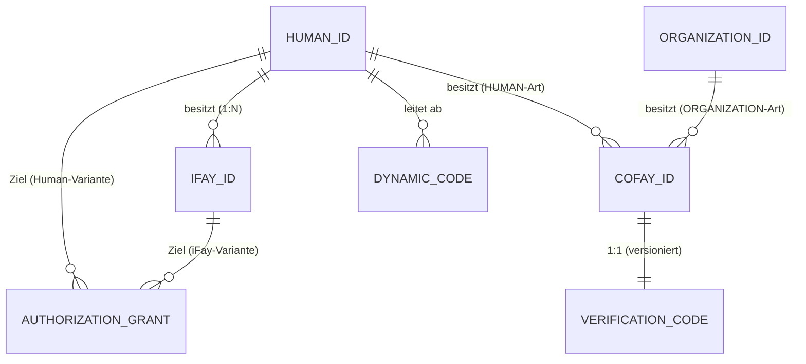

# Kapitel 3: Entitäten und Beziehungen

Dieses Kapitel beschreibt die Semantik, die Eigentumsregeln und die wechselseitigen Beziehungen der vier Arten von Kernentitäten im FayID-System.

---

## Vier Arten von Kernentitäten

### Human ID — Wurzelidentität einer natürlichen Person

Eine Human ID ist die **eindeutige Wurzelidentität** einer natürlichen Person innerhalb des FayID-Systems. Sie hat folgende Eigenschaften:

- Aus einem Schlüsselpaar abgeleitet, mit einem Mnemonic gepaart
- Global eindeutig; das gleiche Mnemonic leitet deterministisch die gleiche Human ID ab
- Der „Eigentumsanker" jeder anderen Entität – iFay IDs sind an sie gebunden, und coFay IDs können ihr gehören
- **Darf in der öffentlichen Kommunikation nicht im Klartext erscheinen** (eine harte Datenschutzeinschränkung)

> Die Human ID ist die Wurzel; jede andere Identität wächst aus ihr.

### iFay ID — Digitale Persona

Eine iFay ID identifiziert eine einzelne digitale iFay-Persona. Kernregeln:

- Jede iFay ID **muss** an genau eine Human ID gebunden sein (n:1)
- Eine einzelne Human ID kann **mehrere** iFay IDs binden (eine Person, viele Personas)
- Eine einzelne iFay ID **darf nicht** an mehrere Human IDs gebunden sein (Bindungen überlappen sich nicht)
- Unterstützt Widerruf (unumkehrbar)

### coFay ID — Öffentliche Rolle

Eine coFay ID identifiziert eine öffentlich auftretende geteilte Rolle. Kernregeln:

- Jede coFay ID hat zu jedem Zeitpunkt genau **einen Eigentümer**
- Der Eigentümer kann entweder eine Human ID oder eine Organization ID sein (das eine oder das andere)
- Eine einzelne Human ID oder Organization ID kann **mehrere** coFay IDs besitzen
- Bei der Erstellung wird zusammen mit der coFay ID ein Verification Code ausgestellt
- Unterstützt Widerruf (unumkehrbar)

### Organization ID — Organisationsbezeichner

Eine Organization ID identifiziert eine organisatorische Entität. Kernregeln:

- Wird öffentlich in **Klartext-Form** verwendet
- **Leitet keinen** Dynamic Code ab (kein Datenschutz erforderlich)
- Kann mehrere coFay IDs besitzen
- Der Resolver kann die entsprechende Organisationsentität direkt aus der Organization-ID-Zeichenkette zurückgeben, ohne dass zusätzliche Anmeldedaten erforderlich sind

---

## Eigentums- und Bindungsbeziehungen

### Beziehungen auf einen Blick

| Beziehung | Kardinalität | Beschreibung |
| --- | --- | --- |
| Human ID → iFay ID | 1:n | Eine Person kann viele digitale Personas haben |
| iFay ID → Human ID | n:1 | Jede Persona gehört zu genau einer Person |
| Human ID → coFay ID | 1:n | Eine Person kann viele öffentliche Rollen besitzen |
| Organization ID → coFay ID | 1:n | Eine Organisation kann viele öffentliche Rollen besitzen |
| coFay ID → Eigentümer | 1:1 | Jede Rolle hat zu jedem Zeitpunkt genau einen Eigentümer |
| Human ID → Dynamic Code | 1:n | Jede Anfrage erzeugt einen neuen Dynamic Code |
| coFay ID → Verification Code | 1:1 (versioniert) | Jede Rotation erzeugt eine neue Version; die vorherige Version wird sofort ungültig |

### Entitäts-Beziehungs-Diagramm

---

## Wesentliche Invarianten

Die folgenden Invarianten müssen in jedem zulässigen Zustand des Systems gelten:

1. **Eindeutigkeit der iFay-ID-Bindung**: Jede iFay ID ist zu jedem Zeitpunkt an genau eine Human ID gebunden, und diese Bindung ist während der gesamten Lebenszeit der iFay ID unveränderlich.

2. **Eindeutigkeit des coFay-ID-Eigentums**: Jede coFay ID hat zu jedem Zeitpunkt genau einen Eigentümer (eine Human ID oder eine Organization ID), und OwnerKind und ownerRef bleiben gegenseitig konsistent.

3. **Globale Eindeutigkeit der Bezeichner**: Human IDs, iFay IDs, coFay IDs und Organization IDs sind innerhalb ihrer jeweiligen Namespaces global eindeutig; das Typpräfix vermeidet typübergreifende Kollisionen auf natürliche Weise.

4. **Monotonie des Widerrufs**: Sobald eine iFay ID oder coFay ID als widerrufen markiert ist, ist dieser Zustand unumkehrbar.

> Diese Invarianten entsprechen Property P1 (Eindeutigkeit der Identitätserstellung + Eigentumskonsistenz) und Property P8 (Monotonie des Widerrufs) im Designdokument.

---

## Eigentumsabfragen

Der Resolver bietet die folgenden Fähigkeiten zur Eigentumsabfrage:

- Gegeben eine iFay ID → liefert die eindeutige Human ID, zu der sie gehört (als opaqueRef, ohne die Human ID jemals im Klartext offenzulegen)
- Gegeben eine coFay ID → liefert OwnerKind (Human / Organization) und den Eigentümer-Bezeichner
- Gegeben eine Human ID + Eigentumsnachweis → liefert die Liste der iFay IDs, die dieser Human ID gehören

> Hinweis: Die Abfrage der Liste der iFay IDs, die einer Human ID gehören, **muss** durch einen Eigentumsnachweis abgesichert sein; ohne einen solchen verweigert der Resolver die Rückgabe von Ergebnissen. Dies ist Teil des Datenschutzes.
