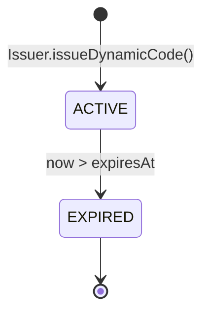
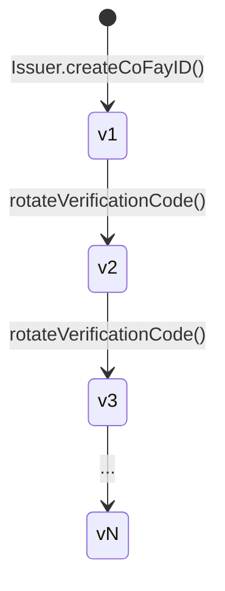
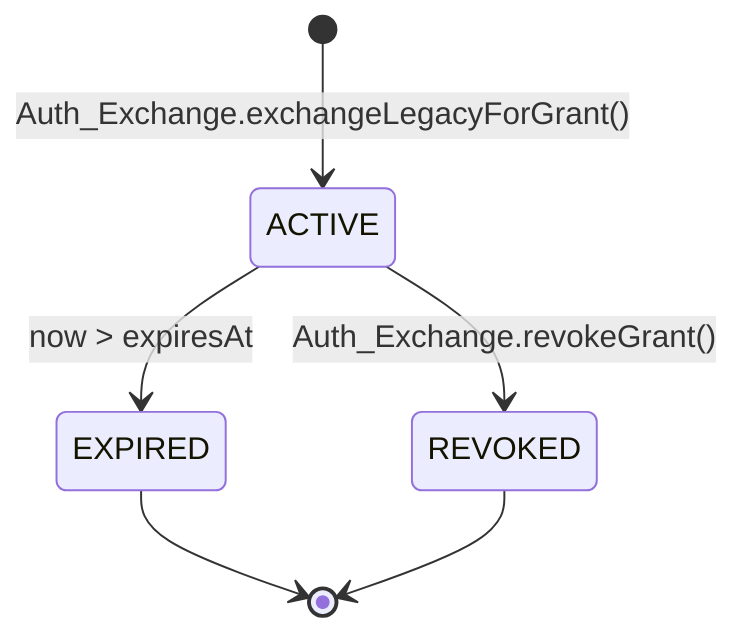
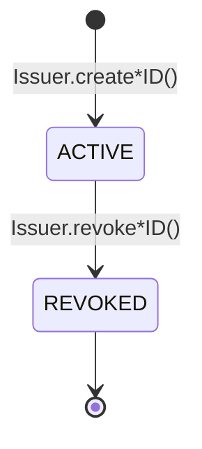

# Kapitel 4: Anmeldedaten und Lebenszyklus

Dieses Kapitel beschreibt, wie die vier Arten von Anmeldedaten im FayID-System erzeugt werden, die Regeln für ihre Gültigkeit, die Rotationsmechanismen und die Semantik des Widerrufs.

---

## Überblick über die Anmeldedaten

Das FayID-System kennt vier Arten von Anmeldedaten, die jeweils einem eigenen Zweck dienen:

| Anmeldedaten | Zweck | Lebenszyklus-Eigenschaften |
| --- | --- | --- |
| **Mnemonic** | Menschenlesbares Backup des privaten Schlüssels einer Human ID | Wird einmal bei der Erzeugung zurückgegeben; niemals persistiert |
| **Dynamic Code** | Ersatz für eine Human ID im öffentlichen Austausch | Zeitlich begrenzt; rotiert bei Ablauf |
| **Verification Code** | Verifiziert die Authentizität eines coFay-ID-Inhabers | Vom Eigentümer rotierbar |
| **Authorization Grant** | Zugangsanmeldedaten, die nach dem Tausch eines traditionellen Authentifizierungs-Anmeldedatums durch FayID erhalten werden | Zeitlich begrenzt; unterstützt aktiven Widerruf |

---

## Mnemonic

### Erzeugung

- Wenn eine natürliche Person eine Human ID erstellt, erzeugt der Issuer gleichzeitig ein Mnemonic
- Das Mnemonic wird der natürlichen Person **nur einmal**, im Moment der Erzeugung, zurückgegeben
- Der Issuer **persistiert das Klartext-Mnemonic niemals** in irgendeinem Speicher

### Deterministische Ableitung

- Wenn dasselbe Mnemonic erneut eingegeben wird, muss das System eine Human ID ableiten, die mit der ursprünglichen identisch ist
- Dies ist der einzige Pfad zur Wiederherstellung einer Human ID

### Sicherheitseinschränkungen

- Das Mnemonic darf in keinem Log, Audit-Output oder ausgehenden Payload erscheinen
- Das Ableiten eines Dynamic Codes **erfordert nicht**, dass der Inhaber das Klartext-Mnemonic vorlegt

> Das Mnemonic ist das sensibelste Geheimmaterial im FayID-System. Geht es verloren, kann die Human ID nicht wiederhergestellt werden.

---

## Dynamic Code

### Erzeugung

- Auf Anfrage eines Human-ID-Inhabers leitet der Issuer aus der Human ID einen Klartext-Dynamic-Code ab
- Jeder Dynamic Code trägt einen expliziten Ablaufzeitpunkt (expiresAt)
- Die Ableitung erfordert kein Klartext-Mnemonic; nur ein Eigentumsnachweis ist nötig

### Gültigkeit und Auflösung

- Solange er gültig ist, kann der Resolver einen Dynamic Code zurück zu der eindeutig zugehörigen Human ID auflösen
- Nach Ablauf verweigert der Resolver die Auflösung und gibt `DYNAMIC_CODE_EXPIRED` zurück

### Rotation

- Jeder neu erzeugte Dynamic Code unterscheidet sich vom vorherigen (kollisionsfrei)
- Zu unterschiedlichen Zeitpunkten erzeugte Dynamic Codes **lassen sich nicht korrelieren** – ein außenstehender Beobachter kann nicht erkennen, ob zwei Dynamic Codes von derselben Human ID stammen

### Sicherheitseigenschaften

- Aus dem literalen Wert eines Dynamic Codes lässt sich weder der private Schlüssel noch das Mnemonic der Human ID rekonstruieren
- Ein Dynamic Code darf in Logs erfasst werden (im Gegensatz zu einer Klartext-Human-ID)

### Zustandsdiagramm

> Ein Dynamic Code hat nur zwei Zustände: ACTIVE und EXPIRED. Es gibt keinen Rückübergang.

---

## Verification Code

### Erzeugung

- Wenn eine coFay ID erfolgreich erstellt wird, stellt der Issuer einen Verification Code aus, der eins-zu-eins mit dieser coFay ID gepaart ist

### Verifizierung

- Der Verifizierer reicht ein Paar (coFay ID, Verification Code) ein, und der Resolver gibt Erfolg oder Misserfolg zurück
- Nach wiederholten Verifizierungsfehlern begrenzt der Resolver die Rate der Verifizierungsanfragen für diese coFay ID (`VERIFICATION_RATE_LIMITED`)

### Rotation

- Der Eigentümer der coFay ID kann eine Rotation des Verification Codes anfordern
- Nach der Rotation wird der alte Verification Code **sofort ungültig**
- Versionsnummern wachsen monoton; der Resolver akzeptiert nur die jeweils neueste Version

### Versionsentwicklung

> Die Rotation ist augenblicklich: Die neue Version wird in demselben Moment wirksam, in dem die alte Version vom Resolver abgelehnt wird.

---

## Authorization Grant

### Erzeugung

- Der Benutzer reicht ein traditionelles Authentifizierungs-Anmeldedatum zusammen mit einer Ziel-FayID (eine iFay ID oder eine Human ID) beim Auth Exchange ein
- Nachdem das traditionelle Anmeldedatum verifiziert wurde, stellt der Auth Exchange einen Authorization Grant für die Ziel-FayID aus
- Der Grant trägt einen expliziten Ablaufzeitpunkt (expiresAt)

### Gültigkeit

- Solange er gültig ist, ist das Vorlegen des Grants gleichwertig mit dem Vorlegen des ursprünglichen traditionellen Authentifizierungs-Anmeldedatums
- Nach Ablauf weist der Auth Exchange den Grant ab (`GRANT_EXPIRED`)

### Widerruf

- Der Inhaber des Grants kann ihn jederzeit widerrufen
- Nach dem Widerruf weist der Auth Exchange den Grant in nachfolgenden Verifizierungen sofort ab (`GRANT_REVOKED`)
- Der Widerruf ist ein Endzustand und kann nicht rückgängig gemacht werden

### Interaktion mit widerrufenen IDs

- Wenn die Ziel-FayID (iFay ID oder coFay ID) widerrufen wurde, lehnt der Auth Exchange die Ausstellung eines neuen Grants dafür ab (`IDENTITY_REVOKED`)

### Zustandsdiagramm

> Sowohl EXPIRED als auch REVOKED sind Endzustände. Sobald ein Grant in einen Endzustand übergegangen ist, kehrt er nie wieder zu ACTIVE zurück.

---

## Identitäts-Lebenszyklus (iFay ID / coFay ID)

iFay IDs und coFay IDs teilen dasselbe Lebenszyklusmodell:

Wesentliche Regeln:

- **Widerruf ist unumkehrbar**: Sobald als REVOKED markiert, wird „Aufheben des Widerrufs" nicht unterstützt
- **Wirkungen des Widerrufs**: Der Resolver gibt zusammen mit dem Auflösungsergebnis ein revoked-Flag zurück; der Auth Exchange verweigert die Ausstellung neuer Grants für eine widerrufene ID
- **Human IDs werden nicht widerrufen**: In der aktuellen Protokollschicht geht eine Human ID nicht in den REVOKED-Zustand über (der Wiederherstellungspfad nach einer Mnemonic-Kompromittierung ist eine offene Frage)

> Der Widerruf ist eine monotone Operation. Jede „Wiederherstellung" muss durch Ausstellung einer neuen Entität erfolgen, nicht durch Umkehrung des Zustands einer alten.
