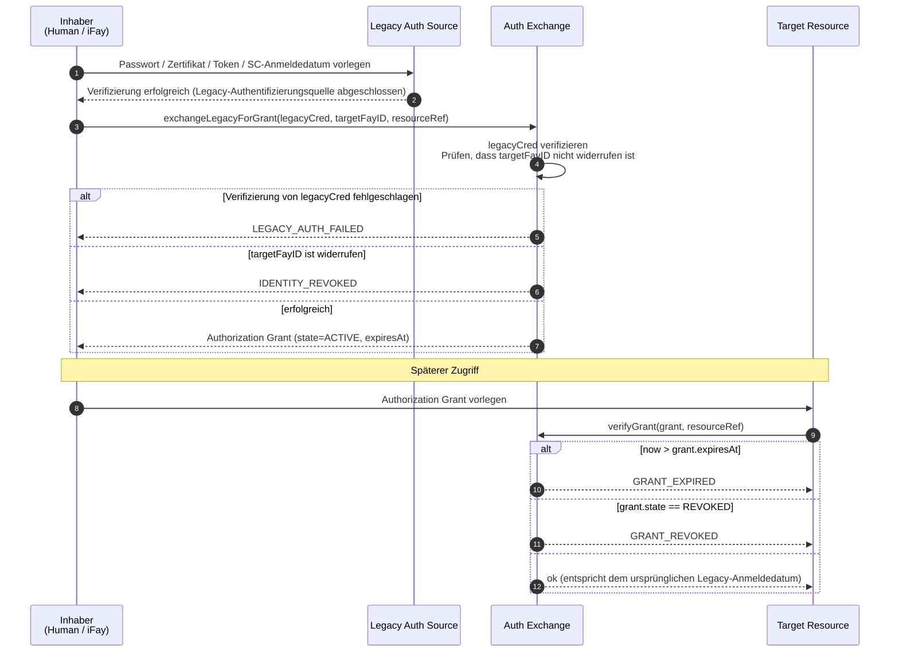
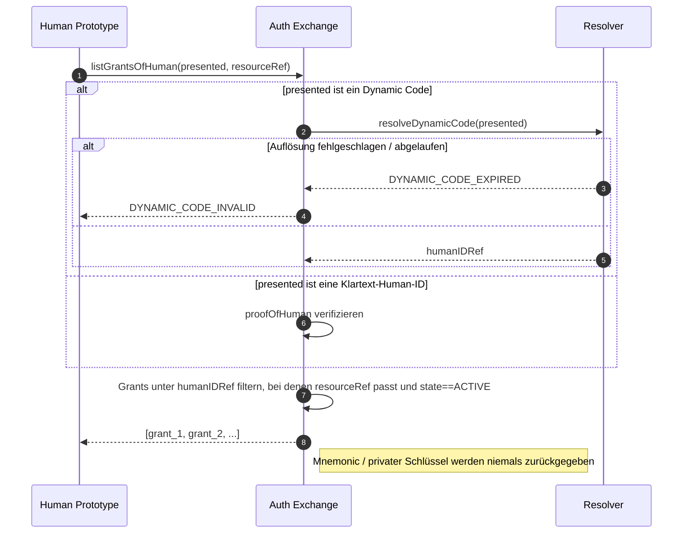
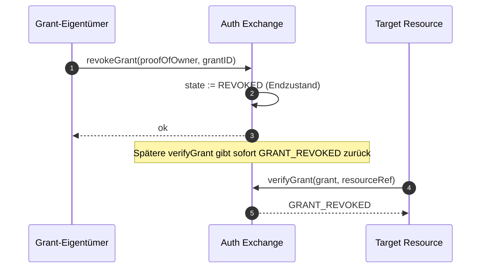

# Kapitel 5: Authentifizierungsaustausch

Dieses Kapitel beschreibt, wie FayID mit traditioneller Authentifizierung interoperiert: durch den Austausch traditioneller Anmeldedaten wie Benutzername/Passwort, Zertifikate, Autorisierungen, Access Tokens und Smart Contracts gegen einen Authorization Grant, sodass ein Benutzer auf eine Vielzahl geschützter Ressourcen zugreifen kann, indem er nur seine FayID (oder deren Dynamic Code) vorlegt.

---

## Designmotivation

Im traditionellen Internet muss eine einzelne Person typischerweise eine große Anzahl unabhängiger Authentifizierungstickets über verschiedene Systeme hinweg verwalten. FayID stellt eine **einheitliche Austauschschicht** bereit: Der Benutzer reicht ein traditionelles Authentifizierungs-Anmeldedatum einmal beim Auth Exchange ein und erhält einen an seine FayID gebundenen Authorization Grant; ab diesem Zeitpunkt erfordert der Zugriff auf die Zielressource nur das Vorlegen des Grants, ohne den traditionellen Authentifizierungsablauf zu wiederholen.

> In einem Satz: FayID ist ein „Ticket-Aggregator" – eine einzelne Human ID kann gleichzeitig mehrere gültige Grants aus verschiedenen Systemen halten.

---

## Fünf Arten von Legacy-Authentifizierungsquellen

Der Auth Exchange unterstützt die folgenden fünf Arten von traditionellen Authentifizierungs-Anmeldedaten:

| Quellenart | Beschreibung |
| --- | --- |
| **PASSWORD** | Konto / Passwort |
| **CERTIFICATE** | Digitales Zertifikat (z. B. X.509) |
| **AUTHORIZATION** | OAuth und ähnliche Autorisierungstoken |
| **ACCESS_TOKEN** | API-Access-Token |
| **SMART_CONTRACT** | Smart-Contract-Anmeldedatum |

Jeder Authorization Grant zeichnet seinen `legacySourceKind` in den Metadaten auf und gibt damit an, aus welcher Art von Quelle er erzeugt wurde.

---

## Austauschablauf

### Grundablauf



### Wesentliche Regeln

- **Ziel-FayID kann eine iFay ID oder eine Human ID sein**: Die Protokollschicht erlaubt beide Ziele, sodass digitale Personas und natürliche Personen gleichermaßen Grants halten können
- **Grants müssen einen Ablaufzeitpunkt tragen**: `expiresAt` ist ein expliziter Wert; „läuft nie ab" ist nicht erlaubt
- **Unterstützung für Widerruf**: Ein Grant kann von seinem Inhaber aktiv widerrufen werden und wird sofort ungültig
- **Äquivalenz**: Solange er gültig ist, ist das Vorlegen eines Grants gleichwertig mit dem Vorlegen des ursprünglichen traditionellen Authentifizierungs-Anmeldedatums

---

## Zentrale Ticket-Verwaltung für eine Human ID

### Designziel

Einer natürlichen Person ermöglichen, jeden Grant unter ihrer Identität einzulösen, indem sie sich nur ihre Human ID (oder deren Dynamic Code) merkt, ohne Tickets pro System verwalten zu müssen.

### Ablaufdiagramm



### Wesentliche Regeln

- **Vorlage eines Dynamic Codes wird unterstützt**: Der Benutzer kann anstelle der Klartext-Human-ID einen Dynamic Code vorlegen und so die Offenlegung der Wurzelidentität vermeiden
- **Behandlung von Dynamic-Code-Fehlern**: Wenn ein Dynamic Code nicht aufgelöst werden kann oder abgelaufen ist, wird `DYNAMIC_CODE_INVALID` zurückgegeben
- **Sensibles Material wird niemals zurückgegeben**: Der Auth Exchange gibt niemals ein Mnemonic oder einen privaten Schlüssel einer Human ID an den Aufrufer zurück
- **Das Ergebnis ist eine gefilterte Menge**: Liefert die Liste der Grants unter dieser Human ID, die zur resourceRef passen und sich im Zustand ACTIVE befinden

---

## Widerrufsprotokoll

### Ablaufdiagramm



### Wesentliche Regeln

- **Widerruf ist ein Endzustand**: Einmal im REVOKED-Zustand ist eine Wiederherstellung nicht möglich
- **Wirkt sofort**: Nach dem Widerruf gibt jeder nachfolgende Aufruf von `verifyGrant` `GRANT_REVOKED` zurück
- **Eigentumsnachweis erforderlich**: Eine Widerrufsanforderung muss proofOfOwner mit sich führen

---

## resourceRef-Namespace

Jeder Authorization Grant identifiziert die geschützte Zielressource über das Feld `resourceRef`.

### Empfohlenes Format

```
resourceRef := "<scheme>://<authority>/<path>"
scheme      := "http" | "https" | "smartcontract" | "rpc" | "fayid" | <impl-defined>
```

### Einschränkungen

- Ein `resourceRef` ist eine vergleichbare opake Zeichenkette
- Die genaue Syntax ist implementierungsdefiniert, **darf jedoch keine** Klartext-Human-ID enthalten
- Zur Interoperabilität zwischen Implementierungen wird empfohlen, dem URI-Standard zu folgen

---

## Interaktion mit widerrufenen IDs

| Szenario | Verhalten des Auth Exchange |
| --- | --- |
| Ziel-FayID (iFay ID / coFay ID) ist widerrufen | Ausstellung eines neuen Grants verweigern; `IDENTITY_REVOKED` zurückgeben |
| Grant ist widerrufen | Spätere Verifizierungen geben `GRANT_REVOKED` zurück |
| Grant ist abgelaufen | Spätere Verifizierungen geben `GRANT_EXPIRED` zurück |
| Verifizierung des Legacy-Authentifizierungs-Anmeldedatums schlägt fehl | Ausstellung verweigern; `LEGACY_AUTH_FAILED` zurückgeben |

> Detaillierte Semantik der Fehlercodes findet sich im Abschnitt „Error Handling" in design.md.
