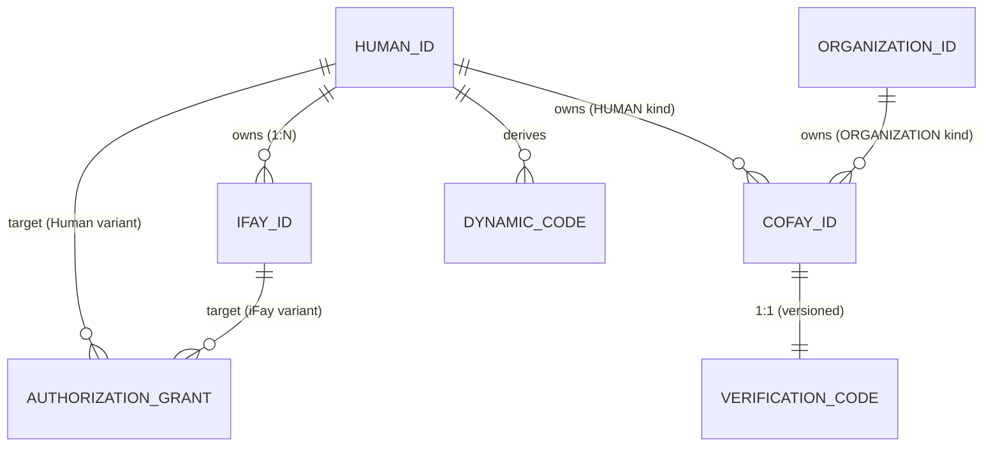

# Chapter 3: Entities and Relationships

This chapter describes the semantics, ownership rules, and mutual relationships of the four kinds of core entities in the FayID system.

---

## Four Kinds of Core Entities

### Human ID — A Natural Person's Root Identity

A Human ID is a natural person's **unique root identity** within the FayID system. It has the following characteristics:

- Derived from a key pair, paired with a Mnemonic
- Globally unique; the same Mnemonic deterministically derives the same Human ID
- The "ownership anchor" of every other entity — iFay IDs are bound to it and coFay IDs may be owned by it
- **Must not appear in plaintext** in public communication (a privacy hard constraint)

> The Human ID is the root; every other identity grows from it.

### iFay ID — Digital Persona

An iFay ID identifies a single iFay digital persona. Core rules:

- Each iFay ID **must** be bound to exactly one Human ID (many-to-one)
- A single Human ID may bind **multiple** iFay IDs (one person, many personas)
- A single iFay ID **may not** be bound to multiple Human IDs (bindings do not overlap)
- Supports revocation (irreversible)

### coFay ID — Public Role

A coFay ID identifies a public-facing shared role. Core rules:

- Each coFay ID has exactly **one owner** at any moment
- The owner may be either a Human ID or an Organization ID (one or the other)
- A single Human ID or Organization ID may own **multiple** coFay IDs
- A Verification Code is issued together with the coFay ID at creation time
- Supports revocation (irreversible)

### Organization ID — Organization Identifier

An Organization ID identifies an organizational entity. Core rules:

- Used publicly in **plaintext string** form
- **Does not derive** a Dynamic Code (no privacy protection needed)
- May own multiple coFay IDs
- The Resolver can return the corresponding organization entity directly from the Organization ID string, with no additional credential required

---

## Ownership and Binding Relationships

### Relationships at a Glance

| Relationship | Cardinality | Description |
| --- | --- | --- |
| Human ID → iFay ID | one-to-many | One person may have many digital personas |
| iFay ID → Human ID | many-to-one | Each persona belongs to exactly one person |
| Human ID → coFay ID | one-to-many | One person may own many public roles |
| Organization ID → coFay ID | one-to-many | One organization may own many public roles |
| coFay ID → owner | one-to-one | Each role has exactly one owner at any moment |
| Human ID → Dynamic Code | one-to-many | Each request generates a new Dynamic Code |
| coFay ID → Verification Code | one-to-one (versioned) | Each rotation produces a new version; the previous version becomes invalid immediately |

### Entity Relationship Diagram

---

## Key Invariants

The following invariants must hold in every legal state of the system:

1. **iFay ID binding uniqueness**: any iFay ID is bound to exactly one Human ID at any moment, and that binding is immutable for the iFay ID's entire lifetime.

2. **coFay ID ownership uniqueness**: any coFay ID has exactly one owner (a Human ID or an Organization ID) at any moment, and the OwnerKind and ownerRef stay mutually consistent.

3. **Global identifier uniqueness**: Human IDs, iFay IDs, coFay IDs, and Organization IDs are globally unique within their respective namespaces; the type prefix naturally avoids cross-type collisions.

4. **Revocation monotonicity**: once an iFay ID or coFay ID is marked revoked, that state is irreversible.

> These invariants correspond to Property P1 (identity-creation uniqueness + ownership consistency) and Property P8 (revocation monotonicity) in the design document.

---

## Ownership Queries

The Resolver provides the following ownership-query capabilities:

- Given an iFay ID → returns the unique Human ID it belongs to (as an opaqueRef, never exposing the Human ID in plaintext)
- Given a coFay ID → returns the OwnerKind (Human / Organization) and the owner identifier
- Given a Human ID + ownership proof → returns the list of iFay IDs owned by that Human ID

> Note: querying the list of iFay IDs owned by a Human ID **must** be gated by ownership proof; without it, the Resolver refuses to return results. This is part of the privacy protection.
