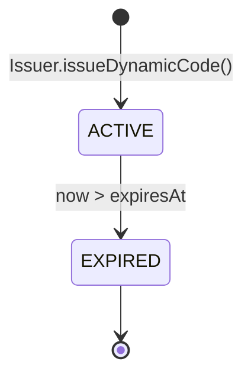
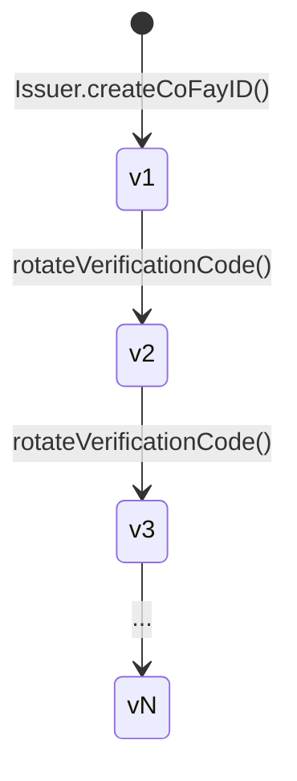
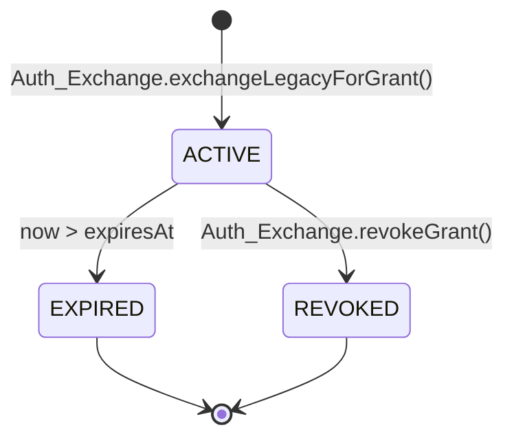
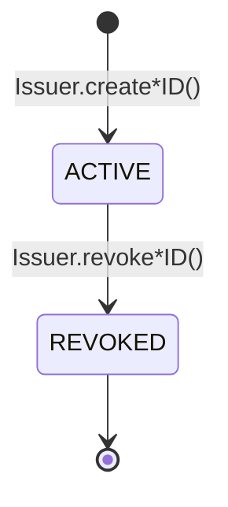

# Chapter 4: Credentials and Lifecycle

This chapter describes how the four kinds of credentials in the FayID system are produced, the rules for their validity, the rotation mechanisms, and the semantics of revocation.

---

## Credential Overview

The FayID system has four kinds of credentials, each serving a distinct purpose:

| Credential | Purpose | Lifecycle Characteristics |
| --- | --- | --- |
| **Mnemonic** | Human-readable backup of a Human ID's private key | Returned once at generation; never persisted |
| **Dynamic Code** | Stand-in for a Human ID in public exchanges | Time-limited; rotates on expiry |
| **Verification Code** | Verifies the authenticity of a coFay ID holder | Rotatable by the owner |
| **Authorization Grant** | Access credential obtained after exchanging a traditional auth credential through FayID | Time-limited; supports active revocation |

---

## Mnemonic

### Generation

- When a natural person creates a Human ID, the Issuer generates a Mnemonic at the same time
- The Mnemonic is returned to the natural person **only once**, at the moment of generation
- The Issuer **never persists the plaintext Mnemonic** in any storage

### Deterministic Derivation

- When the same Mnemonic is re-entered, the system must derive a Human ID identical to the original
- This is the only path for Human ID recovery

### Security Constraints

- The Mnemonic must not appear in any log, audit output, or outbound payload
- Deriving a Dynamic Code **does not require** the holder to present the plaintext Mnemonic

> The Mnemonic is the most sensitive secret material in the FayID system. Once lost, the Human ID cannot be recovered.

---

## Dynamic Code

### Generation

- On request from a Human ID holder, the Issuer derives a plaintext Dynamic Code from the Human ID
- Each Dynamic Code carries an explicit expiration time (expiresAt)
- Derivation does not require a plaintext Mnemonic; only an ownership proof is needed

### Validity and Resolution

- While valid, the Resolver can resolve a Dynamic Code back to the unique corresponding Human ID
- After expiration, the Resolver refuses to resolve and returns `DYNAMIC_CODE_EXPIRED`

### Rotation

- Each newly generated Dynamic Code differs from the previous one (collision-free)
- Dynamic Codes generated at different times **cannot be correlated** — an outside observer cannot tell whether two Dynamic Codes came from the same Human ID

### Security Properties

- A Dynamic Code's literal value cannot be used to recover the Human ID's private key or Mnemonic
- A Dynamic Code may be recorded in logs (unlike a plaintext Human ID)

### State Diagram

> A Dynamic Code has only two states: ACTIVE and EXPIRED. There is no reverse transition.

---

## Verification Code

### Generation

- When a coFay ID is created successfully, the Issuer issues a Verification Code paired one-to-one with that coFay ID

### Verification

- The verifier submits a (coFay ID, Verification Code) pair, and the Resolver returns success or failure
- After repeated verification failures, the Resolver rate-limits verification requests for that coFay ID (`VERIFICATION_RATE_LIMITED`)

### Rotation

- The owner of the coFay ID may request rotation of the Verification Code
- After rotation, the old Verification Code **becomes invalid immediately**
- Version numbers increase monotonically; the Resolver accepts only the latest version

### Version Evolution

> Rotation is instantaneous: the new version takes effect at the same moment the old version is rejected by the Resolver.

---

## Authorization Grant

### Generation

- The user submits a traditional authentication credential plus a target FayID (an iFay ID or a Human ID) to the Auth Exchange
- After the traditional credential is verified, the Auth Exchange issues an Authorization Grant to the target FayID
- The Grant carries an explicit expiration time (expiresAt)

### Validity

- While valid, presenting the Grant is equivalent to presenting the original traditional authentication credential
- After expiration, the Auth Exchange rejects the Grant (`GRANT_EXPIRED`)

### Revocation

- The Grant holder may revoke it at any time
- After revocation, the Auth Exchange immediately rejects the Grant in subsequent verifications (`GRANT_REVOKED`)
- Revocation is a terminal state and cannot be undone

### Interaction with Revoked IDs

- If the target FayID (iFay ID or coFay ID) has been revoked, the Auth Exchange refuses to issue a new Grant for it (`IDENTITY_REVOKED`)

### State Diagram

> Both EXPIRED and REVOKED are terminal states. Once a Grant enters a terminal state, it never returns to ACTIVE.

---

## Identity Lifecycle (iFay ID / coFay ID)

iFay IDs and coFay IDs share the same lifecycle model:

Key rules:

- **Revocation is irreversible**: once marked REVOKED, "un-revocation" is not supported
- **Effects of revocation**: the Resolver returns a revoked flag alongside resolution results; the Auth Exchange refuses to issue new Grants for a revoked ID
- **Human IDs are not revoked**: at the current protocol layer, a Human ID does not enter the REVOKED state (the recovery path after Mnemonic compromise is an Open Question)

> Revocation is a monotonic operation. Any "recovery" must happen by issuing a new entity, not by reversing the state of an old one.
