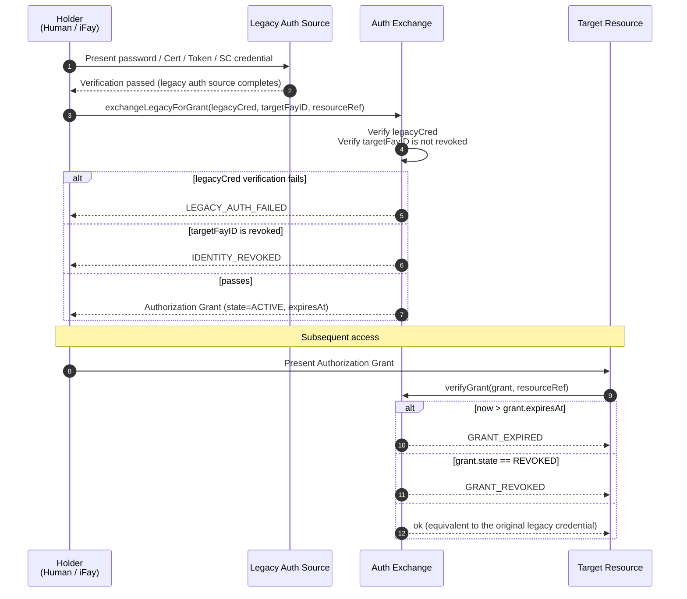
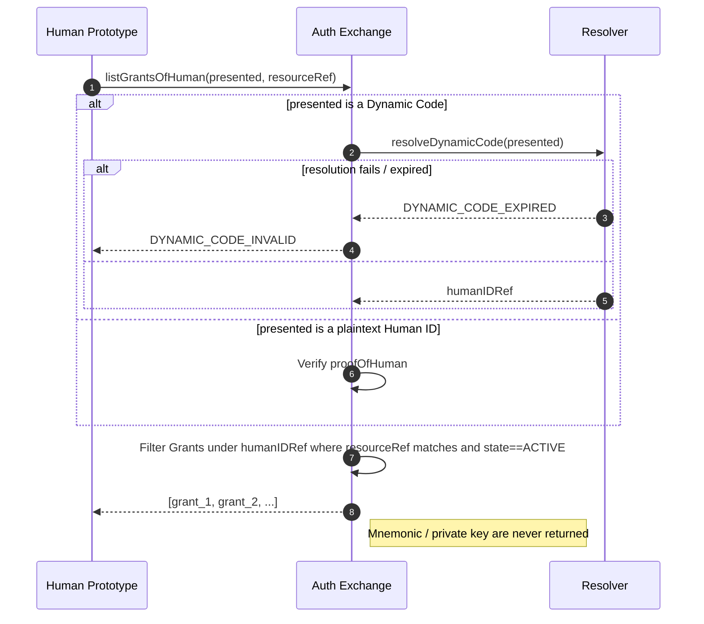
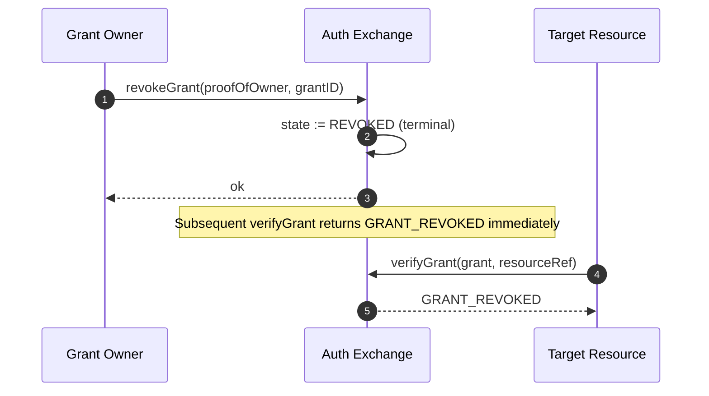

# Chapter 5: Auth Exchange

This chapter describes how FayID interoperates with traditional authentication: by exchanging traditional credentials such as username/password, certificates, authorizations, access tokens, and smart contracts for an Authorization Grant, so that a user can access a wide range of protected resources by presenting only their FayID (or its Dynamic Code).

---

## Design Motivation

On the traditional internet, a single person typically has to maintain a large number of independent authentication tickets across different systems. FayID provides a **unified exchange layer**: the user submits a traditional authentication credential to the Auth Exchange once and receives an Authorization Grant bound to their FayID; from then on, accessing the target resource only requires presenting the Grant, with no need to repeat the traditional authentication flow.

> In one line: FayID is a "ticket aggregator" — a single Human ID can simultaneously hold multiple valid Grants from different systems.

---

## Five Kinds of Legacy Auth Sources

The Auth Exchange supports the following five kinds of traditional authentication credentials:

| Source Kind | Description |
| --- | --- |
| **PASSWORD** | Account / password |
| **CERTIFICATE** | Digital certificate (e.g., X.509) |
| **AUTHORIZATION** | OAuth and similar authorization tokens |
| **ACCESS_TOKEN** | API access token |
| **SMART_CONTRACT** | Smart contract credential |

Every Authorization Grant records its `legacySourceKind` in metadata, indicating which kind of source it was minted from.

---

## Exchange Flow

### Basic Flow



### Key Rules

- **Target FayID may be either an iFay ID or a Human ID**: the protocol layer allows both targets, so digital personas and natural persons alike can hold Grants
- **Grants must carry an expiration time**: `expiresAt` is an explicit field; "never expires" is not allowed
- **Revocation support**: a Grant may be actively revoked by its holder, becoming invalid immediately
- **Equivalence**: while valid, presenting a Grant is equivalent to presenting the original traditional authentication credential

---

## Single-Point Ticket Holding for a Human ID

### Design Goal

Allow a natural person user to redeem every Grant under their identity by remembering only their Human ID (or its Dynamic Code), without having to manage tickets per system.

### Flow Diagram



### Key Rules

- **Dynamic Code presentation is supported**: the user may present a Dynamic Code instead of the plaintext Human ID, avoiding root-identity exposure
- **Dynamic Code failure handling**: when a Dynamic Code fails to resolve or has expired, return `DYNAMIC_CODE_INVALID`
- **Sensitive material is never returned**: the Auth Exchange never returns any Mnemonic or private key for a Human ID to the caller
- **Result is a filtered set**: returns the list of Grants under that Human ID matching the resourceRef and in state ACTIVE

---

## Revocation Protocol

### Flow Diagram



### Key Rules

- **Revocation is terminal**: once in the REVOKED state, recovery is not possible
- **Takes effect immediately**: after revocation, every subsequent `verifyGrant` call returns `GRANT_REVOKED`
- **Ownership proof required**: a revocation request must carry proofOfOwner

---

## resourceRef Namespace

Every Authorization Grant identifies the protected target resource via the `resourceRef` field.

### Recommended Format

```
resourceRef := "<scheme>://<authority>/<path>"
scheme      := "http" | "https" | "smartcontract" | "rpc" | "fayid" | <impl-defined>
```

### Constraints

- A `resourceRef` is a comparable opaque string
- The exact syntax is implementation-defined, but **must not contain** a plaintext Human ID
- For interoperability across implementations, following the URI standard is recommended

---

## Interaction with Revoked IDs

| Scenario | Auth Exchange Behavior |
| --- | --- |
| Target FayID (iFay ID / coFay ID) is revoked | Refuse to issue a new Grant; return `IDENTITY_REVOKED` |
| Grant is revoked | Subsequent verifications return `GRANT_REVOKED` |
| Grant is expired | Subsequent verifications return `GRANT_EXPIRED` |
| Legacy auth credential fails verification | Refuse to issue; return `LEGACY_AUTH_FAILED` |

> See the "Error Handling" section in design.md for detailed error code semantics.
