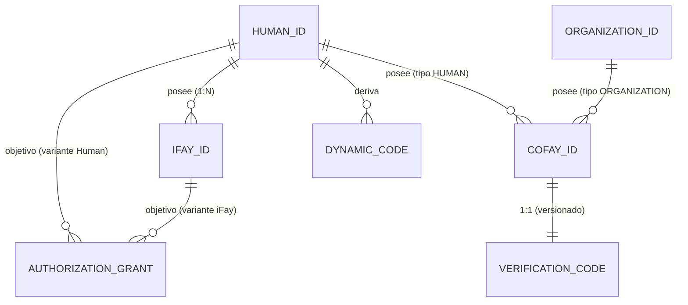

# Capítulo 3: Entidades y Relaciones

Este capítulo describe la semántica, las reglas de titularidad y las relaciones mutuas de los cuatro tipos de entidades centrales en el sistema FayID.

---

## Cuatro tipos de entidades centrales

### Human ID — La identidad raíz de una persona natural

Un Human ID es la **identidad raíz única** de una persona natural dentro del sistema FayID. Tiene las siguientes características:

- Se deriva de un par de claves, emparejado con un Mnemonic
- Es globalmente único; el mismo Mnemonic deriva de forma determinista el mismo Human ID
- Es el "ancla de titularidad" de cualquier otra entidad: los iFay IDs se vinculan a él y los coFay IDs pueden ser de su propiedad
- **No debe aparecer en texto plano** en la comunicación pública (restricción estricta de privacidad)

> El Human ID es la raíz; toda otra identidad crece a partir de él.

### iFay ID — Persona digital

Un iFay ID identifica una persona digital iFay individual. Reglas centrales:

- Cada iFay ID **debe** estar vinculado a exactamente un Human ID (muchos a uno)
- Un único Human ID puede vincular **múltiples** iFay IDs (una persona, muchas personas digitales)
- Un único iFay ID **no puede** estar vinculado a múltiples Human IDs (las vinculaciones no se solapan)
- Soporta revocación (irreversible)

### coFay ID — Rol público

Un coFay ID identifica un rol compartido y público. Reglas centrales:

- Cada coFay ID tiene exactamente **un propietario** en cualquier momento
- El propietario puede ser un Human ID o un Organization ID (uno u otro)
- Un único Human ID u Organization ID puede poseer **múltiples** coFay IDs
- Se emite un Verification Code junto con el coFay ID en el momento de su creación
- Soporta revocación (irreversible)

### Organization ID — Identificador de organización

Un Organization ID identifica una entidad organizativa. Reglas centrales:

- Se utiliza públicamente en forma de **cadena en texto plano**
- **No deriva** un Dynamic Code (no necesita protección de privacidad)
- Puede poseer múltiples coFay IDs
- El Resolver puede devolver la entidad de organización correspondiente directamente a partir de la cadena del Organization ID, sin necesidad de credencial adicional

---

## Relaciones de titularidad y vinculación

### Resumen de relaciones

| Relación | Cardinalidad | Descripción |
| --- | --- | --- |
| Human ID → iFay ID | uno a muchos | Una persona puede tener muchas personas digitales |
| iFay ID → Human ID | muchos a uno | Cada persona digital pertenece a exactamente una persona |
| Human ID → coFay ID | uno a muchos | Una persona puede poseer muchos roles públicos |
| Organization ID → coFay ID | uno a muchos | Una organización puede poseer muchos roles públicos |
| coFay ID → propietario | uno a uno | Cada rol tiene exactamente un propietario en cualquier momento |
| Human ID → Dynamic Code | uno a muchos | Cada solicitud genera un nuevo Dynamic Code |
| coFay ID → Verification Code | uno a uno (versionado) | Cada rotación produce una nueva versión; la versión previa queda inválida de inmediato |

### Diagrama de relaciones de entidad

---

## Invariantes clave

Las siguientes invariantes deben cumplirse en todo estado legal del sistema:

1. **Unicidad de la vinculación de iFay ID**: cualquier iFay ID está vinculado a exactamente un Human ID en cualquier momento, y esa vinculación es inmutable durante toda la vida del iFay ID.

2. **Unicidad de la titularidad de coFay ID**: cualquier coFay ID tiene exactamente un propietario (un Human ID o un Organization ID) en cualquier momento, y el OwnerKind y el ownerRef se mantienen mutuamente coherentes.

3. **Unicidad global de identificadores**: los Human IDs, iFay IDs, coFay IDs y Organization IDs son globalmente únicos dentro de sus respectivos espacios de nombres; el prefijo de tipo evita de manera natural las colisiones entre tipos.

4. **Monotonía de la revocación**: una vez que un iFay ID o coFay ID se marca como revocado, ese estado es irreversible.

> Estas invariantes corresponden a la propiedad P1 (unicidad en la creación de identidad + coherencia de titularidad) y a la propiedad P8 (monotonía de la revocación) del documento de diseño.

---

## Consultas de titularidad

El Resolver provee las siguientes capacidades de consulta de titularidad:

- Dado un iFay ID → devuelve el Human ID único al que pertenece (como un opaqueRef, sin exponer jamás el Human ID en texto plano)
- Dado un coFay ID → devuelve el OwnerKind (Human / Organization) y el identificador del propietario
- Dado un Human ID + prueba de titularidad → devuelve la lista de iFay IDs poseídos por ese Human ID

> Nota: consultar la lista de iFay IDs poseídos por un Human ID **debe** estar protegido por una prueba de titularidad; sin ella, el Resolver rechaza devolver resultados. Esto forma parte de la protección de la privacidad.
