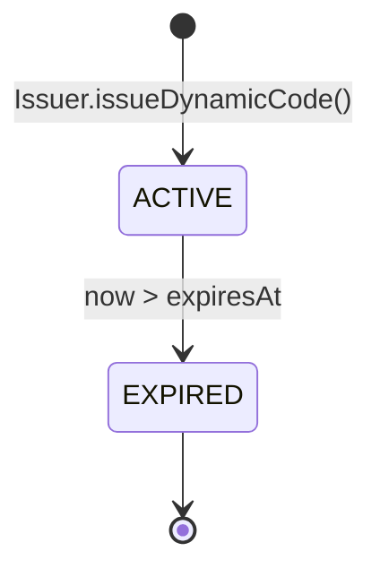
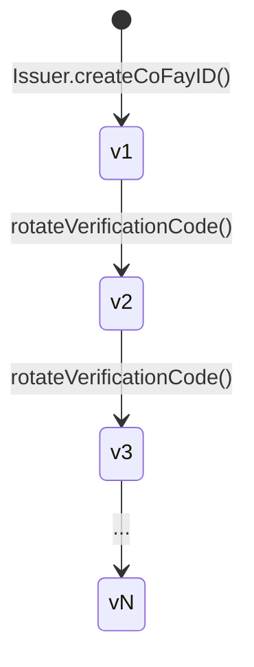
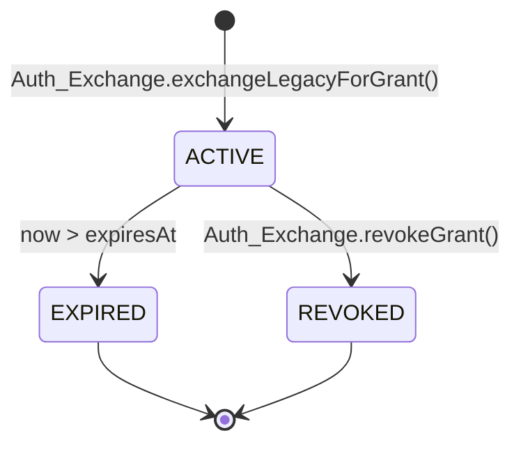
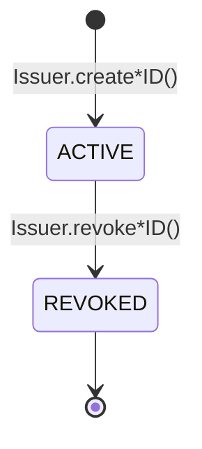

# Capítulo 4: Credenciales y Ciclo de Vida

Este capítulo describe cómo se producen los cuatro tipos de credenciales del sistema FayID, las reglas de su validez, los mecanismos de rotación y la semántica de la revocación.

---

## Resumen de credenciales

El sistema FayID tiene cuatro tipos de credenciales, cada una con un propósito distinto:

| Credencial | Propósito | Características del ciclo de vida |
| --- | --- | --- |
| **Mnemonic** | Respaldo legible por humanos de la clave privada de un Human ID | Se devuelve una sola vez en la generación; nunca se persiste |
| **Dynamic Code** | Sustituto del Human ID en intercambios públicos | Tiempo limitado; rota al expirar |
| **Verification Code** | Verifica la autenticidad del titular de un coFay ID | Rotable por el propietario |
| **Authorization Grant** | Credencial de acceso obtenida tras intercambiar una credencial de autenticación tradicional a través de FayID | Tiempo limitado; soporta revocación activa |

---

## Mnemonic

### Generación

- Cuando una persona natural crea un Human ID, el Issuer genera un Mnemonic al mismo tiempo
- El Mnemonic se devuelve a la persona natural **una sola vez**, en el momento de la generación
- El Issuer **nunca persiste el Mnemonic en texto plano** en ningún almacenamiento

### Derivación determinista

- Cuando se reintroduce el mismo Mnemonic, el sistema debe derivar un Human ID idéntico al original
- Esta es la única vía para la recuperación del Human ID

### Restricciones de seguridad

- El Mnemonic no debe aparecer en ningún registro, salida de auditoría ni payload saliente
- Derivar un Dynamic Code **no requiere** que el titular presente el Mnemonic en texto plano

> El Mnemonic es el material secreto más sensible del sistema FayID. Una vez perdido, el Human ID no puede recuperarse.

---

## Dynamic Code

### Generación

- A petición del titular de un Human ID, el Issuer deriva un Dynamic Code en texto plano a partir del Human ID
- Cada Dynamic Code lleva un tiempo de expiración explícito (expiresAt)
- La derivación no requiere un Mnemonic en texto plano; solo se necesita una prueba de titularidad

### Validez y resolución

- Mientras es válido, el Resolver puede resolver un Dynamic Code de vuelta al Human ID correspondiente único
- Después de la expiración, el Resolver rechaza la resolución y devuelve `DYNAMIC_CODE_EXPIRED`

### Rotación

- Cada Dynamic Code recién generado difiere del anterior (sin colisiones)
- Los Dynamic Codes generados en momentos distintos **no pueden correlacionarse**: un observador externo no puede saber si dos Dynamic Codes provienen del mismo Human ID

### Propiedades de seguridad

- El valor literal de un Dynamic Code no puede usarse para recuperar la clave privada o el Mnemonic del Human ID
- Un Dynamic Code puede registrarse en logs (a diferencia de un Human ID en texto plano)

### Diagrama de estados

> Un Dynamic Code tiene solo dos estados: ACTIVE y EXPIRED. No existe transición inversa.

---

## Verification Code

### Generación

- Cuando se crea exitosamente un coFay ID, el Issuer emite un Verification Code emparejado uno a uno con ese coFay ID

### Verificación

- El verificador presenta un par (coFay ID, Verification Code), y el Resolver devuelve éxito o fallo
- Tras fallos repetidos de verificación, el Resolver limita la tasa de solicitudes de verificación para ese coFay ID (`VERIFICATION_RATE_LIMITED`)

### Rotación

- El propietario del coFay ID puede solicitar la rotación del Verification Code
- Tras la rotación, el Verification Code antiguo **queda inválido de inmediato**
- Los números de versión aumentan de forma monótona; el Resolver acepta únicamente la última versión

### Evolución de versiones

> La rotación es instantánea: la nueva versión entra en vigor en el mismo momento en que la versión antigua es rechazada por el Resolver.

---

## Authorization Grant

### Generación

- El usuario presenta una credencial de autenticación tradicional junto con un FayID objetivo (un iFay ID o un Human ID) al Auth Exchange
- Tras la verificación de la credencial tradicional, el Auth Exchange emite un Authorization Grant para el FayID objetivo
- El Grant lleva un tiempo de expiración explícito (expiresAt)

### Validez

- Mientras es válido, presentar el Grant equivale a presentar la credencial de autenticación tradicional original
- Tras la expiración, el Auth Exchange rechaza el Grant (`GRANT_EXPIRED`)

### Revocación

- El titular del Grant puede revocarlo en cualquier momento
- Tras la revocación, el Auth Exchange rechaza el Grant de inmediato en las verificaciones posteriores (`GRANT_REVOKED`)
- La revocación es un estado terminal y no puede deshacerse

### Interacción con IDs revocados

- Si el FayID objetivo (iFay ID o coFay ID) ha sido revocado, el Auth Exchange rechaza emitir un nuevo Grant para él (`IDENTITY_REVOKED`)

### Diagrama de estados

> Tanto EXPIRED como REVOKED son estados terminales. Una vez que un Grant entra en un estado terminal, nunca regresa a ACTIVE.

---

## Ciclo de vida de la identidad (iFay ID / coFay ID)

Los iFay IDs y los coFay IDs comparten el mismo modelo de ciclo de vida:

Reglas clave:

- **La revocación es irreversible**: una vez marcado como REVOKED, "des-revocar" no está soportado
- **Efectos de la revocación**: el Resolver devuelve una bandera de revocado junto con los resultados de la resolución; el Auth Exchange rechaza emitir nuevos Grants para un ID revocado
- **Los Human IDs no se revocan**: en la capa de protocolo actual, un Human ID no entra en el estado REVOKED (la vía de recuperación tras el compromiso de un Mnemonic es una pregunta abierta)

> La revocación es una operación monótona. Cualquier "recuperación" debe ocurrir mediante la emisión de una nueva entidad, no mediante la inversión del estado de una antigua.
