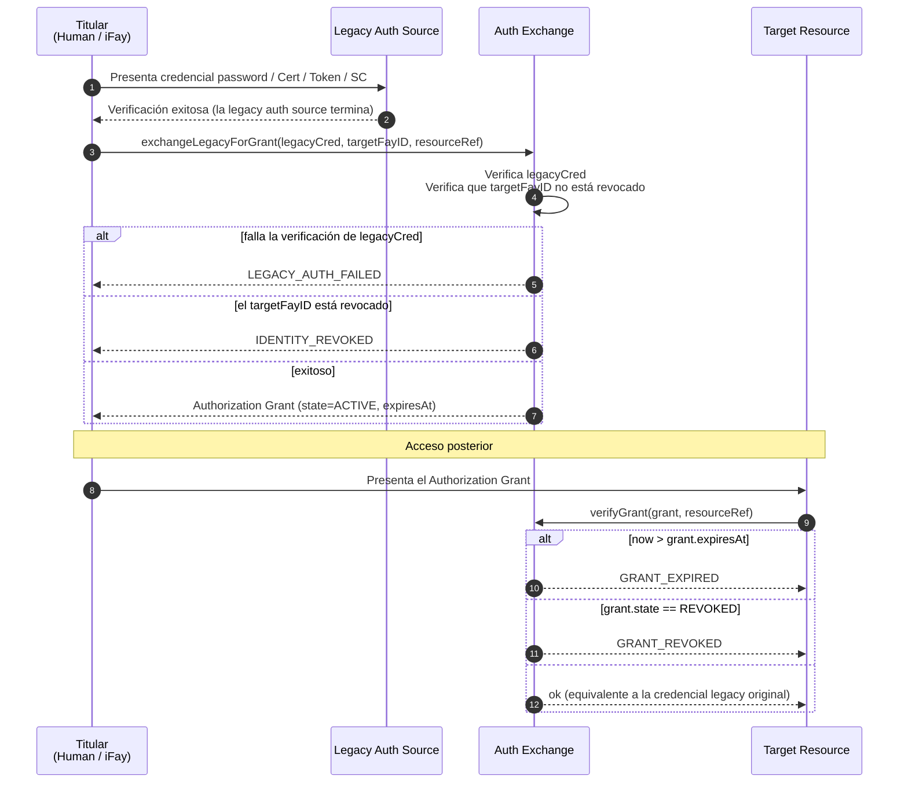
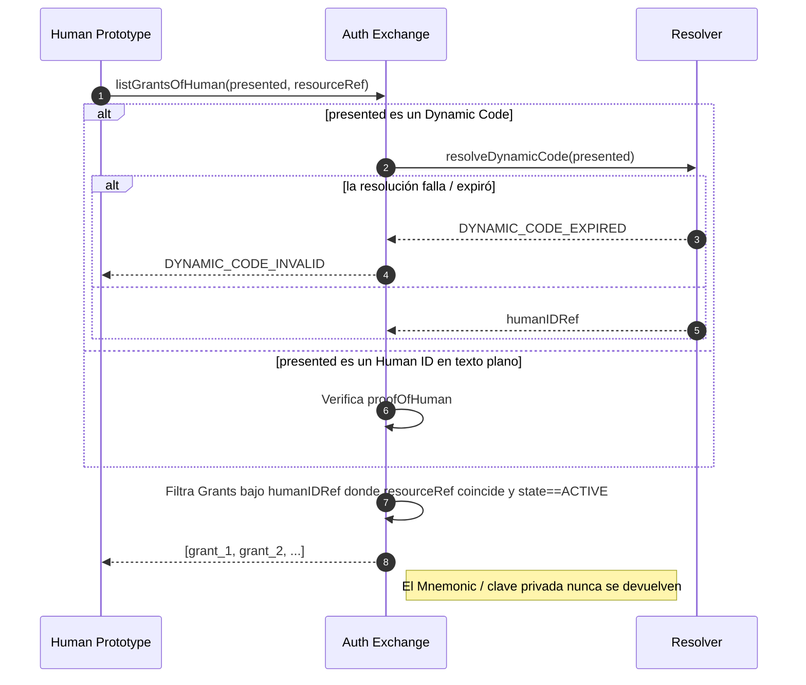
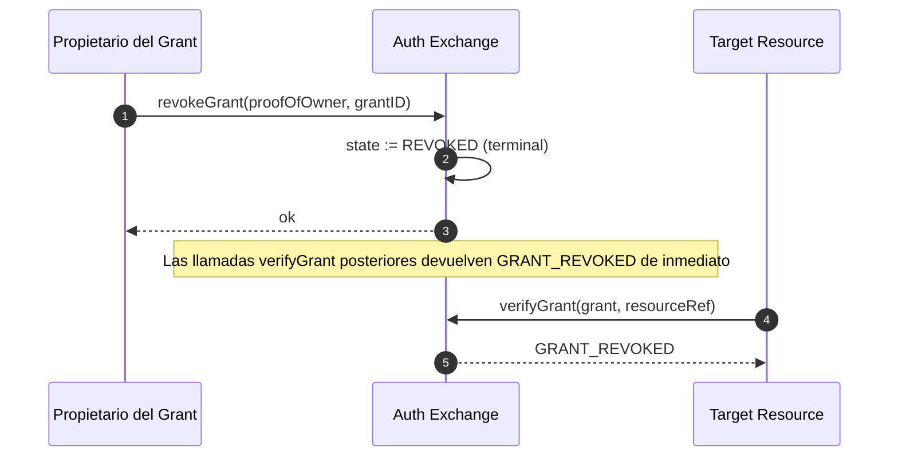

# Capítulo 5: Auth Exchange

Este capítulo describe cómo FayID interopera con la autenticación tradicional: intercambiando credenciales tradicionales como nombre de usuario/contraseña, certificados, autorizaciones, tokens de acceso y contratos inteligentes por un Authorization Grant, de modo que un usuario pueda acceder a una amplia variedad de recursos protegidos presentando únicamente su FayID (o su Dynamic Code).

---

## Motivación del diseño

En la internet tradicional, una sola persona normalmente tiene que mantener un gran número de tickets de autenticación independientes en distintos sistemas. FayID provee una **capa de intercambio unificada**: el usuario presenta una credencial de autenticación tradicional al Auth Exchange una sola vez y recibe un Authorization Grant vinculado a su FayID; a partir de ese momento, acceder al recurso objetivo solo requiere presentar el Grant, sin necesidad de repetir el flujo de autenticación tradicional.

> En una línea: FayID es un "agregador de tickets": un único Human ID puede mantener simultáneamente múltiples Grants válidos provenientes de diferentes sistemas.

---

## Cinco tipos de Legacy Auth Sources

El Auth Exchange soporta los siguientes cinco tipos de credenciales de autenticación tradicional:

| Tipo de fuente | Descripción |
| --- | --- |
| **PASSWORD** | Cuenta / contraseña |
| **CERTIFICATE** | Certificado digital (por ejemplo, X.509) |
| **AUTHORIZATION** | OAuth y tokens de autorización similares |
| **ACCESS_TOKEN** | Token de acceso a API |
| **SMART_CONTRACT** | Credencial de contrato inteligente |

Cada Authorization Grant registra su `legacySourceKind` en sus metadatos, indicando a partir de qué tipo de fuente fue acuñado.

---

## Flujo de intercambio

### Flujo básico



### Reglas clave

- **El FayID objetivo puede ser un iFay ID o un Human ID**: la capa de protocolo permite ambos objetivos, de modo que tanto las personas digitales como las personas naturales pueden poseer Grants
- **Los Grants deben llevar un tiempo de expiración**: `expiresAt` es un campo explícito; "nunca expira" no está permitido
- **Soporte de revocación**: un Grant puede ser revocado activamente por su titular, quedando inválido de inmediato
- **Equivalencia**: mientras es válido, presentar un Grant equivale a presentar la credencial de autenticación tradicional original

---

## Tenencia de tickets en un único punto para un Human ID

### Objetivo del diseño

Permitir que un usuario persona natural reclame todos los Grants bajo su identidad recordando únicamente su Human ID (o su Dynamic Code), sin tener que gestionar tickets por sistema.

### Diagrama del flujo



### Reglas clave

- **Se admite la presentación de un Dynamic Code**: el usuario puede presentar un Dynamic Code en lugar del Human ID en texto plano, evitando la exposición de la identidad raíz
- **Manejo del fallo del Dynamic Code**: cuando un Dynamic Code falla al resolverse o ha expirado, se devuelve `DYNAMIC_CODE_INVALID`
- **El material sensible nunca se devuelve**: el Auth Exchange nunca devuelve al llamador ningún Mnemonic o clave privada de un Human ID
- **El resultado es un conjunto filtrado**: devuelve la lista de Grants bajo ese Human ID que coinciden con el resourceRef y están en estado ACTIVE

---

## Protocolo de revocación

### Diagrama del flujo



### Reglas clave

- **La revocación es terminal**: una vez en el estado REVOKED, la recuperación no es posible
- **Tiene efecto inmediato**: tras la revocación, cada llamada posterior a `verifyGrant` devuelve `GRANT_REVOKED`
- **Se requiere prueba de titularidad**: una solicitud de revocación debe llevar proofOfOwner

---

## Espacio de nombres de resourceRef

Cada Authorization Grant identifica el recurso objetivo protegido mediante el campo `resourceRef`.

### Formato recomendado

```
resourceRef := "<scheme>://<authority>/<path>"
scheme      := "http" | "https" | "smartcontract" | "rpc" | "fayid" | <impl-defined>
```

### Restricciones

- Un `resourceRef` es una cadena opaca comparable
- La sintaxis exacta queda definida por la implementación, pero **no debe contener** un Human ID en texto plano
- Para la interoperabilidad entre implementaciones, se recomienda seguir el estándar URI

---

## Interacción con IDs revocados

| Escenario | Comportamiento del Auth Exchange |
| --- | --- |
| El FayID objetivo (iFay ID / coFay ID) está revocado | Se rechaza emitir un nuevo Grant; devuelve `IDENTITY_REVOKED` |
| El Grant está revocado | Las verificaciones posteriores devuelven `GRANT_REVOKED` |
| El Grant ha expirado | Las verificaciones posteriores devuelven `GRANT_EXPIRED` |
| La credencial de autenticación tradicional falla la verificación | Se rechaza emitir; devuelve `LEGACY_AUTH_FAILED` |

> Consulta la sección "Error Handling" en design.md para la semántica detallada de los códigos de error.
