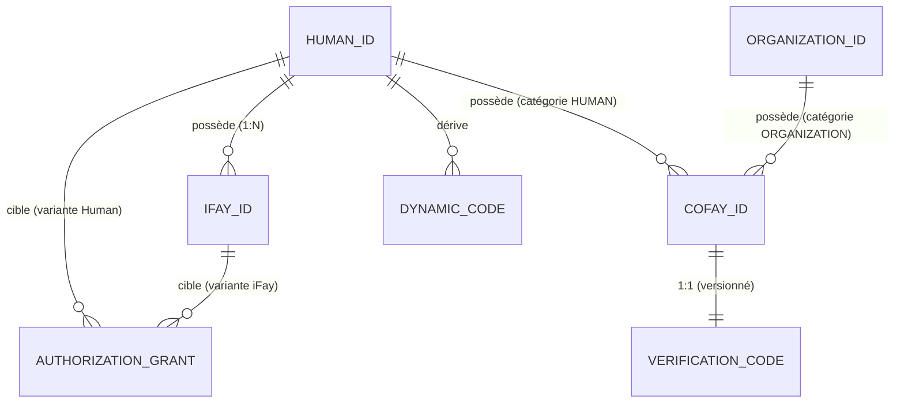

# Chapitre 3 : Entités et Relations

Ce chapitre décrit la sémantique, les règles de propriété et les relations mutuelles des quatre catégories d'entités fondamentales du système FayID.

---

## Quatre catégories d'entités fondamentales

### Human ID — Identité racine d'une personne physique

Un Human ID est l'**identité racine unique** d'une personne physique au sein du système FayID. Il présente les caractéristiques suivantes :

- Dérivé d'une paire de clés, associé à un Mnemonic
- Globalement unique ; le même Mnemonic dérive de manière déterministe le même Human ID
- L'« ancrage de propriété » de toutes les autres entités — les iFay IDs y sont liés et les coFay IDs peuvent en être détenus
- **Ne doit pas apparaître en clair** dans les communications publiques (contrainte stricte de confidentialité)

> Le Human ID est la racine ; toutes les autres identités en grandissent.

### iFay ID — Persona numérique

Un iFay ID identifie un seul persona numérique iFay. Règles fondamentales :

- Chaque iFay ID **doit** être lié à exactement un Human ID (plusieurs-à-un)
- Un même Human ID peut lier **plusieurs** iFay IDs (une personne, plusieurs personas)
- Un même iFay ID **ne peut pas** être lié à plusieurs Human IDs (les liaisons ne se chevauchent pas)
- Prend en charge la révocation (irréversible)

### coFay ID — Rôle public

Un coFay ID identifie un rôle public partagé. Règles fondamentales :

- Chaque coFay ID a exactement **un propriétaire** à tout moment
- Le propriétaire peut être soit un Human ID soit un Organization ID (l'un ou l'autre)
- Un même Human ID ou Organization ID peut posséder **plusieurs** coFay IDs
- Un Verification Code est émis avec le coFay ID au moment de la création
- Prend en charge la révocation (irréversible)

### Organization ID — Identifiant d'organisation

Un Organization ID identifie une entité organisationnelle. Règles fondamentales :

- Utilisé publiquement sous forme de **chaîne en clair**
- **Ne dérive pas** de Dynamic Code (pas de protection de confidentialité requise)
- Peut posséder plusieurs coFay IDs
- Le Resolver peut renvoyer directement l'entité organisation correspondante à partir de la chaîne Organization ID, sans justificatif supplémentaire requis

---

## Relations de propriété et de liaison

### Vue d'ensemble des relations

| Relation | Cardinalité | Description |
| --- | --- | --- |
| Human ID → iFay ID | un-à-plusieurs | Une personne peut avoir plusieurs personas numériques |
| iFay ID → Human ID | plusieurs-à-un | Chaque persona appartient à exactement une personne |
| Human ID → coFay ID | un-à-plusieurs | Une personne peut posséder plusieurs rôles publics |
| Organization ID → coFay ID | un-à-plusieurs | Une organisation peut posséder plusieurs rôles publics |
| coFay ID → propriétaire | un-à-un | Chaque rôle a exactement un propriétaire à tout moment |
| Human ID → Dynamic Code | un-à-plusieurs | Chaque requête génère un nouveau Dynamic Code |
| coFay ID → Verification Code | un-à-un (versionné) | Chaque rotation produit une nouvelle version ; la version précédente devient invalide immédiatement |

### Diagramme des relations entre entités

---

## Invariants clés

Les invariants suivants doivent être vérifiés dans tout état légal du système :

1. **Unicité de la liaison iFay ID** : tout iFay ID est lié à exactement un Human ID à tout moment, et cette liaison est immuable durant toute la durée de vie de l'iFay ID.

2. **Unicité de la propriété coFay ID** : tout coFay ID a exactement un propriétaire (un Human ID ou un Organization ID) à tout moment, et l'OwnerKind et l'ownerRef restent mutuellement cohérents.

3. **Unicité globale des identifiants** : les Human IDs, iFay IDs, coFay IDs et Organization IDs sont globalement uniques dans leurs espaces de noms respectifs ; le préfixe de type évite naturellement les collisions inter-types.

4. **Monotonie de la révocation** : une fois qu'un iFay ID ou un coFay ID est marqué révoqué, cet état est irréversible.

> Ces invariants correspondent à la propriété P1 (unicité de création d'identité + cohérence de propriété) et à la propriété P8 (monotonie de la révocation) dans le document de conception.

---

## Requêtes de propriété

Le Resolver fournit les capacités de requête de propriété suivantes :

- Étant donné un iFay ID → renvoie l'unique Human ID auquel il appartient (sous forme d'opaqueRef, sans jamais exposer le Human ID en clair)
- Étant donné un coFay ID → renvoie l'OwnerKind (Human / Organization) et l'identifiant du propriétaire
- Étant donné un Human ID + preuve de propriété → renvoie la liste des iFay IDs détenus par ce Human ID

> Note : la requête de la liste des iFay IDs détenus par un Human ID **doit** être conditionnée par une preuve de propriété ; sans elle, le Resolver refuse de renvoyer des résultats. Cela fait partie de la protection de la confidentialité.
