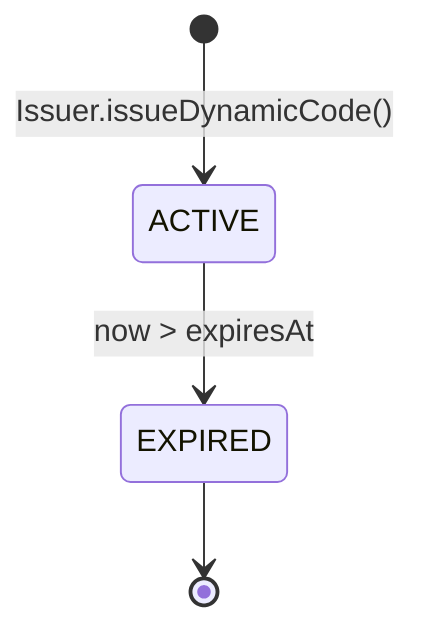
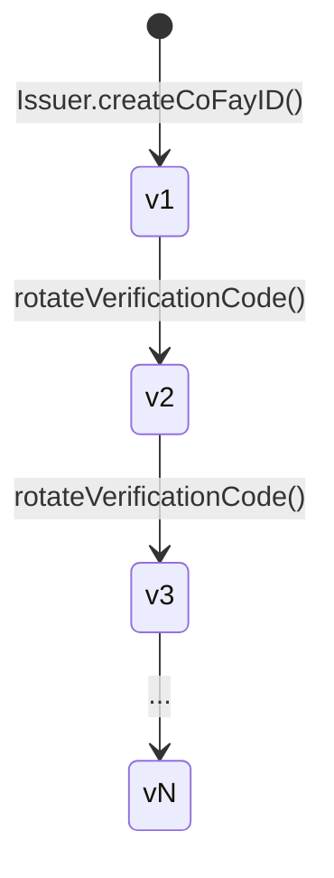
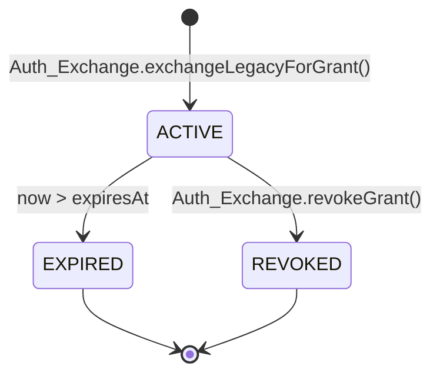
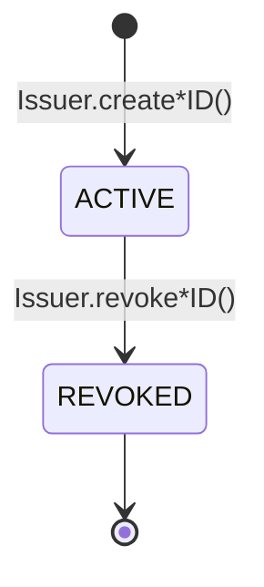

# Chapitre 4 : Justificatifs et Cycle de Vie

Ce chapitre décrit comment les quatre catégories de justificatifs du système FayID sont produits, les règles de leur validité, les mécanismes de rotation et la sémantique de la révocation.

---

## Vue d'ensemble des justificatifs

Le système FayID comporte quatre catégories de justificatifs, chacune servant un objectif distinct :

| Justificatif | Objectif | Caractéristiques du cycle de vie |
| --- | --- | --- |
| **Mnemonic** | Sauvegarde lisible par l'humain de la clé privée d'un Human ID | Renvoyé une seule fois à la génération ; jamais persisté |
| **Dynamic Code** | Substitut d'un Human ID dans les échanges publics | À durée limitée ; rotation à expiration |
| **Verification Code** | Vérifie l'authenticité d'un détenteur de coFay ID | Rotation possible par le propriétaire |
| **Authorization Grant** | Justificatif d'accès obtenu après échange d'un justificatif d'authentification traditionnel via FayID | À durée limitée ; prend en charge la révocation active |

---

## Mnemonic

### Génération

- Lorsqu'une personne physique crée un Human ID, l'Issuer génère simultanément un Mnemonic
- Le Mnemonic est renvoyé à la personne physique **une seule fois**, au moment de la génération
- L'Issuer **ne persiste jamais le Mnemonic en clair** dans aucun stockage

### Dérivation déterministe

- Lorsque le même Mnemonic est ressaisi, le système doit dériver un Human ID identique à l'original
- C'est le seul chemin de récupération d'un Human ID

### Contraintes de sécurité

- Le Mnemonic ne doit pas apparaître dans un quelconque journal, sortie d'audit ou payload sortant
- La dérivation d'un Dynamic Code **n'exige pas** que le détenteur présente le Mnemonic en clair

> Le Mnemonic est le matériel secret le plus sensible du système FayID. Une fois perdu, le Human ID ne peut plus être récupéré.

---

## Dynamic Code

### Génération

- Sur requête du détenteur d'un Human ID, l'Issuer dérive un Dynamic Code en clair à partir du Human ID
- Chaque Dynamic Code porte un délai d'expiration explicite (expiresAt)
- La dérivation n'exige pas de Mnemonic en clair ; seule une preuve de propriété est nécessaire

### Validité et résolution

- Tant qu'il est valide, le Resolver peut résoudre un Dynamic Code vers l'unique Human ID correspondant
- Après expiration, le Resolver refuse la résolution et renvoie `DYNAMIC_CODE_EXPIRED`

### Rotation

- Chaque Dynamic Code nouvellement généré diffère du précédent (sans collision)
- Les Dynamic Codes générés à différents moments **ne peuvent pas être corrélés** — un observateur extérieur ne peut pas dire si deux Dynamic Codes proviennent du même Human ID

### Propriétés de sécurité

- La valeur littérale d'un Dynamic Code ne peut pas être utilisée pour récupérer la clé privée ou le Mnemonic du Human ID
- Un Dynamic Code peut être enregistré dans des journaux (contrairement à un Human ID en clair)

### Diagramme d'état

> Un Dynamic Code n'a que deux états : ACTIVE et EXPIRED. Il n'y a pas de transition inverse.

---

## Verification Code

### Génération

- Lorsqu'un coFay ID est créé avec succès, l'Issuer émet un Verification Code apparié un-à-un avec ce coFay ID

### Vérification

- Le vérificateur soumet une paire (coFay ID, Verification Code) et le Resolver renvoie succès ou échec
- Après des échecs répétés de vérification, le Resolver applique une limitation de débit aux requêtes de vérification pour ce coFay ID (`VERIFICATION_RATE_LIMITED`)

### Rotation

- Le propriétaire du coFay ID peut demander la rotation du Verification Code
- Après rotation, l'ancien Verification Code **devient invalide immédiatement**
- Les numéros de version augmentent de manière monotone ; le Resolver n'accepte que la version la plus récente

### Évolution des versions

> La rotation est instantanée : la nouvelle version prend effet au même moment où l'ancienne version est rejetée par le Resolver.

---

## Authorization Grant

### Génération

- L'utilisateur soumet un justificatif d'authentification traditionnel ainsi qu'un FayID cible (un iFay ID ou un Human ID) à l'Auth Exchange
- Une fois le justificatif traditionnel vérifié, l'Auth Exchange émet un Authorization Grant pour le FayID cible
- Le Grant porte un délai d'expiration explicite (expiresAt)

### Validité

- Tant qu'il est valide, présenter le Grant équivaut à présenter le justificatif d'authentification traditionnel d'origine
- Après expiration, l'Auth Exchange rejette le Grant (`GRANT_EXPIRED`)

### Révocation

- Le détenteur du Grant peut le révoquer à tout moment
- Après révocation, l'Auth Exchange rejette immédiatement le Grant lors des vérifications ultérieures (`GRANT_REVOKED`)
- La révocation est un état terminal et ne peut être annulée

### Interaction avec les identités révoquées

- Si le FayID cible (iFay ID ou coFay ID) a été révoqué, l'Auth Exchange refuse d'émettre un nouveau Grant à son intention (`IDENTITY_REVOKED`)

### Diagramme d'état

> EXPIRED et REVOKED sont tous deux des états terminaux. Une fois qu'un Grant entre dans un état terminal, il ne revient jamais à ACTIVE.

---

## Cycle de vie de l'identité (iFay ID / coFay ID)

Les iFay IDs et coFay IDs partagent le même modèle de cycle de vie :

Règles clés :

- **La révocation est irréversible** : une fois marquée REVOKED, la « dé-révocation » n'est pas prise en charge
- **Effets de la révocation** : le Resolver renvoie un drapeau revoked aux côtés des résultats de résolution ; l'Auth Exchange refuse d'émettre de nouveaux Grants pour un ID révoqué
- **Les Human IDs ne sont pas révoqués** : à la couche de protocole actuelle, un Human ID n'entre pas dans l'état REVOKED (le chemin de récupération après compromission du Mnemonic est une question ouverte)

> La révocation est une opération monotone. Toute « récupération » doit se faire en émettant une nouvelle entité, et non en inversant l'état d'une ancienne.
