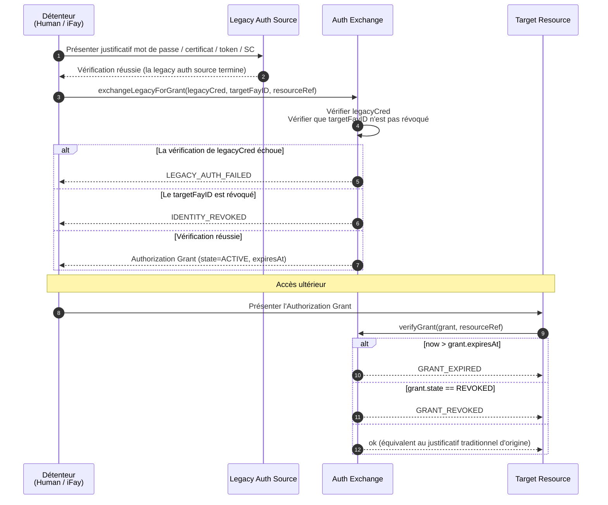
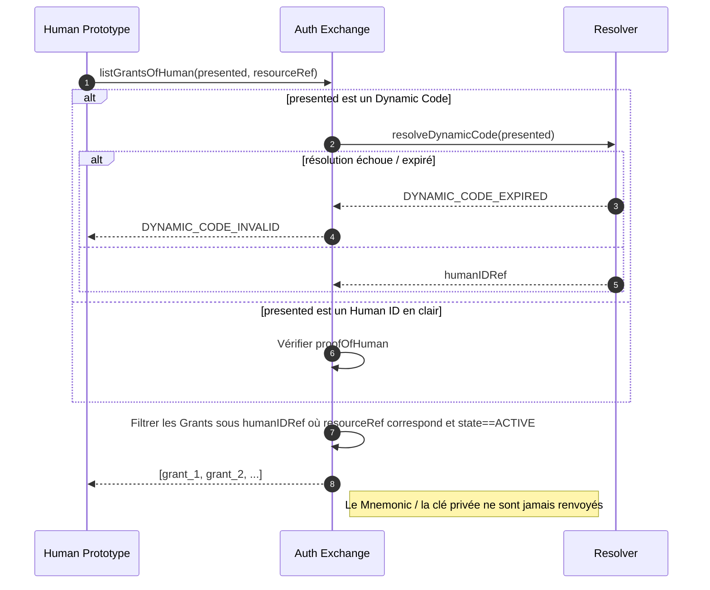
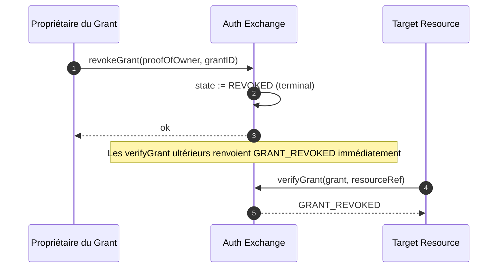

# Chapitre 5 : Auth Exchange

Ce chapitre décrit comment FayID interopère avec l'authentification traditionnelle : en échangeant des justificatifs traditionnels tels que nom d'utilisateur/mot de passe, certificats, autorisations, access tokens et smart contracts contre un Authorization Grant, de sorte qu'un utilisateur puisse accéder à un large éventail de ressources protégées en présentant uniquement son FayID (ou son Dynamic Code).

---

## Motivation de la conception

Sur l'internet traditionnel, une même personne doit typiquement maintenir un grand nombre de tickets d'authentification indépendants à travers différents systèmes. FayID fournit une **couche d'échange unifiée** : l'utilisateur soumet une fois un justificatif d'authentification traditionnel à l'Auth Exchange et reçoit un Authorization Grant lié à son FayID ; à partir de là, accéder à la ressource cible ne nécessite que de présenter le Grant, sans avoir à répéter le flux d'authentification traditionnel.

> En une phrase : FayID est un « agrégateur de tickets » — un seul Human ID peut détenir simultanément plusieurs Grants valides issus de différents systèmes.

---

## Cinq catégories de Legacy Auth Sources

L'Auth Exchange prend en charge les cinq catégories de justificatifs d'authentification traditionnels suivantes :

| Catégorie de source | Description |
| --- | --- |
| **PASSWORD** | Compte / mot de passe |
| **CERTIFICATE** | Certificat numérique (par ex. X.509) |
| **AUTHORIZATION** | OAuth et tokens d'autorisation similaires |
| **ACCESS_TOKEN** | Token d'accès API |
| **SMART_CONTRACT** | Justificatif de smart contract |

Chaque Authorization Grant enregistre son `legacySourceKind` dans ses métadonnées, indiquant à partir de quelle catégorie de source il a été émis.

---

## Flux d'échange

### Flux de base



### Règles clés

- **Le FayID cible peut être soit un iFay ID soit un Human ID** : la couche de protocole autorise les deux cibles, de sorte que les personas numériques comme les personnes physiques peuvent détenir des Grants
- **Les Grants doivent porter un délai d'expiration** : `expiresAt` est un champ explicite ; « jamais expiré » n'est pas autorisé
- **Prise en charge de la révocation** : un Grant peut être activement révoqué par son détenteur, devenant invalide immédiatement
- **Équivalence** : tant qu'il est valide, présenter un Grant équivaut à présenter le justificatif d'authentification traditionnel d'origine

---

## Détention de tickets en point unique pour un Human ID

### Objectif de conception

Permettre à un utilisateur personne physique de récupérer chaque Grant rattaché à son identité en se rappelant uniquement son Human ID (ou son Dynamic Code), sans avoir à gérer les tickets par système.

### Diagramme de flux



### Règles clés

- **La présentation d'un Dynamic Code est prise en charge** : l'utilisateur peut présenter un Dynamic Code au lieu du Human ID en clair, évitant l'exposition de l'identité racine
- **Gestion d'échec du Dynamic Code** : lorsqu'un Dynamic Code échoue à se résoudre ou a expiré, renvoyer `DYNAMIC_CODE_INVALID`
- **Le matériel sensible n'est jamais renvoyé** : l'Auth Exchange ne renvoie jamais aucun Mnemonic ou clé privée d'un Human ID à l'appelant
- **Le résultat est un ensemble filtré** : renvoie la liste des Grants sous ce Human ID correspondant au resourceRef et dans l'état ACTIVE

---

## Protocole de révocation

### Diagramme de flux



### Règles clés

- **La révocation est terminale** : une fois dans l'état REVOKED, la récupération n'est pas possible
- **Prend effet immédiatement** : après révocation, chaque appel ultérieur à `verifyGrant` renvoie `GRANT_REVOKED`
- **Preuve de propriété requise** : une demande de révocation doit porter proofOfOwner

---

## Espace de noms resourceRef

Chaque Authorization Grant identifie la ressource cible protégée via le champ `resourceRef`.

### Format recommandé

```
resourceRef := "<scheme>://<authority>/<path>"
scheme      := "http" | "https" | "smartcontract" | "rpc" | "fayid" | <impl-defined>
```

### Contraintes

- Un `resourceRef` est une chaîne opaque comparable
- La syntaxe exacte est définie par l'implémentation, mais **ne doit pas contenir** de Human ID en clair
- Pour l'interopérabilité entre implémentations, suivre le standard URI est recommandé

---

## Interaction avec les identités révoquées

| Scénario | Comportement de l'Auth Exchange |
| --- | --- |
| Le FayID cible (iFay ID / coFay ID) est révoqué | Refus d'émettre un nouveau Grant ; renvoyer `IDENTITY_REVOKED` |
| Le Grant est révoqué | Les vérifications ultérieures renvoient `GRANT_REVOKED` |
| Le Grant est expiré | Les vérifications ultérieures renvoient `GRANT_EXPIRED` |
| Le justificatif d'authentification traditionnel échoue à la vérification | Refus d'émission ; renvoyer `LEGACY_AUTH_FAILED` |

> Voir la section « Error Handling » dans design.md pour la sémantique détaillée des codes d'erreur.
