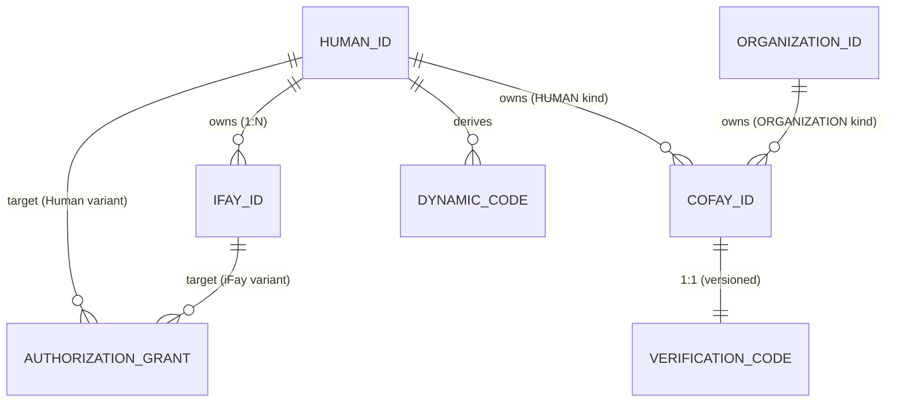

# 第 3 章 エンティティと関係

本章は FayID 体系における 4 種類の中核エンティティの意味、帰属ルール、相互関係について述べる。

---

## 4 種類の中核エンティティ

### Human ID — 自然人の根 ID

Human ID は自然人の FayID 体系における**唯一の根 ID** である。次の特徴を持つ。

- 鍵ペアから派生し、1 つの Mnemonic に対応する
- グローバルに一意であり、同一の Mnemonic から決定論的に同一の Human ID を派生できる
- 他のすべてのエンティティの「帰属アンカー」である——iFay ID はそれにバインドされ、coFay ID はそれに帰属しうる
- 公開通信において**平文で出現してはならない**（プライバシーのハード制約）

> Human ID は「根」であり、他のすべての ID はそこから生じる。

### iFay ID — デジタル人格

iFay ID は 1 つの iFay デジタル人格を識別する。中核ルールは次のとおり。

- 各 iFay ID は唯一の Human ID にバインドされ**なければならない**（多対一）
- 同一の Human ID は**複数の** iFay ID をバインドできる（1 人多人格）
- 同一の iFay ID は複数の Human ID にバインドされて**はならない**（バインディング非重複）
- 失効をサポートする（不可逆）

### coFay ID — 公共ロール

coFay ID は公衆向けの共有ロールを識別する。中核ルールは次のとおり。

- 各 coFay ID は任意時点において**唯一の帰属主体**を持つ
- 帰属主体は Human ID または Organization ID のいずれかである（二者択一）
- 同一の Human ID または Organization ID は**複数の** coFay ID に帰属できる
- 作成時に同期して 1 つの Verification Code を発行する
- 失効をサポートする（不可逆）

### Organization ID — 組織識別子

Organization ID は 1 つの組織エンティティを識別する。中核ルールは次のとおり。

- **平文文字列**形式で公開使用する
- Dynamic Code を**派生しない**（プライバシー保護不要）
- 複数の coFay ID を同時に帰属させることができる
- Resolver は Organization ID 文字列のみで対応する組織エンティティを返却でき、追加クレデンシャルを必要としない

---

## 帰属とバインディングの関係

### 関係の概観

| 関係 | 多重度 | 説明 |
| --- | --- | --- |
| Human ID → iFay ID | 一対多 | 1 人で複数のデジタル人格を持てる |
| iFay ID → Human ID | 多対一 | 各人格は 1 人にのみ属する |
| Human ID → coFay ID | 一対多 | 1 人が複数の公共ロールに帰属できる |
| Organization ID → coFay ID | 一対多 | 1 つの組織が複数の公共ロールに帰属できる |
| coFay ID → 帰属主体 | 一対一 | 各ロールは任意時点において唯一の帰属主体を持つ |
| Human ID → Dynamic Code | 一対多 | 要求のたびに新しい Dynamic Code が生成される |
| coFay ID → Verification Code | 一対一（バージョン管理） | ローテーションのたびに新バージョンが生成され、旧バージョンは即時失効する |

### エンティティ関係図

---

## 主要不変条件

以下の不変条件はシステムの任意の正当な状態において成立しなければならない。

1. **iFay ID バインディングの一意性**：任意の iFay ID は任意時点においてちょうど 1 つの Human ID にバインドされ、当該バインディングは iFay ID の生涯を通じて変更できない。

2. **coFay ID 帰属の一意性**：任意の coFay ID は任意時点においてちょうど 1 つの帰属主体（Human ID または Organization ID）を持ち、帰属種別（OwnerKind）と帰属参照（ownerRef）は整合を保つ。

3. **識別子のグローバル一意性**：Human ID、iFay ID、coFay ID、Organization ID はそれぞれの名前空間においてグローバルに一意である。種別間では型プレフィックスにより自然に衝突しない。

4. **失効の単調性**：iFay ID または coFay ID が失効済みとマークされた後、その状態は逆転不可能である。

> これらの不変条件は design 文書における Property P1（識別子作成の一意性 + 帰属整合性）および Property P8（失効の単調性）に対応する。

---

## 帰属クエリ

Resolver は次の帰属クエリ機能を提供する。

- iFay ID を入力 → その唯一の所属 Human ID を返却（opaqueRef 形式とし、Human ID 平文を露出しない）
- coFay ID を入力 → その帰属主体の種別（Human / Organization）と識別子を返却
- Human ID + 所有権証明 を入力 → その Human ID 名義下の iFay ID リストを返却

> 注意：Human ID 名義下の iFay ID リストの照会は所有権証明を**必須**とする。証明が通らない場合、Resolver は返却を拒否する。これはプライバシー保護の一部である。
