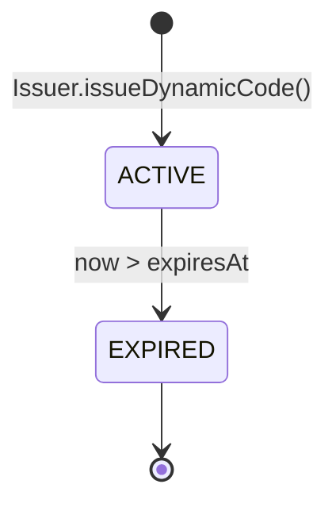
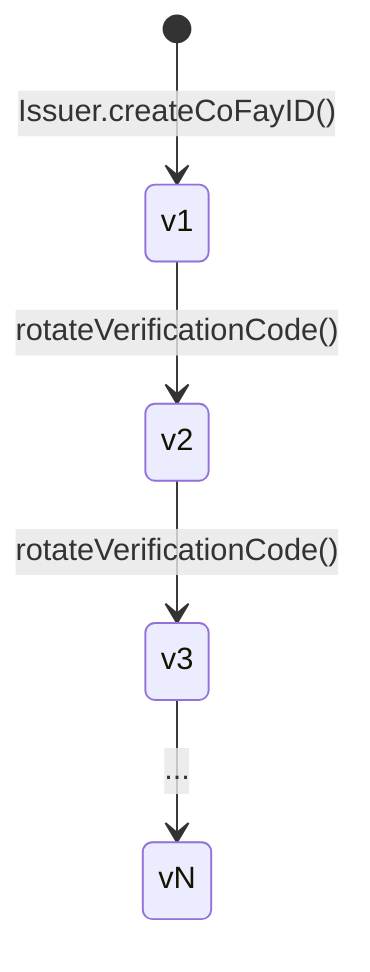
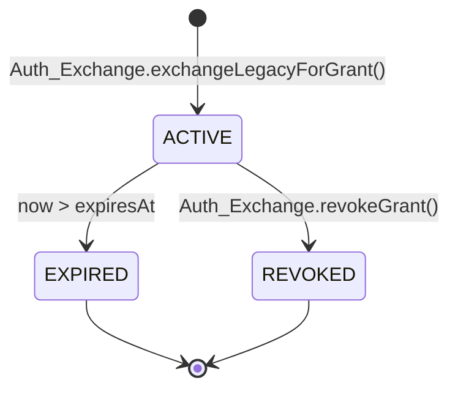
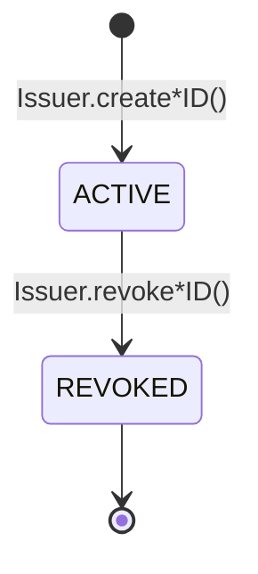

# 第 4 章 クレデンシャルとライフサイクル

本章は FayID 体系における 4 種類のクレデンシャルの生成方式、有効期限規則、ローテーションメカニズム、失効セマンティクスについて述べる。

---

## クレデンシャル概観

FayID 体系には 4 種類のクレデンシャルが存在し、それぞれ異なる目的に用いられる。

| クレデンシャル | 用途 | ライフサイクルの特徴 |
| --- | --- | --- |
| **Mnemonic** | Human ID 秘密鍵の人間可読バックアップ | 1 度のみ返却、永続化しない |
| **Dynamic Code** | Human ID 平文に代えて対外提示する | 有効期限あり。期限切れ後にローテーション |
| **Verification Code** | coFay ID 保持者の真正性を検証 | 帰属主体が能動的にローテーション可能 |
| **Authorization Grant** | FayID が従来型認証と交換した後に得られるアクセスクレデンシャル | 有効期限あり、能動的に失効可能 |

---

## Mnemonic（ニーモニック）

### 生成

- 自然人が Human ID を作成すると、Issuer は同時に 1 つの Mnemonic を生成する
- Mnemonic は生成時にその自然人へ**1 度のみ**返却される
- Issuer は **いかなる永続化ストレージにも** Mnemonic 平文を保持しない

### 決定論的派生

- 同じ Mnemonic を再入力した場合、システムは元の Human ID と完全に一致する Human ID を派生させなければならない
- これは Human ID 復旧の唯一の経路である

### セキュリティ制約

- Mnemonic はいかなるログ、監査出力、出方向ペイロードにも出現してはならない
- Dynamic Code を派生する際、保持者に Mnemonic 平文の提示を**要求しない**

> Mnemonic は FayID 体系で最高セキュリティ等級の秘密材料である。一度紛失すると、Human ID は復旧不可能となる。

---

## Dynamic Code（ダイナミックコード）

### 生成

- Human ID 保持者の要求時に、Issuer は当該 Human ID から平文の Dynamic Code を派生させる
- 各 Dynamic Code は明確な失効時刻（expiresAt）を伴う
- 派生プロセスは Mnemonic 平文を要求せず、所有権証明のみを必要とする

### 有効期限と解決

- 有効期限内において、Resolver は Dynamic Code を一意に対応する Human ID へ解決できる
- 有効期限を超過した場合、Resolver は解決を拒否し `DYNAMIC_CODE_EXPIRED` を返す

### ローテーション

- 毎回生成される Dynamic Code は前回と**同一でない**（衝突不可）
- 異なる時点で生成された Dynamic Code どうしは**関連付け不能**——外部観察者は 2 つの Dynamic Code が同一の Human ID から出たものか判断できない

### セキュリティ性質

- Dynamic Code の文字列から Human ID の秘密鍵や Mnemonic を逆推できない
- Dynamic Code はログに記録できる（Human ID 平文とは異なる）

### 状態図

> Dynamic Code は 2 つの状態のみを持つ。すなわち有効（ACTIVE）と期限切れ（EXPIRED）である。逆方向への遷移は存在しない。

---

## Verification Code（検証コード）

### 生成

- coFay ID の作成が成功すると、Issuer は当該 coFay ID と一対一に対応する Verification Code を同時に発行する

### 検証

- 検証側は (coFay ID, Verification Code) のペアを入力し、Resolver は検証成功または失敗を返す
- 連続して複数回の検証失敗が発生した場合、Resolver は当該 coFay ID の検証要求頻度を制限する（`VERIFICATION_RATE_LIMITED`）

### ローテーション

- coFay ID の帰属主体は Verification Code のローテーションを要求できる
- ローテーション後、旧 Verification Code は **即時失効する**
- バージョン番号は単調に増加し、Resolver は最新バージョンのみを受理する

### バージョン進化

> ローテーションは瞬時操作である。新バージョンが有効になると同時に、旧バージョンは Resolver により即時に拒否される。

---

## Authorization Grant（認可クレデンシャル）

### 生成

- ユーザーは Auth Exchange に対して従来型認証クレデンシャル + 対象 FayID（iFay ID または Human ID）を提出する
- 従来型クレデンシャルが検証成功すると、Auth Exchange は対象 FayID へ Authorization Grant を 1 件発行する
- Grant は明確な失効時刻（expiresAt）を持つ

### 有効期限

- 有効期限内では、Grant の提示は元の従来型認証クレデンシャルの提示と等価である
- 失効時刻を超過した後、Auth Exchange は当該 Grant を拒否する（`GRANT_EXPIRED`）

### 失効

- Grant の保持者は能動的に失効させることができる
- 失効後、Auth Exchange は後続の検証において即時に拒否する（`GRANT_REVOKED`）
- 失効は終局状態であり、復元できない

### 失効済み ID との相互作用

- 対象 FayID（iFay ID または coFay ID）が既に失効している場合、Auth Exchange は新 Grant の発行を拒否する（`IDENTITY_REVOKED`）

### 状態図

> EXPIRED と REVOKED はいずれも終局状態である。終局状態に入った後、Grant は二度と ACTIVE に戻らない。

---

## Identity ライフサイクル（iFay ID / coFay ID）

iFay ID と coFay ID は同じライフサイクルモデルを共有する。

主要ルール：

- **失効は不可逆**：いったん REVOKED とマークされると、「失効取消」はサポートしない
- **失効後の影響**：Resolver は解決時に失効フラグを付随して返却する。Auth Exchange は失効済み ID への新 Grant 発行を拒否する
- **Human ID は失効しない**：現行のプロトコル層では Human ID は REVOKED 状態に入らない（Mnemonic 漏洩後の救済経路は Open Question）

> 失効は単調操作である。「復元」は新規発行エンティティを介して行うべきであり、旧エンティティの状態を逆転させてはならない。
