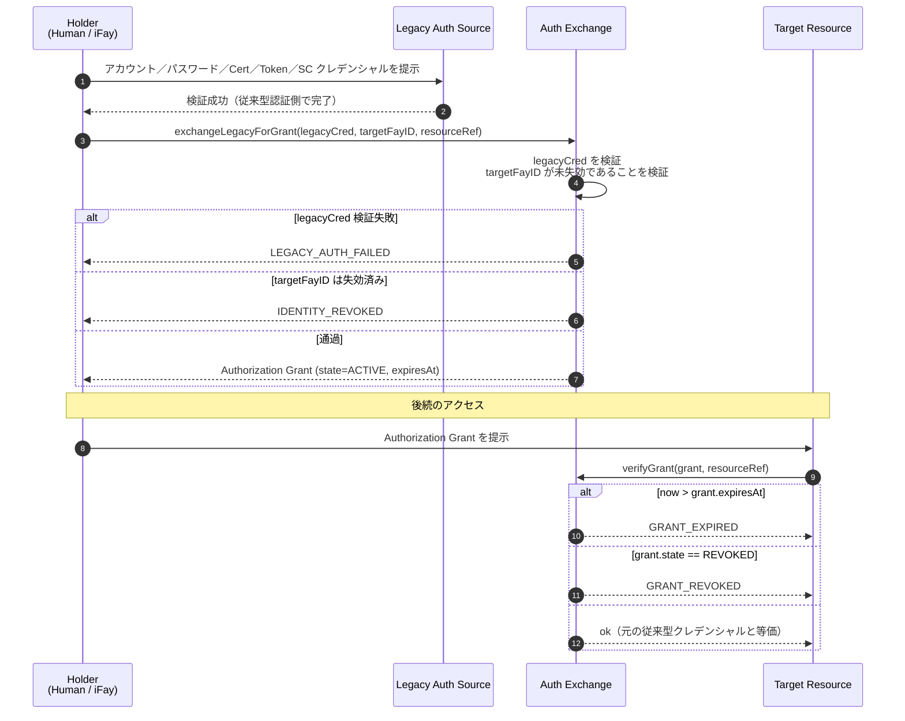
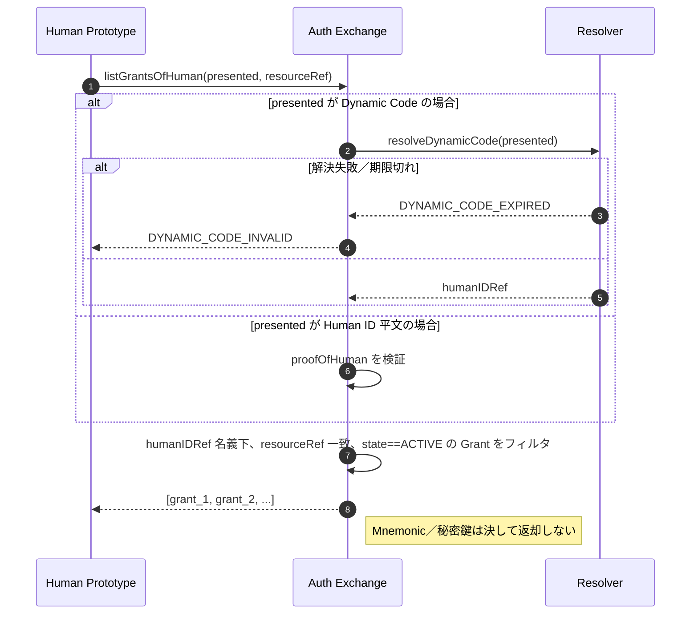
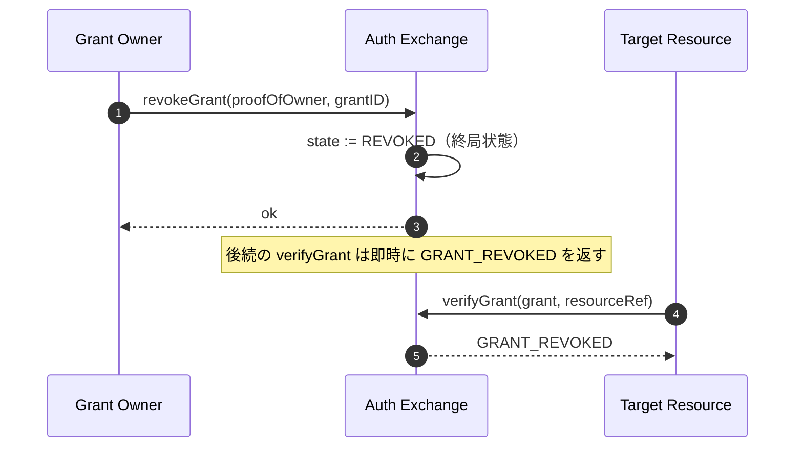

# 第 5 章 認証交換

本章は FayID が従来型認証方式と相互運用する方式について述べる。すなわち、アカウント／パスワード、Certificate、Authorization、Access Token、Smart Contract 等の従来型クレデンシャルを Authorization Grant に交換することで、ユーザーが FayID（あるいはその Dynamic Code）を提示するだけで様々な保護されたリソースにアクセスできるようにする。

---

## 設計動機

従来のインターネットでは、1 人の人間が異なるシステムごとに大量の独立した認証チケットを管理する必要があった。FayID は**統一された交換層**を提供する。ユーザーは Auth Exchange に対して 1 度だけ従来型認証クレデンシャルを提出すれば、FayID にバインドされた Authorization Grant を取得できる。以後、対象リソースへのアクセス時には Grant の提示のみで済み、毎回従来型認証を再度通す必要はない。

> 一文で表すと、FayID は「チケット集約器」である——1 つの Human ID 名義下で、異なるシステムからの複数の有効な Grant を同時に保持できる。

---

## 5 種類の従来型認証ソース

Auth Exchange は次の 5 種類の従来型認証クレデンシャルをサポートする。

| ソース種別 | 説明 |
| --- | --- |
| **PASSWORD** | アカウント／パスワード |
| **CERTIFICATE** | デジタル証明書（X.509 等） |
| **AUTHORIZATION** | OAuth 等の認可トークン |
| **ACCESS_TOKEN** | API Access Token |
| **SMART_CONTRACT** | スマートコントラクトクレデンシャル |

各 Authorization Grant はメタデータ内に `legacySourceKind` を記録し、当該 Grant がどの種別のソースから交換されたものかを示す。

---

## 交換フロー

### 基本フロー



### 主要ルール

- **対象 FayID は iFay ID または Human ID のいずれでもよい**：プロトコル層は両方の target を許容し、デジタル人格と自然人の双方がチケットを保持できる
- **Grant は失効時刻を必ず伴う**：`expiresAt` は明示フィールドであり、無期限は許容しない
- **失効サポート**：Grant は保持者により能動的に失効させることができ、失効後は即時無効となる
- **等価性**：有効期限内において Grant の提示は元の従来型認証クレデンシャルの提示と等価である

---

## Human ID 単一点でのチケット保持

### 設計目的

自然人ユーザーが Human ID（あるいはその Dynamic Code）のみを記憶していれば、名義下のすべての Grant と交換でき、各システムごとに個別にチケット管理する必要がなくなる。

### フロー図



### 主要ルール

- **Dynamic Code 提示をサポート**：ユーザーは Human ID 平文の代わりに Dynamic Code を用いることができ、根 ID の露出を回避する
- **Dynamic Code 失敗時の処理**：Dynamic Code の解決失敗または期限切れの際は `DYNAMIC_CODE_INVALID` を返す
- **機微材料は決して返却しない**：Auth Exchange は呼び出し側に対して、いかなる Human ID の Mnemonic や秘密鍵も返却しない
- **結果はフィルタ済み集合**：当該 Human ID 名義下、resourceRef に一致し、状態が ACTIVE である Grant のリストを返す

---

## 失効プロトコル

### フロー図



### 主要ルール

- **失効は終局状態**：いったん REVOKED 状態に入ると、復元できない
- **即時有効**：失効後、すべての後続 `verifyGrant` 呼び出しは即時に `GRANT_REVOKED` を返す
- **所有権証明が必要**：失効要求は proofOfOwner を伴う必要がある

---

## resourceRef 名前空間

各 Authorization Grant は `resourceRef` フィールドにより保護対象リソースを識別する。

### 推奨形式

```
resourceRef := "<scheme>://<authority>/<path>"
scheme      := "http" | "https" | "smartcontract" | "rpc" | "fayid" | <impl-defined>
```

### 制約

- `resourceRef` は比較可能な不透明文字列である
- 具体的な構文は実装が決定するが、**Human ID 平文を含んではならない**
- 実装間の相互運用に際しては URI 標準への準拠を推奨する

---

## 失効済み ID との相互作用

| シナリオ | Auth Exchange の挙動 |
| --- | --- |
| 対象 FayID（iFay ID／coFay ID）が失効済み | 新 Grant の発行を拒否し、`IDENTITY_REVOKED` を返す |
| Grant が失効済み | 後続の検証で `GRANT_REVOKED` を返す |
| Grant が期限切れ | 後続の検証で `GRANT_EXPIRED` を返す |
| 従来型認証クレデンシャルの検証が失敗 | 発行を拒否し、`LEGACY_AUTH_FAILED` を返す |

> 詳細なエラーコードのセマンティクスは design.md の「Error Handling」章を参照。
