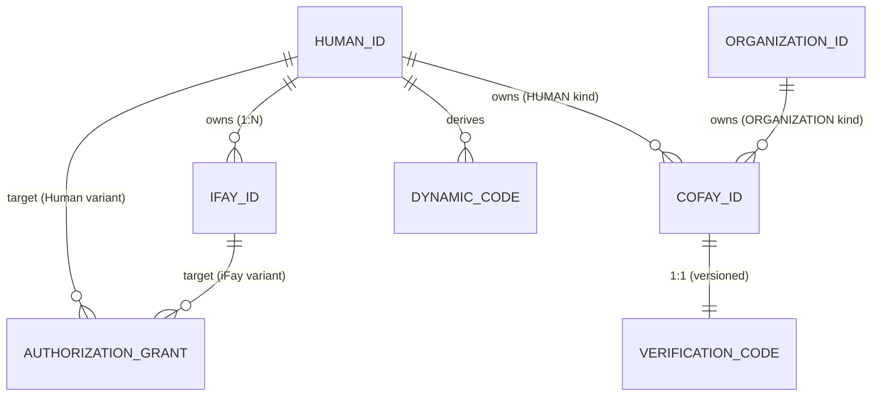

# 제 3 장 엔티티와 관계

본 장은 FayID 체계의 네 종류 핵심 엔티티의 의미, 귀속 규칙, 상호 관계를 기술한다.

---

## 네 종류 핵심 엔티티

### Human ID — 자연인 루트 신원

Human ID는 자연인이 FayID 체계에서 가지는 **유일한 루트 신원**이다. 다음과 같은 특징을 가진다:

- 키 쌍에서 파생되며 한 부의 니모닉(Mnemonic)에 대응된다
- 전역적으로 유일하며, 동일한 Mnemonic은 결정론적으로 동일한 Human ID를 파생한다
- 다른 모든 엔티티의 "귀속 앵커"다. iFay ID는 여기에 바인딩되고, coFay ID는 여기에 귀속될 수 있다
- 공개 통신에서 **평문으로 등장해서는 안 된다** (프라이버시 하드 제약)

> Human ID는 "뿌리"이며, 다른 모든 신원은 여기서 자라난다.

### iFay ID — 디지털 인격

iFay ID는 한 iFay 디지털 인격을 식별한다. 핵심 규칙:

- 각 iFay ID는 **반드시** 유일한 Human ID에 바인딩되어야 한다 (다대일)
- 동일한 Human ID는 **여러** iFay ID에 바인딩될 수 있다 (한 사람 다중 인격)
- 동일한 iFay ID는 여러 Human ID에 바인딩될 수 **없다** (바인딩 중첩 불가)
- 폐기를 지원한다 (불가역)

### coFay ID — 공공 역할

coFay ID는 대중을 향한 공유 역할을 식별한다. 핵심 규칙:

- 각 coFay ID는 임의 시점에 정확히 **하나의 귀속 주체**만 가진다
- 귀속 주체는 Human ID 또는 Organization ID 중 하나일 수 있다
- 동일한 Human ID 또는 Organization ID는 **여러** coFay ID에 귀속될 수 있다
- 생성 시 동시에 하나의 Verification Code(검증 코드)가 발급된다
- 폐기를 지원한다 (불가역)

### Organization ID — 조직 식별자

Organization ID는 한 조직 엔티티를 식별한다. 핵심 규칙:

- **평문 문자열** 형태로 공개적으로 사용된다
- Dynamic Code를 **파생하지 않는다** (프라이버시 보호 불필요)
- 여러 coFay ID를 동시에 귀속시킬 수 있다
- Resolver는 Organization ID 문자열을 통해 직접 대응되는 조직 엔티티를 반환할 수 있으며, 추가 자격 증명이 필요하지 않다

---

## 귀속과 바인딩 관계

### 관계 개요

| 관계 | 카디널리티 | 설명 |
| --- | --- | --- |
| Human ID → iFay ID | 일대다 | 한 사람이 여러 디지털 인격을 가질 수 있다 |
| iFay ID → Human ID | 다대일 | 각 인격은 한 사람에게만 속한다 |
| Human ID → coFay ID | 일대다 | 한 사람이 여러 공공 역할에 귀속될 수 있다 |
| Organization ID → coFay ID | 일대다 | 한 조직이 여러 공공 역할에 귀속될 수 있다 |
| coFay ID → 귀속 주체 | 일대일 | 각 역할은 임의 시점에 하나의 귀속 주체만 가진다 |
| Human ID → Dynamic Code | 일대다 | 매 요청마다 새 Dynamic Code 생성 |
| coFay ID → Verification Code | 일대일 (버전 관리) | 매 교체마다 새 버전 생성, 이전 버전은 즉시 무효화 |

### 엔티티 관계도

---

## 핵심 불변 조건

다음 불변 조건은 시스템의 임의의 합법적 상태에서 모두 성립해야 한다:

1. **iFay ID 바인딩 유일성**: 임의의 iFay ID는 임의 시점에 정확히 하나의 Human ID에 바인딩되며, 해당 바인딩은 iFay ID의 전체 생명주기 동안 변경될 수 없다.

2. **coFay ID 귀속 유일성**: 임의의 coFay ID는 임의 시점에 정확히 하나의 귀속 주체(Human ID 또는 Organization ID)를 가지며, 귀속 타입(OwnerKind)과 귀속 참조(ownerRef)가 일관성을 유지한다.

3. **식별자 전역 유일성**: Human ID, iFay ID, coFay ID, Organization ID는 각각의 네임스페이스 내에서 전역적으로 유일하다. 타입 간에는 타입 접두사를 통해 자연스럽게 충돌하지 않는다.

4. **폐기 단조성**: iFay ID 또는 coFay ID가 폐기됨으로 표시되면 해당 상태는 되돌릴 수 없다.

> 이 불변 조건들은 design 문서의 Property P1 (식별자 생성 유일성 + 귀속 일관성) 및 Property P8 (폐기 단조성)에 대응된다.

---

## 귀속 조회

Resolver는 다음의 귀속 조회 능력을 제공한다:

- 주어진 iFay ID → 그것이 속하는 유일한 Human ID 반환 (opaqueRef 형태로, Human ID 평문은 노출하지 않음)
- 주어진 coFay ID → 그 귀속 주체의 타입(Human / Organization)과 식별자 반환
- 주어진 Human ID + 소유권 증명 → 해당 Human ID 명의의 iFay ID 목록 반환

> 주의: Human ID 명의의 iFay ID 목록을 조회하려면 **반드시** 소유권 증명을 거쳐야 하며, 통과하지 못하면 Resolver는 반환을 거부한다. 이는 프라이버시 보호의 일부다.
