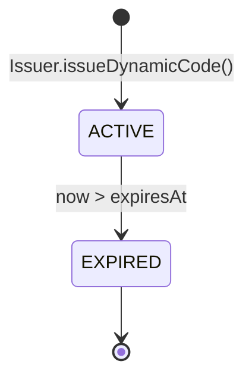
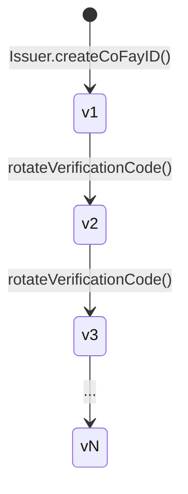
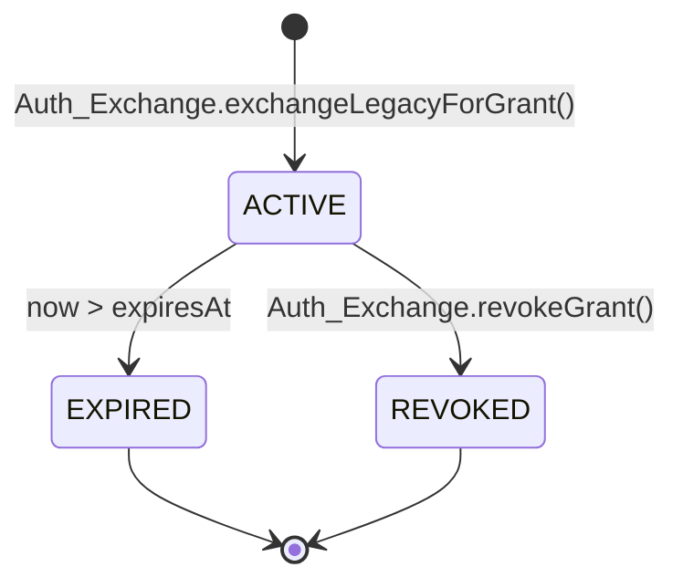
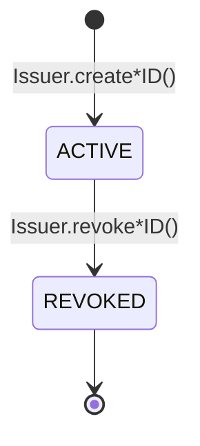

# 제 4 장 자격 증명과 생명주기

본 장은 FayID 체계에서 네 종류 자격 증명의 생성 방식, 유효 기간 규칙, 교체 메커니즘, 폐기 의미를 기술한다.

---

## 자격 증명 개요

FayID 체계에는 네 종류의 자격 증명이 있으며, 각각 다른 목적에 사용된다:

| 자격 증명 | 용도 | 생명주기 특성 |
| --- | --- | --- |
| **Mnemonic** | Human ID 개인 키의 인간이 읽을 수 있는 백업 | 일회성 반환, 영속화되지 않음 |
| **Dynamic Code** | Human ID 평문 대신 외부에 제시 | 시간 제한 있음, 만료 후 교체 |
| **Verification Code** | coFay ID 보유자의 진위 검증 | 귀속 주체가 능동적으로 교체 가능 |
| **Authorization Grant** | FayID가 전통 인증을 교환하여 얻은 액세스 자격 증명 | 시간 제한 있음, 능동적으로 폐기 가능 |

---

## Mnemonic (니모닉)

### 생성

- 자연인이 Human ID를 생성할 때, Issuer가 동시에 한 부의 Mnemonic을 생성한다
- Mnemonic은 생성 시점에 해당 자연인에게 **단 한 번** 반환된다
- Issuer는 **어떠한 영속화 저장소에도** Mnemonic 평문을 보관하지 **않는다**

### 결정론적 파생

- 동일한 Mnemonic을 다시 입력했을 때, 시스템은 반드시 원래 Human ID와 완전히 일치하는 Human ID를 파생해야 한다
- 이는 Human ID 복구의 유일한 경로다

### 보안 제약

- Mnemonic은 어떠한 로그, 감사 출력, 출항 페이로드에도 등장해서는 안 된다
- Dynamic Code 파생 시 보유자에게 Mnemonic 평문 제시를 **요구하지 않는다**

> Mnemonic은 FayID 체계에서 가장 높은 보안 등급의 비밀 자료다. 한 번 분실하면 Human ID는 복구할 수 없다.

---

## Dynamic Code (동적 코드)

### 생성

- Human ID 보유자가 요청 시, Issuer는 해당 Human ID를 기반으로 평문 Dynamic Code를 파생한다
- 각 Dynamic Code에는 명확한 유효 기간 만료 시점(expiresAt)이 첨부된다
- 파생 과정에서 Mnemonic 평문은 요구되지 않으며, 소유권 증명만 필요하다

### 유효 기간과 해석

- 유효 기간 내에는 Resolver가 Dynamic Code를 유일하게 대응되는 Human ID로 해석할 수 있다
- 유효 기간이 지난 후에는 Resolver가 해석을 거부하고 `DYNAMIC_CODE_EXPIRED`를 반환한다

### 교체

- 매번 생성되는 Dynamic Code는 이전 회차와 **다르다** (충돌 불가)
- 서로 다른 회차에 생성된 Dynamic Code 사이에는 **상관 관계가 없다**. 외부 관찰자는 두 Dynamic Code가 동일한 Human ID에서 나왔는지 판단할 수 없다

### 보안 성질

- Dynamic Code 문자열로부터 Human ID의 개인 키나 Mnemonic을 역추적할 수 없다
- Dynamic Code는 로그에 기록될 수 있다 (Human ID 평문과 다름)

### 상태도

> Dynamic Code는 두 가지 상태만 가진다: 유효(ACTIVE)와 만료(EXPIRED). 역방향 전이는 존재하지 않는다.

---

## Verification Code (검증 코드)

### 생성

- coFay ID가 성공적으로 생성될 때, Issuer는 동시에 해당 coFay ID와 일대일로 대응되는 Verification Code를 발급한다

### 검증

- 검증자는 (coFay ID, Verification Code) 쌍을 입력하고, Resolver는 검증 통과 또는 실패를 반환한다
- 연속하여 여러 번 검증에 실패하면, Resolver는 해당 coFay ID의 검증 요청 빈도를 제한한다 (`VERIFICATION_RATE_LIMITED`)

### 교체

- coFay ID의 귀속 주체는 Verification Code 교체를 요청할 수 있다
- 교체 후, 이전 Verification Code는 **즉시 무효화**된다
- 버전 번호는 단조 증가하며, Resolver는 최신 버전만 수용한다

### 버전 변천

> 교체는 즉시 작업이다. 새 버전이 발효되는 동시에 이전 버전은 즉시 Resolver에 의해 거부된다.

---

## Authorization Grant (인증 부여)

### 생성

- 사용자가 Auth Exchange에 전통 인증 자격 증명 + 대상 FayID(iFay ID 또는 Human ID)를 제출한다
- 전통 자격 증명 검증이 통과하면, Auth Exchange는 대상 FayID에 Authorization Grant를 발급한다
- Grant는 명확한 만료 시간(expiresAt)을 가진다

### 유효 기간

- 유효 기간 내에는 Grant 제시가 원래 전통 인증 자격 증명과 동등하다
- 만료 시간이 지나면 Auth Exchange는 해당 Grant를 거부한다 (`GRANT_EXPIRED`)

### 폐기

- Grant 보유자는 능동적으로 폐기할 수 있다
- 폐기 후, Auth Exchange는 후속 검증에서 즉시 거부한다 (`GRANT_REVOKED`)
- 폐기는 종결 상태이며 복구할 수 없다

### 폐기된 ID와의 상호작용

- 대상 FayID(iFay ID 또는 coFay ID)가 이미 폐기된 경우, Auth Exchange는 새 Grant 발급을 거부한다 (`IDENTITY_REVOKED`)

### 상태도

> EXPIRED와 REVOKED는 모두 종결 상태다. 종결 상태에 진입하면 Grant는 다시는 ACTIVE로 돌아가지 않는다.

---

## Identity 생명주기 (iFay ID / coFay ID)

iFay ID와 coFay ID는 동일한 생명주기 모델을 공유한다:

핵심 규칙:

- **폐기 불가역**: REVOKED로 표시되면 "폐기 취소"는 지원되지 않는다
- **폐기 결과**: Resolver는 해석 시 폐기 플래그를 함께 반환한다. Auth Exchange는 폐기된 ID에 대한 새 Grant 발급을 거부한다
- **Human ID는 폐기되지 않음**: 현재 프로토콜 계층에서 Human ID는 REVOKED 상태에 진입하지 않는다 (Mnemonic 유출 후의 보완 경로는 Open Question)

> 폐기는 단조 작업이다. 어떠한 "복구"도 이전 엔티티 상태를 역전시키는 것이 아니라 새 엔티티 발급을 통해 이루어져야 한다.
