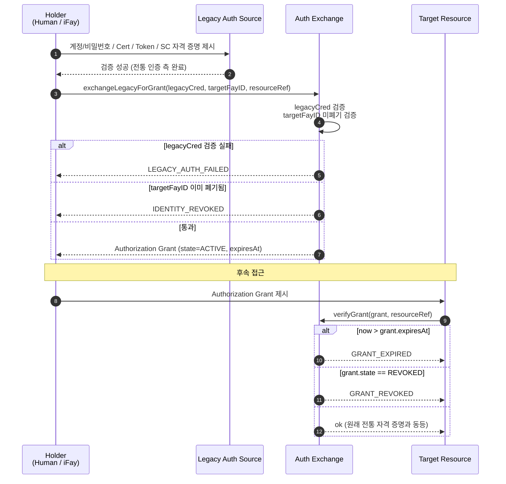
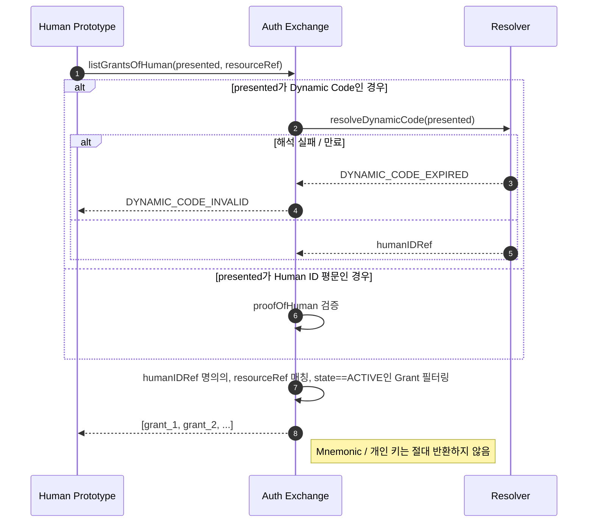
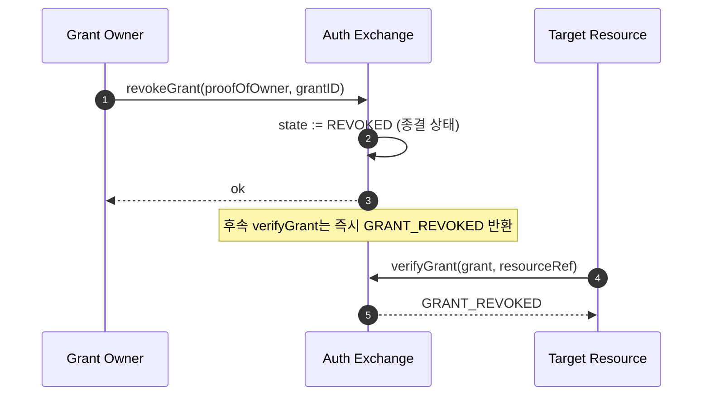

# 제 5 장 인증 교환

본 장은 FayID가 전통 인증 방식과 어떻게 상호 운용되는지 기술한다: 계정/비밀번호, Certificate, Authorization, Access Token, Smart Contract 등의 전통 자격 증명을 Authorization Grant로 교환함으로써, 사용자가 FayID(또는 그 Dynamic Code)만 제시하면 다양한 보호 리소스에 접근할 수 있도록 한다.

---

## 설계 동기

전통적인 인터넷에서 한 사람은 서로 다른 시스템마다 수많은 독립 인증 티켓을 관리해야 한다. FayID는 **통합 교환 계층**을 제공한다: 사용자가 Auth Exchange에 전통 인증 자격 증명을 한 번 제출하면, FayID에 바인딩된 Authorization Grant를 받을 수 있다. 이후 대상 리소스에 접근할 때 Grant만 제시하면 되며, 매번 다시 전통 인증을 거칠 필요가 없다.

> 한마디로: FayID는 "티켓 집계기"다. 한 Human ID 명의로 서로 다른 시스템에서 발급된 여러 유효 Grant를 동시에 보유할 수 있다.

---

## 다섯 종류의 전통 인증 소스

Auth Exchange는 다음 다섯 종류의 전통 인증 자격 증명을 지원한다:

| 소스 타입 | 설명 |
| --- | --- |
| **PASSWORD** | 계정 / 비밀번호 |
| **CERTIFICATE** | 디지털 인증서 (예: X.509) |
| **AUTHORIZATION** | OAuth 등 인증 토큰 |
| **ACCESS_TOKEN** | API Access Token |
| **SMART_CONTRACT** | 스마트 컨트랙트 자격 증명 |

각 Authorization Grant는 메타데이터에 `legacySourceKind`를 기록하여, 해당 Grant가 어떤 종류의 소스에서 교환되었는지 표시한다.

---

## 교환 흐름

### 기본 흐름



### 핵심 규칙

- **대상 FayID는 iFay ID 또는 Human ID일 수 있다**: 프로토콜 계층은 두 종류의 target을 허용하여, 디지털 인격과 자연인 모두가 티켓을 보유할 수 있도록 한다
- **Grant는 만료 시간을 반드시 포함해야 한다**: `expiresAt`은 명시적 필드이며, 영구 만료 없음은 허용되지 않는다
- **폐기 지원**: Grant는 보유자에 의해 능동적으로 폐기될 수 있으며, 폐기 후 즉시 무효화된다
- **동등성**: 유효 기간 내에 Grant 제시는 원래 전통 인증 자격 증명을 제시하는 것과 동등하다

---

## Human ID 단일 지점 티켓 보유

### 설계 목적

자연인 사용자가 Human ID(또는 그 Dynamic Code)만 기억하면 명의 하의 모든 Grant를 교환해 낼 수 있도록 하여, 더 이상 시스템마다 별도로 티켓을 관리할 필요가 없게 한다.

### 흐름도



### 핵심 규칙

- **Dynamic Code 제시 지원**: 사용자는 Human ID 평문 대신 Dynamic Code를 사용하여 루트 신원 노출을 피할 수 있다
- **Dynamic Code 실패 처리**: Dynamic Code 해석 실패 또는 만료 시 `DYNAMIC_CODE_INVALID`를 반환한다
- **민감 자료 절대 반환 금지**: Auth Exchange는 호출자에게 어떠한 Human ID의 Mnemonic이나 개인 키도 반환하지 않는다
- **결과는 필터링된 집합**: 해당 Human ID 명의의, resourceRef와 매칭되며 상태가 ACTIVE인 Grant 목록을 반환한다

---

## 폐기 프로토콜

### 흐름도



### 핵심 규칙

- **폐기는 종결 상태**: REVOKED 상태에 진입하면 복구할 수 없다
- **즉시 발효**: 폐기 후 모든 후속 `verifyGrant` 호출은 즉시 `GRANT_REVOKED`를 반환한다
- **소유권 증명 필요**: 폐기 요청은 반드시 proofOfOwner를 포함해야 한다

---

## resourceRef 네임스페이스

각 Authorization Grant는 `resourceRef` 필드를 통해 보호 대상 리소스를 식별한다.

### 권장 형식

```
resourceRef := "<scheme>://<authority>/<path>"
scheme      := "http" | "https" | "smartcontract" | "rpc" | "fayid" | <impl-defined>
```

### 제약

- `resourceRef`는 비교 가능한 불투명 문자열이다
- 구체적인 구문은 구현이 결정하지만, Human ID 평문을 **포함해서는 안 된다**
- 구현 간 상호 운용 시 URI 표준을 준수할 것을 권장한다

---

## 폐기된 ID와의 상호작용

| 시나리오 | Auth Exchange 동작 |
| --- | --- |
| 대상 FayID(iFay ID / coFay ID)가 이미 폐기됨 | 새 Grant 발급 거부, `IDENTITY_REVOKED` 반환 |
| Grant가 이미 폐기됨 | 후속 검증에서 `GRANT_REVOKED` 반환 |
| Grant가 이미 만료됨 | 후속 검증에서 `GRANT_EXPIRED` 반환 |
| 전통 인증 자격 증명 검증 실패 | 발급 거부, `LEGACY_AUTH_FAILED` 반환 |

> 자세한 에러 코드 의미는 design.md의 "Error Handling" 장을 참고한다.
