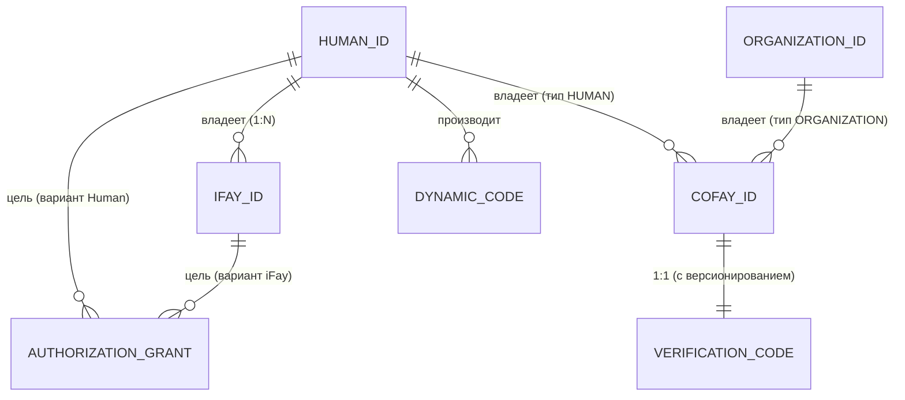

# Глава 3. Сущности и связи

В этой главе описываются семантика, правила владения и взаимные отношения четырёх видов основных сущностей в системе FayID.

---

## Четыре вида основных сущностей

### Human ID — корневая идентичность физического лица

Human ID — это **уникальная корневая идентичность** физического лица в системе FayID. Она обладает следующими характеристиками:

- Производится из пары ключей, сопровождается Mnemonic
- Глобально уникальна; один и тот же Mnemonic детерминированно производит один и тот же Human ID
- «Якорь владения» каждой другой сущности — iFay ID привязываются к нему, а coFay ID могут принадлежать ему
- **Не должна появляться в открытом виде** в публичных коммуникациях (жёсткое ограничение конфиденциальности)

> Human ID — это корень; всякая другая идентичность вырастает из него.

### iFay ID — цифровая персона

iFay ID идентифицирует одну цифровую персону iFay. Основные правила:

- Каждый iFay ID **должен** быть привязан ровно к одному Human ID (многие к одному)
- Один Human ID может привязывать **несколько** iFay ID (один человек, много персон)
- Один iFay ID **не может** быть привязан к нескольким Human ID (привязки не пересекаются)
- Поддерживает отзыв (необратимый)

### coFay ID — публичная роль

coFay ID идентифицирует публично ориентированную совместно используемую роль. Основные правила:

- Каждый coFay ID имеет ровно **одного владельца** в любой момент
- Владельцем может быть либо Human ID, либо Organization ID (одно или другое)
- Один Human ID или Organization ID может владеть **несколькими** coFay ID
- Verification Code выпускается вместе с coFay ID в момент создания
- Поддерживает отзыв (необратимый)

### Organization ID — идентификатор организации

Organization ID идентифицирует организационную сущность. Основные правила:

- Используется публично в форме **открытой строки**
- **Не производит** Dynamic Code (защита конфиденциальности не нужна)
- Может владеть несколькими coFay ID
- Resolver может вернуть соответствующую организационную сущность напрямую из строки Organization ID, не требуя дополнительных учётных данных

---

## Отношения владения и привязки

### Отношения с первого взгляда

| Отношение | Кардинальность | Описание |
| --- | --- | --- |
| Human ID → iFay ID | один ко многим | Один человек может иметь много цифровых персон |
| iFay ID → Human ID | многие к одному | Каждая персона принадлежит ровно одному человеку |
| Human ID → coFay ID | один ко многим | Один человек может владеть многими публичными ролями |
| Organization ID → coFay ID | один ко многим | Одна организация может владеть многими публичными ролями |
| coFay ID → владелец | один к одному | Каждая роль имеет ровно одного владельца в любой момент |
| Human ID → Dynamic Code | один ко многим | Каждый запрос генерирует новый Dynamic Code |
| coFay ID → Verification Code | один к одному (с версионированием) | Каждая ротация производит новую версию; предыдущая версия немедленно становится недействительной |

### Диаграмма отношений сущностей

---

## Ключевые инварианты

Следующие инварианты должны выполняться в каждом легальном состоянии системы:

1. **Уникальность привязки iFay ID**: любой iFay ID привязан ровно к одному Human ID в любой момент, и эта привязка неизменна на протяжении всей жизни iFay ID.

2. **Уникальность владения coFay ID**: любой coFay ID имеет ровно одного владельца (Human ID или Organization ID) в любой момент, а OwnerKind и ownerRef остаются взаимно согласованными.

3. **Глобальная уникальность идентификаторов**: Human ID, iFay ID, coFay ID и Organization ID глобально уникальны в своих соответствующих пространствах имён; префикс типа естественным образом избегает межтиповых коллизий.

4. **Монотонность отзыва**: после того как iFay ID или coFay ID помечен как отозванный, это состояние необратимо.

> Эти инварианты соответствуют Свойству P1 (уникальность создания идентичности + согласованность владения) и Свойству P8 (монотонность отзыва) в документе проектирования.

---

## Запросы владения

Resolver предоставляет следующие возможности запросов владения:

- По iFay ID → возвращает уникальный Human ID, которому он принадлежит (как opaqueRef, никогда не раскрывая Human ID в открытом виде)
- По coFay ID → возвращает OwnerKind (Human / Organization) и идентификатор владельца
- По Human ID + доказательство владения → возвращает список iFay ID, принадлежащих этому Human ID

> Примечание: запрос списка iFay ID, принадлежащих Human ID, **должен** проходить через доказательство владения; без него Resolver отказывается возвращать результаты. Это часть защиты конфиденциальности.
