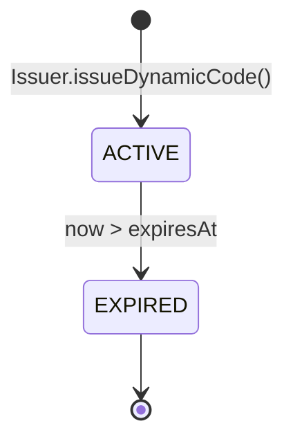
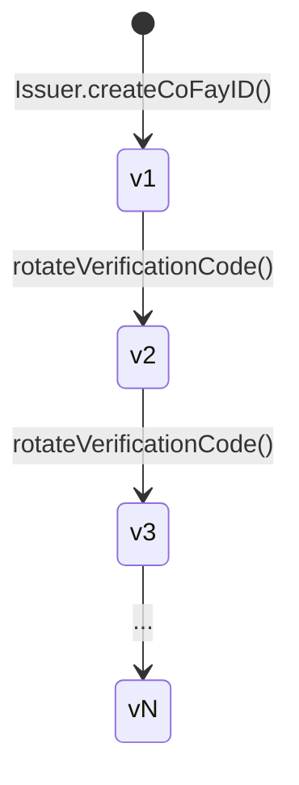
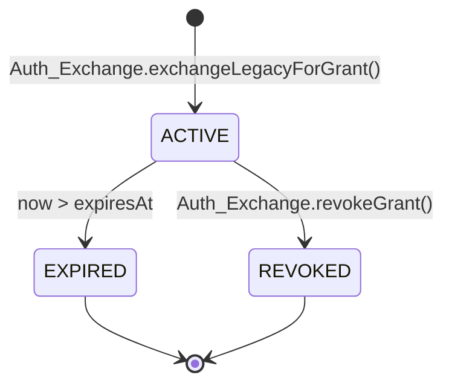
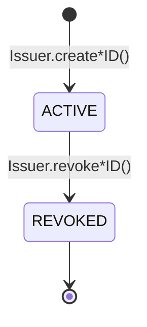

# Глава 4. Учётные данные и жизненный цикл

В этой главе описывается, как производятся четыре вида учётных данных в системе FayID, правила их действительности, механизмы ротации и семантика отзыва.

---

## Обзор учётных данных

В системе FayID есть четыре вида учётных данных, каждый из которых служит своему назначению:

| Учётные данные | Назначение | Характеристики жизненного цикла |
| --- | --- | --- |
| **Mnemonic** | Человекочитаемая резервная копия закрытого ключа Human ID | Возвращается один раз при генерации; никогда не сохраняется |
| **Dynamic Code** | Замена Human ID в публичных обменах | Ограничен по времени; ротируется при истечении |
| **Verification Code** | Проверяет подлинность держателя coFay ID | Может быть ротирован владельцем |
| **Authorization Grant** | Учётные данные доступа, полученные после обмена традиционных учётных данных аутентификации через FayID | Ограничен по времени; поддерживает активный отзыв |

---

## Mnemonic

### Генерация

- Когда физическое лицо создаёт Human ID, Issuer одновременно генерирует Mnemonic
- Mnemonic возвращается физическому лицу **только один раз**, в момент генерации
- Issuer **никогда не сохраняет открытый Mnemonic** в каком-либо хранилище

### Детерминированный вывод

- При повторном вводе одного и того же Mnemonic система должна произвести Human ID, идентичный исходному
- Это единственный путь восстановления Human ID

### Ограничения безопасности

- Mnemonic не должен появляться в каком-либо журнале, выводе аудита или исходящем содержимом
- Производство Dynamic Code **не требует**, чтобы держатель предоставлял открытый Mnemonic

> Mnemonic — это самый чувствительный секретный материал в системе FayID. После потери Human ID не может быть восстановлен.

---

## Dynamic Code

### Генерация

- По запросу держателя Human ID, Issuer производит открытый Dynamic Code из Human ID
- Каждый Dynamic Code несёт явное время истечения (expiresAt)
- Производство не требует открытого Mnemonic; нужно только доказательство владения

### Действительность и разрешение

- Пока действителен, Resolver может разрешать Dynamic Code обратно в уникальный соответствующий Human ID
- После истечения Resolver отказывается разрешать и возвращает `DYNAMIC_CODE_EXPIRED`

### Ротация

- Каждый вновь сгенерированный Dynamic Code отличается от предыдущего (без коллизий)
- Dynamic Code, сгенерированные в разное время, **не могут быть скоррелированы** — внешний наблюдатель не может определить, происходят ли два Dynamic Code от одного и того же Human ID

### Свойства безопасности

- Литеральное значение Dynamic Code не может быть использовано для восстановления закрытого ключа Human ID или Mnemonic
- Dynamic Code может быть записан в журналы (в отличие от открытого Human ID)

### Диаграмма состояний

> Dynamic Code имеет только два состояния: ACTIVE и EXPIRED. Обратного перехода нет.

---

## Verification Code

### Генерация

- При успешном создании coFay ID Issuer выпускает Verification Code, парно сопоставленный один к одному с этим coFay ID

### Проверка

- Проверяющий отправляет пару (coFay ID, Verification Code), и Resolver возвращает успех или неудачу
- После повторных неудач проверки Resolver ограничивает скорость запросов проверки для этого coFay ID (`VERIFICATION_RATE_LIMITED`)

### Ротация

- Владелец coFay ID может запросить ротацию Verification Code
- После ротации старый Verification Code **немедленно становится недействительным**
- Номера версий монотонно увеличиваются; Resolver принимает только последнюю версию

### Эволюция версий

> Ротация мгновенна: новая версия вступает в силу в тот же момент, когда старая версия отвергается Resolver.

---

## Authorization Grant

### Генерация

- Пользователь отправляет традиционные учётные данные аутентификации плюс целевой FayID (iFay ID или Human ID) в Auth Exchange
- После того как традиционные учётные данные проверены, Auth Exchange выпускает Authorization Grant для целевого FayID
- Grant несёт явное время истечения (expiresAt)

### Действительность

- Пока действителен, предъявление Grant эквивалентно предъявлению исходных традиционных учётных данных аутентификации
- После истечения Auth Exchange отвергает Grant (`GRANT_EXPIRED`)

### Отзыв

- Держатель Grant может отозвать его в любое время
- После отзыва Auth Exchange немедленно отвергает Grant в последующих проверках (`GRANT_REVOKED`)
- Отзыв является конечным состоянием и не может быть отменён

### Взаимодействие с отозванными ID

- Если целевой FayID (iFay ID или coFay ID) был отозван, Auth Exchange отказывается выпускать новый Grant для него (`IDENTITY_REVOKED`)

### Диаграмма состояний

> Оба состояния EXPIRED и REVOKED являются конечными. После того как Grant входит в конечное состояние, он никогда не возвращается в ACTIVE.

---

## Жизненный цикл идентичности (iFay ID / coFay ID)

iFay ID и coFay ID разделяют одну и ту же модель жизненного цикла:

Ключевые правила:

- **Отзыв необратим**: после пометки REVOKED «отмена отзыва» не поддерживается
- **Эффекты отзыва**: Resolver возвращает флаг revoked вместе с результатами разрешения; Auth Exchange отказывается выпускать новые Grant для отозванного ID
- **Human ID не отзываются**: на текущем уровне протокола Human ID не входит в состояние REVOKED (путь восстановления после компрометации Mnemonic — открытый вопрос)

> Отзыв — монотонная операция. Любое «восстановление» должно происходить путём выпуска новой сущности, а не путём обращения состояния старой.
