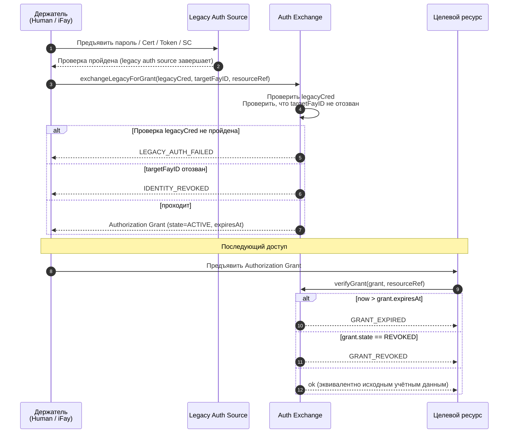
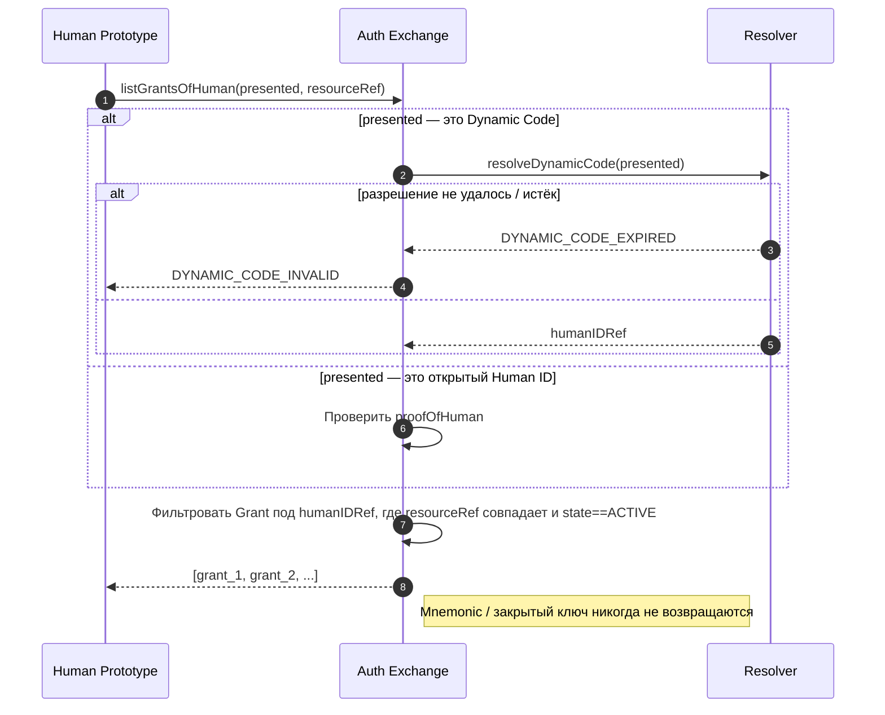
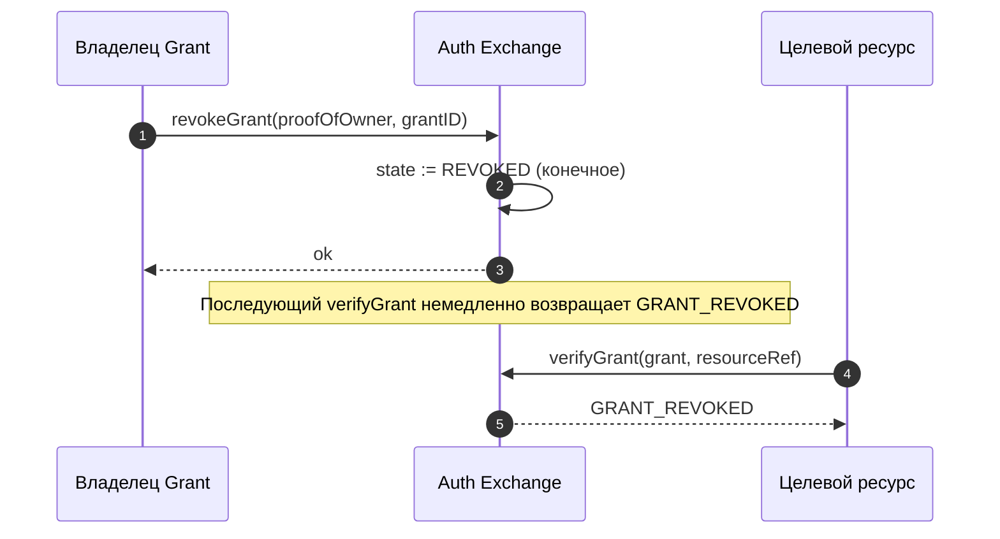

# Глава 5. Auth Exchange

В этой главе описывается, как FayID взаимодействует с традиционной аутентификацией: путём обмена традиционных учётных данных, таких как имя пользователя/пароль, сертификаты, авторизации, токены доступа и смарт-контракты, на Authorization Grant, чтобы пользователь мог получать доступ к широкому спектру защищённых ресурсов, предъявляя только свой FayID (или его Dynamic Code).

---

## Мотивация дизайна

В традиционном интернете одному человеку обычно приходится поддерживать большое количество независимых тикетов аутентификации в разных системах. FayID предоставляет **унифицированный уровень обмена**: пользователь однократно отправляет традиционные учётные данные аутентификации в Auth Exchange и получает Authorization Grant, привязанный к его FayID; с этого момента доступ к целевому ресурсу требует лишь предъявления Grant, без необходимости повторять традиционный поток аутентификации.

> Одной строкой: FayID — это «агрегатор тикетов» — один Human ID может одновременно держать несколько действительных Grant из разных систем.

---

## Пять видов источников унаследованной аутентификации

Auth Exchange поддерживает следующие пять видов традиционных учётных данных аутентификации:

| Вид источника | Описание |
| --- | --- |
| **PASSWORD** | Учётная запись / пароль |
| **CERTIFICATE** | Цифровой сертификат (например, X.509) |
| **AUTHORIZATION** | OAuth и подобные токены авторизации |
| **ACCESS_TOKEN** | Токен доступа API |
| **SMART_CONTRACT** | Учётные данные смарт-контракта |

Каждый Authorization Grant записывает свой `legacySourceKind` в метаданные, указывая, из какого вида источника он был выпущен.

---

## Поток обмена

### Базовый поток



### Ключевые правила

- **Целевой FayID может быть либо iFay ID, либо Human ID**: уровень протокола разрешает обе цели, поэтому как цифровые персоны, так и физические лица могут держать Grant
- **Grant должен нести время истечения**: `expiresAt` — это явное поле; «никогда не истекает» не разрешено
- **Поддержка отзыва**: Grant может быть активно отозван его держателем, немедленно становясь недействительным
- **Эквивалентность**: пока действителен, предъявление Grant эквивалентно предъявлению исходных традиционных учётных данных аутентификации

---

## Удержание тикетов в одной точке для Human ID

### Цель дизайна

Позволить пользователю-физическому лицу выкупать каждый Grant под его идентичностью, помня только свой Human ID (или его Dynamic Code), без необходимости управлять тикетами по системам.

### Диаграмма потока



### Ключевые правила

- **Поддерживается предъявление Dynamic Code**: пользователь может предъявить Dynamic Code вместо открытого Human ID, избегая раскрытия корневой идентичности
- **Обработка отказа Dynamic Code**: когда Dynamic Code не удаётся разрешить или истёк, возвращается `DYNAMIC_CODE_INVALID`
- **Чувствительный материал никогда не возвращается**: Auth Exchange никогда не возвращает вызывающей стороне какой-либо Mnemonic или закрытый ключ для Human ID
- **Результат — отфильтрованный набор**: возвращает список Grant под этим Human ID, соответствующих resourceRef и находящихся в состоянии ACTIVE

---

## Протокол отзыва

### Диаграмма потока



### Ключевые правила

- **Отзыв конечен**: после входа в состояние REVOKED восстановление невозможно
- **Вступает в силу немедленно**: после отзыва каждый последующий вызов `verifyGrant` возвращает `GRANT_REVOKED`
- **Требуется доказательство владения**: запрос отзыва должен нести proofOfOwner

---

## Пространство имён resourceRef

Каждый Authorization Grant идентифицирует защищаемый целевой ресурс через поле `resourceRef`.

### Рекомендуемый формат

```
resourceRef := "<scheme>://<authority>/<path>"
scheme      := "http" | "https" | "smartcontract" | "rpc" | "fayid" | <impl-defined>
```

### Ограничения

- `resourceRef` — сравнимая непрозрачная строка
- Точный синтаксис определяется реализацией, но **не должен содержать** открытый Human ID
- Для совместимости между реализациями рекомендуется следовать стандарту URI

---

## Взаимодействие с отозванными ID

| Сценарий | Поведение Auth Exchange |
| --- | --- |
| Целевой FayID (iFay ID / coFay ID) отозван | Отказывает в выпуске нового Grant; возвращает `IDENTITY_REVOKED` |
| Grant отозван | Последующие проверки возвращают `GRANT_REVOKED` |
| Grant истёк | Последующие проверки возвращают `GRANT_EXPIRED` |
| Учётные данные унаследованной аутентификации не прошли проверку | Отказ в выпуске; возвращает `LEGACY_AUTH_FAILED` |

> Подробную семантику кодов ошибок см. в разделе «Error Handling» в design.md.
