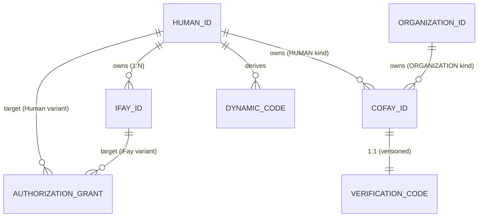

# 第 3 章 实体与关系

本章描述 FayID 体系中四类核心实体的语义、归属规则与相互关系。

---

## 四类核心实体

### Human ID — 自然人根身份

Human ID 是自然人在 FayID 体系中的**唯一根身份**。它具有以下特征：

- 由密钥对派生，对应一份助记词（Mnemonic）
- 全局唯一，且同一份 Mnemonic 可确定性地派生出相同的 Human ID
- 是所有其他实体的"归属锚点"——iFay ID 绑定到它，coFay ID 可归属于它
- 在公开通信中**不得以明文出现**（隐私硬约束）

> Human ID 是"根"，其他一切身份都从它生长出来。

### iFay ID — 数字人格

iFay ID 标识一个 iFay 数字人格。核心规则：

- 每个 iFay ID **必须**绑定到唯一的 Human ID（多对一）
- 同一个 Human ID 可绑定**多个** iFay ID（一人多人格）
- 同一个 iFay ID **不可**绑定到多个 Human ID（绑定不可重叠）
- 支持撤销（不可逆）

### coFay ID — 公共角色

coFay ID 标识一个面向公众的共享角色。核心规则：

- 每个 coFay ID 在任意时刻有且仅有**一个归属主体**
- 归属主体可以是 Human ID 或 Organization ID（二选一）
- 同一个 Human ID 或 Organization ID 可归属**多个** coFay ID
- 创建时同步签发一个 Verification Code（验证码）
- 支持撤销（不可逆）

### Organization ID — 组织标识

Organization ID 标识一个组织实体。核心规则：

- 以**明文字符串**形式公开使用
- **不派生** Dynamic Code（无需隐私保护）
- 可同时归属多个 coFay ID
- Resolver 可直接根据 Organization ID 字符串返回对应组织实体，无需附加凭证

---

## 归属与绑定关系

### 关系总览

| 关系 | 基数 | 说明 |
| --- | --- | --- |
| Human ID → iFay ID | 一对多 | 一人可有多个数字人格 |
| iFay ID → Human ID | 多对一 | 每个人格只属于一个人 |
| Human ID → coFay ID | 一对多 | 一人可归属多个公共角色 |
| Organization ID → coFay ID | 一对多 | 一个组织可归属多个公共角色 |
| coFay ID → 归属主体 | 一对一 | 每个角色在任意时刻只有一个归属主体 |
| Human ID → Dynamic Code | 一对多 | 每次请求生成新的动态码 |
| coFay ID → Verification Code | 一对一（版本化） | 每次轮换产生新版本，旧版本立即失效 |

### 实体关系图

---

## 关键不变量

以下不变量在系统的任意合法状态下都必须成立：

1. **iFay ID 绑定唯一性**：任意 iFay ID 在任意时刻恰好绑定到一个 Human ID，且该绑定在 iFay ID 的整个生命周期内不可变更。

2. **coFay ID 归属唯一性**：任意 coFay ID 在任意时刻恰好有一个归属主体（Human ID 或 Organization ID），且归属类型（OwnerKind）与归属引用（ownerRef）保持一致。

3. **标识全局唯一**：Human ID、iFay ID、coFay ID、Organization ID 在各自的命名空间内全局唯一；跨类型通过类型前缀天然不冲突。

4. **撤销单调性**：一旦 iFay ID 或 coFay ID 被标记为已撤销，该状态不可逆转。

> 这些不变量对应 design 文档中的 Property P1（标识创建唯一性 + 归属一致性）与 Property P8（撤销单调性）。

---

## 归属查询

Resolver 提供以下归属查询能力：

- 给定 iFay ID → 返回其唯一所属的 Human ID（以 opaqueRef 形式，不暴露 Human ID 明文）
- 给定 coFay ID → 返回其归属主体的类型（Human / Organization）与标识
- 给定 Human ID + 所有权证明 → 返回该 Human ID 名下的 iFay ID 列表

> 注意：查询 Human ID 名下的 iFay ID 列表**必须**通过所有权证明，未通过时 Resolver 拒绝返回。这是隐私保护的一部分。
