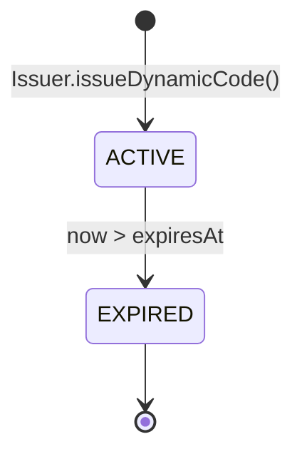
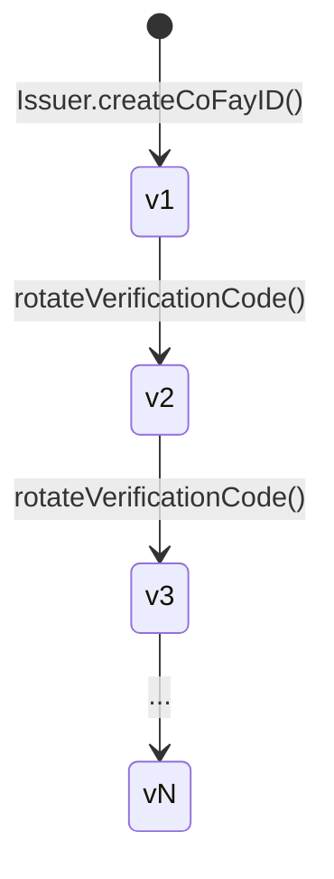
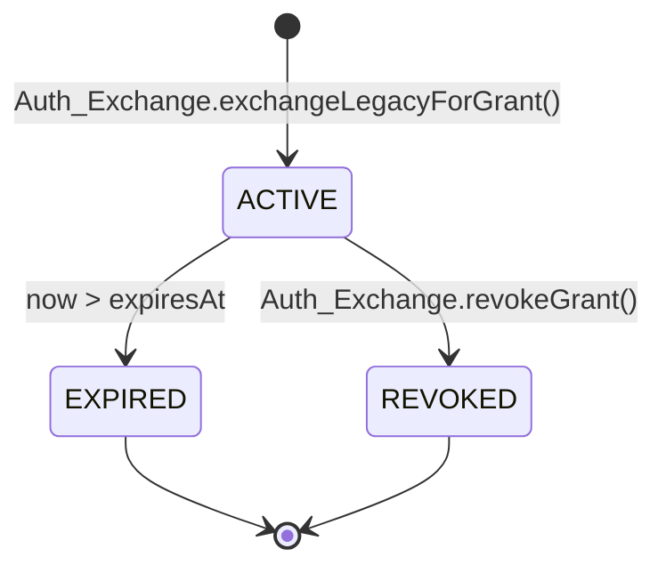
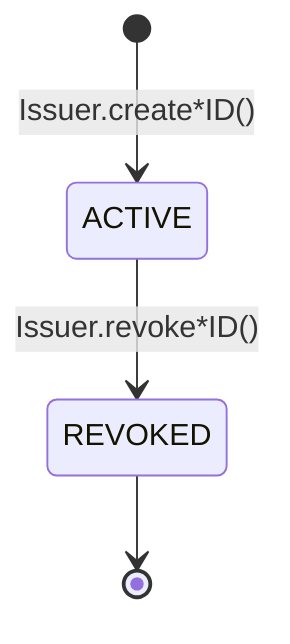

# 第 4 章 凭证与生命周期

本章描述 FayID 体系中四类凭证的产生方式、有效期规则、轮换机制与撤销语义。

---

## 凭证概览

FayID 体系中存在四类凭证，各自服务于不同目的：

| 凭证 | 用途 | 生命周期特征 |
| --- | --- | --- |
| **Mnemonic** | Human ID 私钥的人类可读备份 | 一次性返回，永不持久化 |
| **Dynamic Code** | 代替 Human ID 明文对外出示 | 有时效，过期后轮换 |
| **Verification Code** | 校验 coFay ID 持有者真实性 | 可被归属主体主动轮换 |
| **Authorization Grant** | FayID 兑换传统鉴权后获得的访问凭据 | 有时效，可被主动撤销 |

---

## Mnemonic（助记词）

### 产生

- 当自然人创建 Human ID 时，Issuer 同时生成一份 Mnemonic
- Mnemonic 仅在生成时刻返回给该自然人**一次**
- Issuer **不在任何持久化存储中保留** Mnemonic 明文

### 确定性派生

- 同一份 Mnemonic 重新输入时，系统必须派生出与原 Human ID 完全一致的 Human ID
- 这是 Human ID 恢复的唯一途径

### 安全约束

- Mnemonic 不得出现在任何日志、审计输出或出站载荷中
- 派生 Dynamic Code 时**不要求**持有者出示 Mnemonic 明文

> Mnemonic 是 FayID 体系中安全等级最高的秘密材料。一旦丢失，Human ID 将无法恢复。

---

## Dynamic Code（动态码）

### 产生

- Human ID 持有者请求时，Issuer 基于该 Human ID 派生一个明文 Dynamic Code
- 每个 Dynamic Code 附带一个明确的有效期截止时间（expiresAt）
- 派生过程不要求 Mnemonic 明文，仅需所有权证明

### 有效期与解析

- 在有效期内，Resolver 可将 Dynamic Code 解析回唯一对应的 Human ID
- 超过有效期后，Resolver 拒绝解析并返回 `DYNAMIC_CODE_EXPIRED`

### 轮换

- 每次生成的 Dynamic Code 与上一次**不相同**（不可碰撞）
- 不同次生成的 Dynamic Code 之间**不可关联**——外部观察者无法判断两个 Dynamic Code 是否出自同一 Human ID

### 安全性质

- 不可从 Dynamic Code 字面量反推 Human ID 的私钥或 Mnemonic
- Dynamic Code 可在日志中记录（与 Human ID 明文不同）

### 状态图

> Dynamic Code 只有两个状态：有效（ACTIVE）与过期（EXPIRED）。不存在反向迁移。

---

## Verification Code（验证码）

### 产生

- 当 coFay ID 创建成功时，Issuer 同时签发一个与该 coFay ID 一一对应的 Verification Code

### 校验

- 验证方输入 (coFay ID, Verification Code) 对，Resolver 返回校验通过或失败
- 连续多次校验失败时，Resolver 限制该 coFay ID 的校验请求频率（`VERIFICATION_RATE_LIMITED`）

### 轮换

- coFay ID 的归属主体可请求轮换 Verification Code
- 轮换后，旧的 Verification Code **立即失效**
- 版本号单调递增，Resolver 仅接受最新版本

### 版本演化

> 轮换是瞬时操作：新版本生效的同时，旧版本立即被 Resolver 拒绝。

---

## Authorization Grant（授权凭据）

### 产生

- 用户向 Auth Exchange 提交传统鉴权凭据 + 目标 FayID（iFay ID 或 Human ID）
- 传统凭据校验通过后，Auth Exchange 向目标 FayID 颁发一个 Authorization Grant
- Grant 携带明确的过期时间（expiresAt）

### 有效期

- 在有效期内，出示 Grant 等效于原始传统鉴权凭据
- 超过过期时间后，Auth Exchange 拒绝该 Grant（`GRANT_EXPIRED`）

### 撤销

- Grant 持有者可主动撤销
- 撤销后，Auth Exchange 在后续校验中立即拒绝（`GRANT_REVOKED`）
- 撤销是终态，不可恢复

### 与已撤销 ID 的交互

- 若目标 FayID（iFay ID 或 coFay ID）已被撤销，Auth Exchange 拒绝为其颁发新 Grant（`IDENTITY_REVOKED`）

### 状态图

> EXPIRED 与 REVOKED 都是终态。一旦进入终态，Grant 永远不会再变为 ACTIVE。

---

## Identity 生命周期（iFay ID / coFay ID）

iFay ID 与 coFay ID 共享相同的生命周期模型：

关键规则：

- **撤销不可逆**：一旦标记为 REVOKED，不支持"取消撤销"
- **撤销后果**：Resolver 在解析时附带返回撤销标志；Auth Exchange 拒绝为已撤销 ID 颁发新 Grant
- **Human ID 不撤销**：当前协议层 Human ID 不进入 REVOKED 状态（Mnemonic 泄露后的补救路径为 Open Question）

> 撤销是一个单调操作。任何"恢复"都必须通过新签发实体完成，而不是逆转旧实体的状态。
