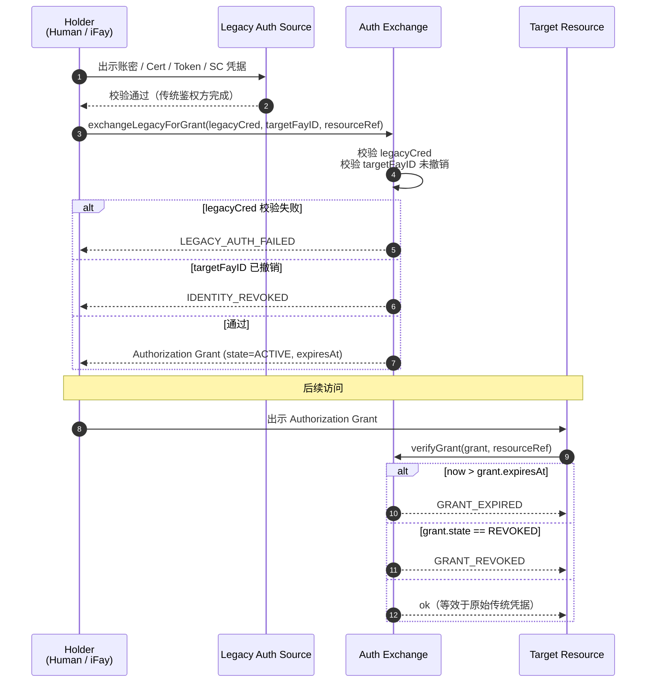
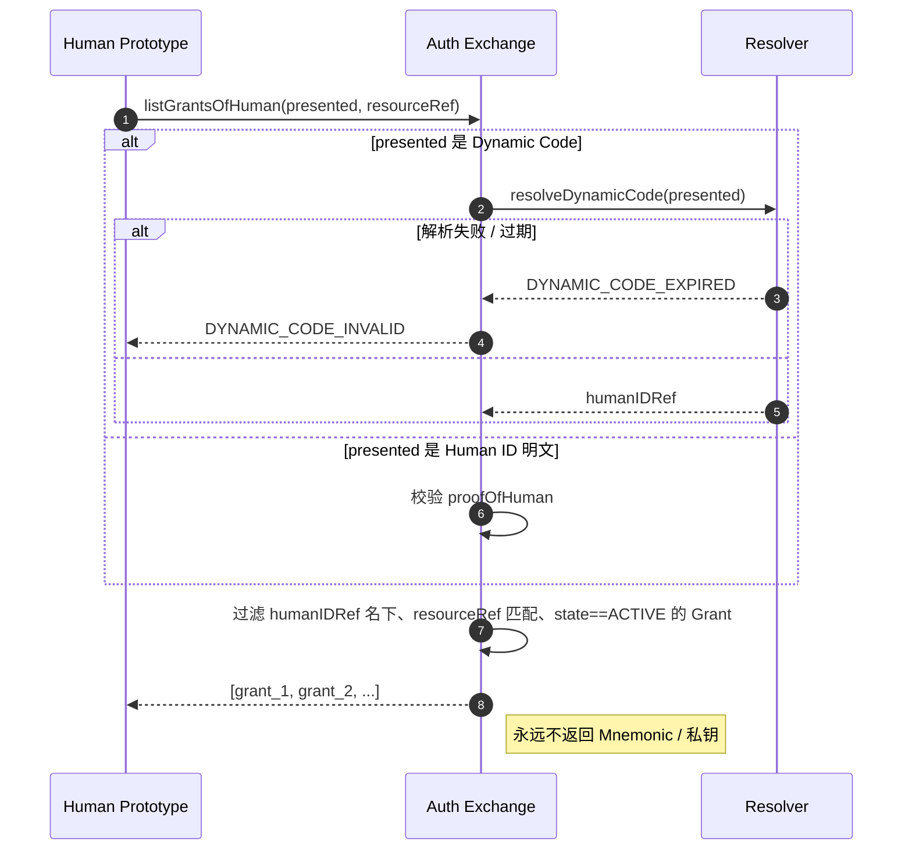
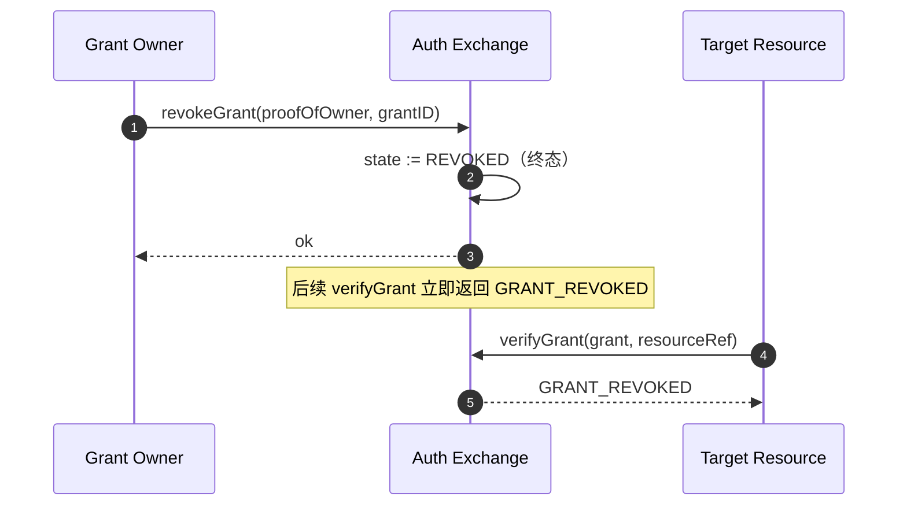

# 第 5 章 鉴权兑换

本章描述 FayID 如何与传统鉴权方式互通：把账密、Certificate、Authorization、Access Token、Smart Contract 等传统凭据兑换为 Authorization Grant，从而让用户只需出示 FayID（或其动态码）即可访问多种受保护资源。

---

## 设计动机

传统互联网中，一个人往往需要为不同系统维护大量独立的鉴权票据。FayID 提供了一个**统一的兑换层**：用户向 Auth Exchange 提交一次传统鉴权凭据，即可获得一份绑定到 FayID 的 Authorization Grant；此后访问目标资源时，只需出示 Grant 即可，不再需要每次重新走传统鉴权。

> 一句话：FayID 是"票据聚合器"——一个 Human ID 名下可同时持有来自不同系统的多份有效 Grant。

---

## 五类传统鉴权来源

Auth Exchange 支持以下五类传统鉴权凭据：

| 来源类型 | 说明 |
| --- | --- |
| **PASSWORD** | 账号 / 密码 |
| **CERTIFICATE** | 数字证书（如 X.509） |
| **AUTHORIZATION** | OAuth 等授权令牌 |
| **ACCESS_TOKEN** | API Access Token |
| **SMART_CONTRACT** | 智能合约凭据 |

每份 Authorization Grant 在元数据中记录其 `legacySourceKind`，标明该 Grant 是从哪类来源兑换而来。

---

## 兑换流程

### 基本流程



### 关键规则

- **目标 FayID 可以是 iFay ID 或 Human ID**：协议层允许两种 target，使数字人格与自然人都能持票
- **Grant 必须携带过期时间**：`expiresAt` 是显式字段，不允许永不过期
- **撤销支持**：Grant 可被持有者主动撤销，撤销后立即失效
- **等效性**：在有效期内，出示 Grant 等效于出示原始传统鉴权凭据

---

## Human ID 单点持票

### 设计目的

让自然人用户只需记忆 Human ID（或其动态码）即可换出名下所有 Grant，不再为每个系统单独管理票据。

### 流程图



### 关键规则

- **支持 Dynamic Code 出示**：用户可用动态码代替 Human ID 明文，避免暴露根身份
- **Dynamic Code 失败处理**：动态码解析失败或过期时，返回 `DYNAMIC_CODE_INVALID`
- **永不返回敏感材料**：Auth Exchange 不向调用方返回任何 Human ID 的 Mnemonic 或私钥
- **结果是过滤集**：返回该 Human ID 名下、匹配 resourceRef、状态为 ACTIVE 的 Grant 列表

---

## 撤销协议

### 流程图



### 关键规则

- **撤销是终态**：一旦进入 REVOKED 状态，不可恢复
- **立即生效**：撤销后，所有后续 `verifyGrant` 调用都立即返回 `GRANT_REVOKED`
- **需要所有权证明**：撤销请求必须携带 proofOfOwner

---

## resourceRef 命名空间

每份 Authorization Grant 通过 `resourceRef` 字段标识它保护的目标资源。

### 建议格式

```
resourceRef := "<scheme>://<authority>/<path>"
scheme      := "http" | "https" | "smartcontract" | "rpc" | "fayid" | <impl-defined>
```

### 约束

- `resourceRef` 是可比较的不透明字符串
- 具体语法由实现决定，但 **不得包含** Human ID 明文
- 跨实现互操作时，建议遵循 URI 标准

---

## 与撤销 ID 的交互

| 场景 | Auth Exchange 行为 |
| --- | --- |
| 目标 FayID（iFay ID / coFay ID）已撤销 | 拒绝颁发新 Grant，返回 `IDENTITY_REVOKED` |
| Grant 已撤销 | 后续校验返回 `GRANT_REVOKED` |
| Grant 已过期 | 后续校验返回 `GRANT_EXPIRED` |
| 传统鉴权凭据校验失败 | 拒绝颁发，返回 `LEGACY_AUTH_FAILED` |

> 详细的错误码语义见 design.md 的"Error Handling"章节。
