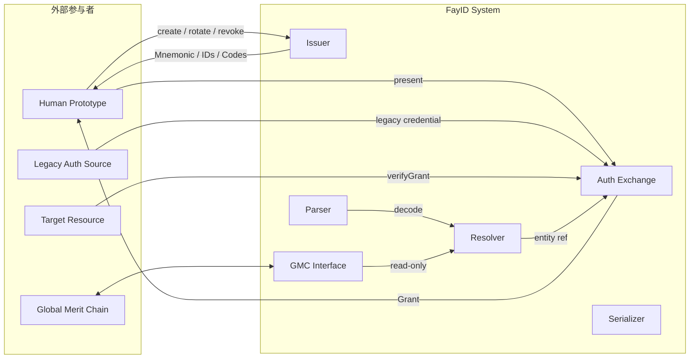
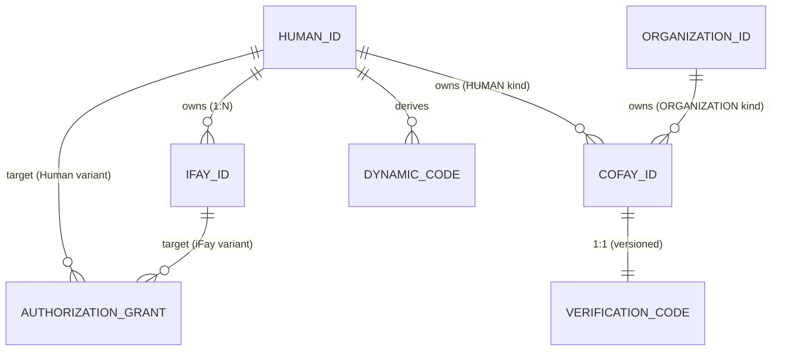
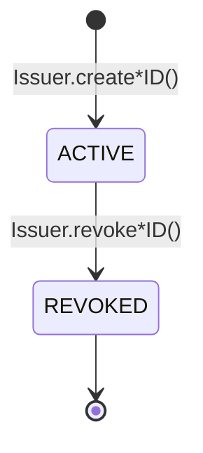
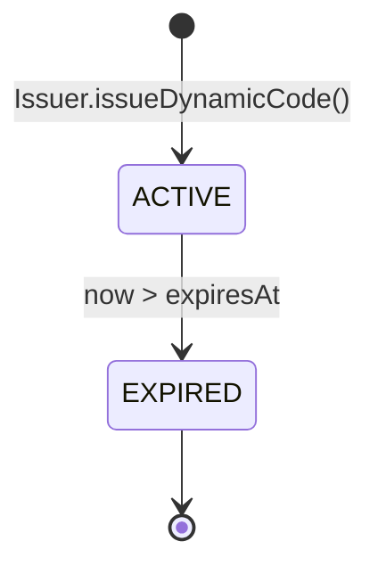
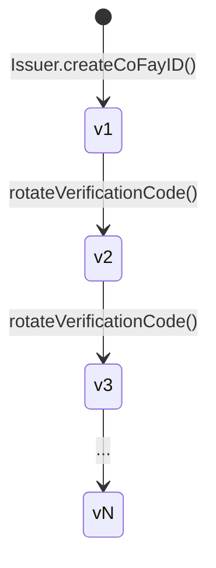
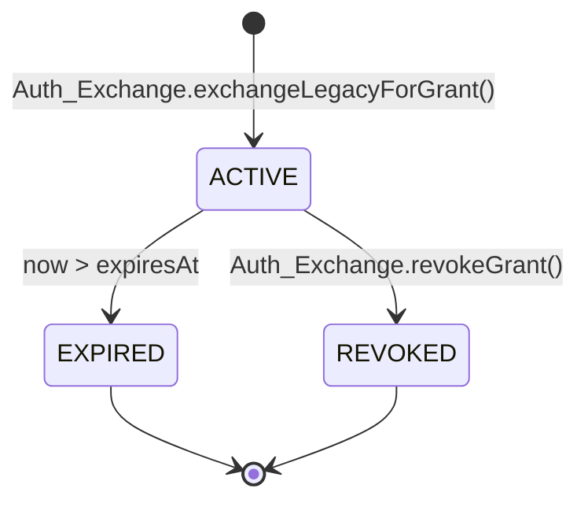

# FayID 身份协议规范（Draft）

**协议版本**：`fayid/1.0`（线格式可见；见 §1.4）
**文档状态**：`Draft`（front matter `status`；不进线格式）
**编辑版次**：`2025-10-25`（front matter `date` / 发布目录锚点；不进线格式）
**适用范围**：iFay 生态全部参与者；FayID 体系内的标识、绑定、鉴权兑换与隐私边界

> 版本编号、协商与兼容性规则的**权威定义见 §1.4「版本管理与兼容性」**（Normative）。本头部与 front matter 仅为该节规则的展示，规则冲突时以 §1.4 为准。

> 本文档是 FayID 身份协议的正式规范草案，描述协议层的实体、字符串编码、密码学派生、状态机、接口契约与错误语义。具体业务背景与设计动机见 [蓝图（Blueprint）](../../blueprint/01-引言.md)。

---

## Abstract

FayID 协议为 iFay 生态定义统一身份基础设施。它规定了四类标识（Human ID、iFay ID、coFay ID、Organization ID）的生成、绑定与归属语义；两类衍生凭证（Dynamic Code、Verification Code）的派生与轮换语义；一类鉴权兑换凭据（Authorization Grant）的颁发、校验、撤销语义；以及与 Global Merit Chain 的接口边界。

协议层规定"什么"——数据形状、状态、不变量、错误码——并为 v1 互操作面固定最小密码学与规范化序列化 profile。存储介质、部署形态、传输协议与 SDK 绑定留待实现侧 spec 决定，并通过版本化命名（如 `fayid/dyn/v1`）保证未来可升级。

## Status of This Document

本文档为 FayID 协议的 **Working Draft**（front matter `status: Draft`）。在 `docs/zh-CN/specification/draft/` 目录下迭代，正式发布版本将冻结到带日期戳的目录（首个目标版本 `2025-10-25`）。

Draft 状态下的章节、字段、错误码均可能变更。仅当本文档移入 `2025-10-25/` 目录并将 `status` 置为 `Final` 后，其内容方为稳定的 v1 协议表面。

> 文档状态（`Draft / Final / Deprecated / Obsolete`）、编辑版次与协议版本的完整语义、协商与兼容性规则，权威定义见 §1.4「版本管理与兼容性」（Normative）。

---

## 1. Introduction

### 1.1 文档目标

本文档对 FayID 身份协议给出可由独立实现复现的规范级描述。它面向：

- 实现 FayID 体系的 SDK / 库 / 服务的开发者
- 与 FayID 集成的目标资源（Target Resource）的运行方
- 审计 FayID 实现密码学与隐私性质的安全研究者
- Global Merit Chain 的集成方

### 1.2 文档范围

本文档涵盖：

- 协议版本编号、版本协商与兼容性规则（§1.4）
- 实体的字段、字符串表示、唯一性约束（§4、§5）
- 密码学原语的 v1 基线算法与抽象性质（§6）
- 实体与凭据的状态机（§7）
- Issuer / Resolver / Auth Exchange / GMC Interface 的方法签名与错误语义（§8、§9、§10）
- 隐私层硬约束（§11）
- 一致性要求（§12）

本文档**不涵盖**：

- 具体存储介质、传输协议、通用载荷序列化格式（如 JSON / CBOR / Protobuf；Grant 签名规范化输入除外，见 §6.6）
- 用户界面、密钥托管、多端同步
- Global Merit Chain 自身的内部结构
- SDK 的具体编程语言绑定

### 1.3 规范关系

- 本协议引用 [BIP-39] 作为 v1 Mnemonic 编码方案。
- 本协议引用 [RFC 5869] 作为 v1 HKDF 实例化。
- 本协议引用 [RFC 8032] (Ed25519) 作为 v1 签名曲线。
- 本协议引用 [RFC 4648] (Base32) 作为 v1 字符串编码。

> 上述引用构成 v1 基线 profile。实现可在后续版本替换为同等或更高安全级别的替代品，但需通过版本化标签（如 `v2`）声明替换。

---

### 1.4 版本管理与兼容性（Normative）

本节为 FayID 协议版本编号、协商与兼容性规则的**唯一权威来源**（single source of truth）。本文档其它位置（front matter、文档头部、变更日志）对版本的任何描述均为本节规则的展示；若有冲突，以本节为准。本节与 iFay 生态其它姐妹协议（如 Faying Protocol）的版本管理规则保持一致。

本节标注为 **Normative**，§1.4.1–§1.4.3、§1.4.5 中的 RFC 2119 关键词具有规范性含义；§1.4.4（编辑版次与勘误）中除明确标注的硬约束外为对治理流程的 Non-normative 约束。

#### 1.4.1 三条正交的版本轴

FayID 的版本信息由**三条正交的轴**构成，MUST NOT 被合并为单一编号：

1. **协议版本（互操作契约）**：形如 `fayid/MAJOR.MINOR`，只有两级，**不设 PATCH**。它是唯一描述互操作契约的轴，也是唯一进入线格式的轴。
2. **文档状态（生命周期）**：枚举 `Draft / Final / Deprecated / Obsolete`，记录在 front matter 的 `status` 字段。
3. **编辑版次（勘误与澄清）**：以发布日期为锚点（如 `2025-10-25`），记录在 front matter 的 `date` 字段与发布目录名。

**核心约束（MUST）**：只有「协议版本 `MAJOR.MINOR`」进入线格式（信封 `version` 字段、schema 文件名）。文档状态与编辑版次 MUST NOT 进入线格式；对端 MUST NOT 依据文档状态或编辑版次改变报文处理行为。

#### 1.4.2 `MAJOR.MINOR` 语义

- **MAJOR**：破坏互操作的变更。包括但不限于：改变权威 schema 字段语义、删除报文或错误码、重定义错误码、改变状态机的吸收态（终态）。MAJOR 进位时 MINOR MUST 归零。不同 MAJOR 之间 **MUST NOT** 假设互操作。
- **MINOR**：向后兼容的增补。包括但不限于：新增可选字段、新增报文或错误码、新增参数、新增属性。MINOR 自增；同一 MAJOR 内较高的 MINOR **MUST** 向下兼容到 `MAJOR.0`。

**判据（MUST 据此分类）**：
- 改动是否会让一个严格按旧版实现的对端**拒绝或误解**新报文？是 → **MAJOR**。
- 否，但**增加了线格式可见的内容**（字段 / 报文 / 错误码 / 参数）？→ **MINOR**。
- 只改动文字、不改动线格式？→ **不动协议版本**，走编辑版次（§1.4.4）。

#### 1.4.3 版本协商与兼容性规则（Normative）

- 通信双方 MUST 在握手 / 引导阶段各自声明所支持的协议版本集合。
- **同 MAJOR**：双方 MUST 取共同支持的**最高 MINOR**；较高 MINOR 的一方 **MUST** 能服务较低 MINOR 的对端。
- **跨 MAJOR**：MUST NOT 协商，MUST 直接以协议错误拒绝，MUST NOT 做「尽力而为」降级。
- 收到**同 MAJOR、更高 MINOR** 的报文：接收方 MUST 按自身最高 MINOR 解读，并 MUST 忽略不认识的可选字段，MUST NOT 因存在未知可选字段而拒绝。
- 版本滚动升级 **MUST NOT** 使既有的、未过期的凭据 / 令牌（如 Authorization Grant、Dynamic Code）失效。
- 若协议已有算法套件协商（见 §6 的 `fayid/*/vN` profile 标签），版本协商 MUST 复用同一口径：各自声明、取共同最高。

#### 1.4.4 编辑版次与勘误

- 定稿后的**纯文字勘误**（typo、补充示例、澄清、修复链接）MUST NOT 改变协议版本号；以新的发布日期目录承载，协议版本不变。
- 编辑版次迁移 SHOULD 在变更日志中以 `Editorial` 类目登记，并在 front matter 以 `edition` 字段标注。
- **硬约束（MUST）**：编辑版次只允许 Non-normative 改动。任何触及线格式语义的修改 MUST 升 MINOR 或 MAJOR，MUST NOT 伪装成勘误发布。

#### 1.4.5 版本号落点与标准执行者注意事项

**落点表**：

| 落点 | 承载内容 | 是否线格式语义 |
| --- | --- | --- |
| 线信封 `version` 字段 | 仅 `MAJOR.MINOR`（如 `fayid/1.0`） | 是 |
| schema 文件名 | 跟随 `MAJOR.MINOR`；**不**随编辑版次改名（保持引用稳定） | 是 |
| `content-type` | 标识协议族；`version=` 参数仅作网关路由便利 | 否（路由便利，非线格式语义） |
| front matter `status` / `date` / `edition` | 文档治理标记 | 否 |
| git tag | `fayid-v<MAJOR.MINOR>-<状态>`；tag MUST 同时覆盖正文 + 测试向量 + schema | 否 |

**执行者必读清单**：

- 判断互操作**只看协议版本** `MAJOR.MINOR`，不看文档状态与编辑版次。
- 同一 MAJOR 内**必须向下兼容**到 `MAJOR.0`。
- **别把勘误当升级**：纯文字勘误不改版本号。
- **别依赖 schema 文件名编码编辑版次**：文件名只随 `MAJOR.MINOR` 变化。
- `Draft` 期间**无任何兼容性承诺**：字段、错误码、状态机均可能变更。

> **目录与定稿流程**：文档状态如何映射到目录、`Draft → Final` 的标准动作（`git mv`、`status` 迁移、打 tag 等）见 Appendix B（信息性）。状态流转只改 front matter，目录永不挪动。

> **变更日志说明**：本协议当前无独立变更日志。未来引入变更日志时，其中关于版本号的说明 MUST 指向本节（§1.4）作为权威规则，MUST NOT 重复定义版本语义，仅保留与 changelog 条目相关的归类（如 `MAJOR` / `MINOR` / `Editorial`）说明。

---

## 2. Conventions and Terminology

### 2.1 RFC 2119 关键词

本文档中的关键词 **MUST**、**MUST NOT**、**REQUIRED**、**SHALL**、**SHALL NOT**、**SHOULD**、**SHOULD NOT**、**RECOMMENDED**、**MAY**、**OPTIONAL** 按 [RFC 2119]、[RFC 8174] 解释，且仅在以全大写出现时具有规范性含义。

### 2.2 规范性 vs. 信息性

带有 RFC 2119 关键词的语句、伪 IDL、错误码定义、状态机均具有规范性。叙述性段落、注释、示例为信息性。

### 2.3 字面量表示

- 行内代码 `code` 表示实体字段、错误码常量、IDL 标识符。
- 三反引号代码块用于伪 IDL、密码学派生表达式、状态机伪代码、字符串模板。
- mermaid 块用于状态机与序列图，仅用作信息性插图。

---

## 3. Terminology

本节定义本规范中使用的全部术语。术语的非形式化扩展定义见 [蓝图第 2 章 术语表](../../blueprint/02-术语表.md)。

| 术语 | 定义 |
| --- | --- |
| **FayID System** | 实现本协议的逻辑组件集合，包括 Issuer、Resolver、Auth Exchange、GMC Interface、Serializer、Parser。 |
| **Human Prototype** | 与 Human ID 一一对应的真实自然人。 |
| **Human ID** | 自然人在 FayID 体系中的根身份标识。由密钥对派生，对应一份 Mnemonic。 |
| **iFay ID** | 一个数字人格的标识。每个 iFay ID 绑定到唯一的 Human ID。 |
| **coFay ID** | 公共角色的标识。每个 coFay ID 归属到唯一的 Human ID 或 Organization ID。 |
| **Organization ID** | 组织的标识。明文公开，不派生 Dynamic Code。 |
| **Mnemonic** | Human ID 私钥的人类可读备份；仅在生成时返回一次。 |
| **Dynamic Code** | 由 Human ID 派生的、有时效的明文字符串，用于代替 Human ID 在外部出现。 |
| **Verification Code** | 与 coFay ID 一一对应的验证码，用于校验 coFay ID 的持有者真实性。 |
| **Authorization Grant** | 经 Auth Exchange 颁发的、有时效的鉴权凭据。 |
| **Issuer** | 负责生成、轮换、撤销标识与凭证的逻辑组件。 |
| **Resolver** | 将明文凭证或 ID 字符串解析为内部实体的组件。 |
| **Auth Exchange** | 负责传统鉴权与 FayID 之间相互兑换的组件。 |
| **GMC Interface** | FayID System 与 Global Merit Chain 的边界组件，仅暴露只读方法。 |
| **OpaqueRef** | 由 Human ID 派生的稳定不可逆引用，用于在 Global Merit Chain 上指代自然人。 |
| **resourceRef** | Authorization Grant 中标识目标资源的字符串。 |
| **HumanIDProofRef** | 在接口中代表 Human ID 目标的受保护引用，MUST 通过 `proofOfTarget` 或 `proofOfHuman` 解析为内部 Human ID 引用，MUST NOT 是公共出站载荷中的 Human ID 明文字面量。 |
| **proofOfHuman** / **proofOfOwner** / **proofOfTarget** | 抽象的所有权证明（实现侧通常为签名挑战）。`proofOfTarget` 专用于证明 Authorization Grant 的目标主体由调用方控制。 |
| **LegacySubjectRef** | 传统鉴权来源返回的主体引用，用于把 `legacyCred` 的真实主体绑定到目标 FayID。 |
| **ProofChallenge** | FayID System 为所有权证明生成的一次性挑战，包含 nonce、audience、intent、subjectRef 与过期时间。 |
| **scopeMode** | Authorization Grant 的资源匹配模式，v1 取 `EXACT` 或 `PREFIX`。 |

---

## 4. Architecture

### 4.1 逻辑组件

FayID System MUST 至少在概念上分离以下逻辑组件，组件之间通过本规范定义的接口耦合：

- **Issuer**：唯一可生成、轮换、撤销标识与凭证的组件。
- **Resolver**：唯一可将明文 ID 字符串、Dynamic Code、(coFay ID, Verification Code) 对解析为内部实体引用的组件。
- **Auth Exchange**：唯一可在传统鉴权凭据与 Authorization Grant 之间互兑的组件。
- **GMC Interface**：唯一对 Global Merit Chain 暴露的边界组件。
- **Serializer / Parser**：负责实体与字符串之间的双向转换。

实现 MAY 将多个逻辑组件部署在同一进程；MUST NOT 让任何外部参与者绕过 GMC Interface 直接访问内部实体。

### 4.2 信任边界

- **强信任内部**：Issuer 与 Mnemonic / 私钥派生材料之间。Mnemonic MUST 仅在 Issuer 生成时刻沿一次性出站路径返回给 Human Prototype，MUST NOT 进入持久化存储。
- **半信任**：Resolver、Auth Exchange、GMC Interface 之间。它们可共享内部标识与归属图，但 MUST NOT 共享 Mnemonic / 私钥。
- **零信任外部**：第三方资源、Global Merit Chain、传统鉴权来源、可观测性后端。所有跨边界载荷 MUST 经 Serializer 规范化，并满足 §11 的隐私约束。

### 4.3 组件关系图（信息性）



---

## 5. Identifiers and Encoding

### 5.1 类型前缀表（规范性）

每类实体的字符串表示 MUST 以下表前缀开头。Parser MUST 通过前缀区分实体类型，且任意字符串至多匹配一个类型。

| 实体 | 前缀 | 最小熵（bits） | 字符集 | 公开使用 |
| --- | --- | --- | --- | --- |
| Human ID | `hid_` | 256 | base32-no-pad | **禁止**（隐私层约束，详见 §11） |
| iFay ID | `ifay_` | 192 | base32-no-pad | 允许 |
| coFay ID | `cofay_` | 192 | base32-no-pad | 允许 |
| Organization ID | `org_` | 不约束 | base32 + `[a-z0-9-]` | 允许（明文） |
| Dynamic Code | `dyn_` | 128（payload）+ 元数据 | base32-no-pad | 允许 |
| Verification Code | `vrf_` | 128 | base32-no-pad | 仅与 coFay ID 配对出现 |
| Authorization Grant | `grt_` | 128 | base32-no-pad | 允许 |
| OpaqueRef | `gmcref_` | 256 | base32-no-pad | 允许（仅作为不可逆引用） |

### 5.2 字符集与规范化

- 所有 FayID 字符串 MUST 使用 ASCII 安全字符集。RECOMMENDED 编码为 [RFC 4648] base32，去除填充字符 `=`，使用小写。
- Serializer MUST 输出小写形式。Parser MUST 在比较前对输入执行 `normalize`：
  ```
  normalize(s) :=
    lowercase(s)
    然后按前缀匹配
    然后校验该前缀允许的字符集白名单
    若任意步骤失败，返回错误 MALFORMED_FAYID_STRING
  ```
- Parser MUST 拒绝不属于任何已知前缀的字符串，并返回 `MALFORMED_FAYID_STRING`。
- Parser MUST 将任意非白名单字符、长度不足、长度超过实现声明上限的输入作为错误拒绝，MUST NOT 通过删除、替换或忽略字符来"修复"输入。
- Parser MUST NOT 将 `hid_` 字符串与 `dyn_` 字符串相互误认。

### 5.3 Round-trip 不变量

设 `serialize` 为 Serializer，`parse` 为 Parser，`E` 为合法实体集合，`S` 为合法字符串集合。本协议要求：

- **实体侧**：FOR ALL `e ∈ E`，`parse(serialize(e)) = Ok(e)`（Property P11）。
- **字符串侧**：FOR ALL `s ∈ S`，IF `parse(s) = Ok(e)`，THEN `serialize(e) = normalize(s)`（Property P12）。

### 5.4 字段结构（规范性）

每类实体在内部 MUST 至少携带下表字段。实现 MAY 扩展字段，但 MUST NOT 改变其语义。

#### 5.4.1 Human ID

| 字段 | 类型 | 约束 |
| --- | --- | --- |
| `id` | bytes | 由 §6.2 派生；全局唯一；MUST NOT 在出站载荷或日志中以明文出现 |
| `publicKey` | bytes | 与 `id` 一一对应 |
| `createdAt` | timestamp | 单调可比较 |

Human ID 的字符串表示由 §5.1 与 §5.2 规定。

#### 5.4.2 iFay ID

| 字段 | 类型 | 约束 |
| --- | --- | --- |
| `id` | bytes | 全局唯一 |
| `ownerHumanID` | Human ID 引用 | 多对一；不可变更 |
| `createdAt` | timestamp | |
| `revoked` | bool | 单调；一旦为 true 不可逆 |

#### 5.4.3 coFay ID

| 字段 | 类型 | 约束 |
| --- | --- | --- |
| `id` | bytes | 全局唯一 |
| `ownerKind` | enum | `HUMAN` 或 `ORGANIZATION` |
| `ownerRef` | Human ID 引用 或 Organization ID 引用 | 由 `ownerKind` 决定指向；任意时刻仅一个归属主体 |
| `verificationCode` | bytes | 与 `id` 一一对应 |
| `verificationCodeVersion` | uint64 | 单调递增；初始为 1 |
| `createdAt` | timestamp | |
| `revoked` | bool | 单调 |

#### 5.4.4 Organization ID

| 字段 | 类型 | 约束 |
| --- | --- | --- |
| `id` | string | 明文；全局唯一 |
| `displayName` | string | 可选；信息性 |
| `createdAt` | timestamp | |

Organization ID **MUST NOT** 派生 Dynamic Code。

#### 5.4.5 Dynamic Code

| 字段 | 类型 | 约束 |
| --- | --- | --- |
| `code` | string | 由 §6.3 派生；可在出站载荷明文传输 |
| `humanIDRef` | 内部引用 | 仅 Resolver 内部可见；MUST NOT 下发给调用方 |
| `issuedAt` | timestamp | |
| `expiresAt` | timestamp | MUST 显式存在；MUST > `issuedAt` |
| `nonce` | bytes | 每次新生成；至少 64 bit 熵 |
| `lookupKey` | bytes | `SHA-256(code)`；仅用于 Resolver 查表；MUST NOT 出站 |

#### 5.4.6 Verification Code

| 字段 | 类型 | 约束 |
| --- | --- | --- |
| `code` | bytes | 由 §6.4 派生 |
| `cofayIDRef` | 内部引用 | |
| `version` | uint64 | 单调递增；轮换后旧版本立即失效 |
| `issuedAt` | timestamp | |

#### 5.4.7 Authorization Grant

| 字段 | 类型 | 约束 |
| --- | --- | --- |
| `grantID` | bytes | 全局唯一 |
| `targetFayID` | iFay ID 引用 或 Human ID 引用 | v1 不支持 coFay ID 作为 Grant target |
| `legacySubjectRef` | LegacySubjectRef | 传统鉴权来源校验后返回的主体引用 |
| `legacySourceKind` | enum | `PASSWORD` / `CERTIFICATE` / `AUTHORIZATION` / `ACCESS_TOKEN` / `SMART_CONTRACT` |
| `legacyTrustLevel` | enum | `LOW` / `MEDIUM` / `HIGH`；由 §10.3 派生 |
| `resourceRef` | string | 见 §10.1 |
| `scopeMode` | enum | `EXACT` / `PREFIX`；默认 `EXACT` |
| `issuedAt` | timestamp | |
| `expiresAt` | timestamp | MUST 显式存在；MUST > `issuedAt` |
| `signature` | bytes | 由 Auth Exchange 签发，MUST 可被独立校验 |
| `statusVersion` | uint64 | 状态库版本；每次撤销或目标 ID 撤销后单调递增 |
| `state` | enum | `ACTIVE` / `EXPIRED` / `REVOKED`；派生状态，不属于离线签名 token 的可信字段 |

### 5.5 实体关系（信息性）



---

## 6. Cryptographic Primitives

本节给出 v1 基线密码学原语。声明兼容 `fayid/*/v1` 的实现 MUST 实现 §6.1 的算法套件与 §6.6 的规范化签名输入，以保证跨实现互操作。未来版本 MAY 替换算法，但替换品 MUST 满足列出的抽象性质，并通过版本标签（如 `fayid/dyn/v2`）声明；替换后不得仍声称其输出属于 v1 字符串版本。

### 6.1 v1 算法清单

| 用途 | v1 基线算法 | 未来版本替换允许的最低安全等级 |
| --- | --- | --- |
| Mnemonic 编码 | [BIP-39] 256-bit 熵 | ≥ 256 bit 熵的等价方案 |
| Mnemonic → Seed | PBKDF2-HMAC-SHA512, 2048 iterations, salt = `"fayid"` | 任意强 KDF，输出 ≥ 512 bit |
| Seed → Keypair | Ed25519 ([RFC 8032]) | 抗碰撞签名曲线，安全等级 ≥ 128 bit |
| KDF | HKDF-SHA256 ([RFC 5869]) | 抗碰撞 KDF，输出可变长 |
| Hash | SHA-256 | 抗碰撞哈希，输出 ≥ 256 bit |
| 字符串编码 | base32-no-pad ([RFC 4648]) | ASCII 安全、固定字典 |

### 6.2 Human ID 派生

```
mnemonic := BIP-39 256-bit 熵
seed     := PBKDF2-HMAC-SHA512(mnemonic, salt = "fayid", iterations = 2048, dkLen = 64)
keypair  := Ed25519.from_seed(truncate(seed, 32))
humanID.id        := SHA-256(keypair.publicKey)        // 256 bit
humanID.publicKey := keypair.publicKey
```

抽象性质（规范性）：

- **确定性**：FOR ALL `m ∈ Mnemonic`，`derive(m)` 在多次调用下产生相同的 `humanID`（Property P2）。
- **不可反推**：仅给定 `humanID.id` 时，恢复 `mnemonic` 或 `keypair.privateKey` 在多项式时间内 MUST 不可行。
- **熵阈值**：若熵源不足以满足 v1 算法要求，Issuer MUST 拒绝生成并返回 `INSUFFICIENT_ENTROPY`。

### 6.3 Dynamic Code 派生

```
deriveSecret(humanID) := HKDF-SHA256(
  ikm   = issuer_master_secret,
  salt  = humanID.id,
  info  = "fayid/derive_secret/v1",
  length = 32 bytes
)

dynamicCode.code := encode(
  prefix  = "dyn_",
  payload = HKDF-SHA256(
    ikm   = deriveSecret(humanID),
    salt  = nonce,                    // 每次新生成，≥ 64 bit
    info  = "fayid/dyn/v1" || timeWindow,
    length = 16 bytes
  ),
  meta    = { issuedAt, expiresAt, nonce }
)

dynamicCode.lookupKey := SHA-256(dynamicCode.code)
```

抽象性质（规范性）：

- **不可关联性**：FOR ALL `humanID`，FOR ALL 两次调用 `issueDynamicCode(humanID)` 产生的 `dc1`、`dc2`，外部观察者在不持有 `deriveSecret(humanID)` 时，区分 `dc1`、`dc2` 是否同源 MUST 不优于随机猜测（Property P9 的密码学基础）。
- **可解析性**：FOR ALL 有效期内的 `dc = issueDynamicCode(humanID)`，Resolver MUST 能将 `dc` 解析回 `humanID`（Property P3）。
- **时窗约束**：当 `now > dc.expiresAt`，Resolver MUST 拒绝并返回 `DYNAMIC_CODE_EXPIRED`。
- **不要求 Mnemonic**：派生过程 MUST 仅依赖 `issuer_master_secret` 与 `humanID.id`，MUST NOT 要求 Human Prototype 出示 Mnemonic 明文。
- **索引模型**：v1 Dynamic Code 是服务端索引型 token。Issuer MUST 在签发时把 `{ lookupKey, humanIDRef, issuedAt, expiresAt, nonce }` 写入 Resolver 可访问的短期索引。Resolver MUST 通过 `SHA-256(dynamicCode.code)` 查找该索引；MUST NOT 通过扫描全部 Human ID 来解析 Dynamic Code。
- **索引过期**：当 `now > expiresAt`，Resolver MUST 拒绝解析；实现 SHOULD 删除或归档对应索引项，归档内容 MUST 不包含 Dynamic Code 明文。
- **碰撞处理**：若新生成的 `lookupKey` 已存在且未过期，Issuer MUST 重新生成 `nonce` 并重新派生；若连续 3 次仍无法生成唯一项，MUST 拒绝签发并返回 `DYNAMIC_CODE_INVALID`。
- **默认 TTL**：v1 Dynamic Code 的默认 TTL MUST NOT 超过 10 分钟。实现 MAY 配置更短 TTL；若配置超过 10 分钟，MUST 使用新的 profile 名称，MUST NOT 声称符合 v1 baseline。
- **索引一致性**：多实例部署时，Dynamic Code 索引 MUST 在签发成功前对所有可接收解析请求的 Resolver 可见，或请求路由 MUST 保证解析落到持有该索引的 Resolver。索引不可用时 Resolver MUST fail closed，返回 `DYNAMIC_CODE_INVALID`。
- **存储保护**：Dynamic Code 索引 MUST 只存储 `lookupKey`，MUST NOT 存储 Dynamic Code 明文字面量。`lookupKey` 存储 SHOULD 使用带服务端密钥的 `HMAC-SHA256(dynamic_code_index_secret, code)`；若使用裸 `SHA-256(code)`，索引存储 MUST 被视为敏感数据并加密保存。

### 6.4 Verification Code 派生

```
verificationCode_v.code := encode(
  prefix  = "vrf_",
  payload = HKDF-SHA256(
    ikm   = issuer_master_secret,
    salt  = cofayID.id || encode_uint64(version),
    info  = "fayid/vrf/v1",
    length = 16 bytes
  )
)
```

抽象性质：

- 每次 `rotateVerificationCode(cofayID)` MUST `version := version + 1`。
- 当 `verifyCoFayCode(cofayID, code)` 被调用时，Resolver MUST 仅当 `code` 等于当前最新 `version` 派生的 `code` 时返回成功；任何更早 version 的 `code` MUST 被拒绝（Property P5）。

### 6.5 GMC opaqueRef 派生

```
opaqueRef := encode(
  prefix  = "gmcref_",
  payload = HKDF-SHA256(
    ikm   = gmc_namespace_secret,
    salt  = humanID.id,
    info  = "fayid/gmc/v1",
    length = 32 bytes
  )
)
```

抽象性质（规范性）：

- **稳定性**：FOR ALL `humanID`，多次调用 `gmcDeriveOpaqueRef(humanID)` MUST 返回相等结果（Property P10）。
- **抗碰撞**：FOR ALL `h1 ≠ h2`，`gmcDeriveOpaqueRef(h1) ≠ gmcDeriveOpaqueRef(h2)`（除可忽略碰撞概率）。
- **不可反推**：在不持有 `gmc_namespace_secret` 的前提下，从 `opaqueRef` 反推 `humanID` MUST 不可行。
- **不可关联**：opaqueRef 与 Dynamic Code 的派生 MUST NOT 共享密钥材料，使二者在外部观察者视角不可关联。

### 6.6 Authorization Grant 签名与状态

Authorization Grant 的 `signature` 字段 MUST 由 Auth Exchange 用其专属签名密钥对下列字段的规范化序列化字节签名：

```
grantSignedPayload := (
  grantID,
  targetFayID,
  legacySubjectRef,
  legacySourceKind,
  legacyTrustLevel,
  resourceRef,
  scopeMode,
  issuedAt,
  expiresAt,
  statusVersion
)
```

Authorization Grant 的签名只证明 token 本身由 Auth Exchange 签发且未被篡改；它 **MUST NOT** 单独证明 Grant 当前未被撤销。`state` 是 Auth Exchange 状态库或状态证明派生出的运行时状态，不是调用方可自行修改并重新提交的可信字段。

Target Resource 在 v1 中有两种合规校验模式：

- **在线校验模式（REQUIRED）**：Target Resource 调用 `verifyGrant`，由 Auth Exchange 校验签名、过期时间、撤销状态、目标 ID 状态与 `resourceRef`。任何声明符合 v1 的实现 MUST 支持该模式。
- **离线预检模式（OPTIONAL）**：Target Resource MAY 使用 Auth Exchange 公钥离线校验 `signature` 与 `expiresAt`，但离线预检结果只能作为"格式与签名有效"判断，MUST NOT 被解释为"未撤销"。需要离线授权的实现 MUST 额外定义短 TTL 与撤销状态列表 / 状态证明机制；该机制不在 v1 基线内。

签名算法 v1 使用 [RFC 8032] Ed25519。签名前的规范化序列化 v1 MUST 使用 UTF-8 JSON Canonicalization Scheme（JCS，[RFC 8785]；对象键按字典序排序、无额外空白、整数使用十进制字符串或 JSON number 的最短形式）。实现若选择 CBOR / Protobuf 等其他 canonical bytes，MUST 使用新的签名版本标签，MUST NOT 标记为 `fayid/grant/v1`。

---

## 7. Lifecycle and State Machines

### 7.1 Identity 生命周期（iFay ID / coFay ID）



规范性约束：

- 状态空间 MUST 仅为 `{ ACTIVE, REVOKED }`。
- 状态迁移 MUST 单调：从 `REVOKED` 到 `ACTIVE` 的反向迁移 MUST 不被支持（Property P8）。
- 当 iFay ID 处于 `REVOKED` 状态：Resolver MUST 在解析结果中附带 `revoked = true`；Auth Exchange MUST 拒绝以该 ID 为 `targetFayID` 颁发新 Grant，返回 `IDENTITY_REVOKED`。
- v1 Authorization Grant 的 `targetFayID` 仅允许 Human ID 或 iFay ID。coFay ID 处于 `REVOKED` 状态时，Resolver MUST 在解析结果中附带 `revoked = true`，但 Auth Exchange v1 不以 coFay ID 为 Grant target。

### 7.2 Human ID 生命周期

Human ID 在协议 v1 层 **MUST NOT** 进入 `REVOKED` 状态。Mnemonic 泄露后的补救路径作为 Open Issue（§13）。

### 7.3 Dynamic Code 生命周期



规范性约束：

- 当 `now > expiresAt`，Resolver MUST 立即视为 `EXPIRED` 并返回 `DYNAMIC_CODE_EXPIRED`。
- `EXPIRED → ACTIVE` 反向迁移 MUST 不被支持。

### 7.4 Verification Code 版本演化



规范性约束：

- `version` MUST 单调递增。
- 任意时刻，仅最新 `version` 对应的 `code` 是有效的；旧 `version` MUST 被 Resolver 立即拒绝。

### 7.5 Authorization Grant 生命周期



规范性约束（Property P6）：

```
verifyGrant(g, ref) = Ok(true)
  ⇔ now ≤ g.expiresAt
  ∧ currentState(g.grantID) = ACTIVE
  ∧ matches(g.resourceRef, ref, g.scopeMode)
  ∧ verifySignature(g.signature, g.signedPayload)
  ∧ ¬ isRevoked(g.targetFayID)
```

- `EXPIRED` 与 `REVOKED` 均为终态，MUST NOT 转回 `ACTIVE`。
- 当 `state = EXPIRED` 或 `now > expiresAt`，`verifyGrant` MUST 返回 `GRANT_EXPIRED`。
- 当 `state = REVOKED`，`verifyGrant` MUST 返回 `GRANT_REVOKED`。
- 若 Grant 签名无效、`resourceRef` 不匹配或目标 ID 字符串非法，`verifyGrant` MUST 返回 `GRANT_INVALID`。

---

## 8. Issuer

### 8.1 接口签名（伪 IDL）

```
createHumanID(entropy: bytes)
  -> Result<{ humanID: HumanID, mnemonic: Mnemonic }, INSUFFICIENT_ENTROPY>

deriveHumanIDFromMnemonic(mnemonic: Mnemonic)
  -> HumanID

issueDynamicCode(proofOfHuman: ProofOfHuman)
  -> Result<DynamicCode, /* 与所有权证明实现相关的错误 */>

createIFayID(proofOfHuman: ProofOfHuman)
  -> Result<IFayID, HUMAN_ID_OWNERSHIP_NOT_PROVEN>

createCoFayID(ownerRef: HumanID | OrganizationID, proofOfOwner: ProofOfOwner)
  -> Result<{ cofayID: CoFayID, verificationCode: VerificationCode }, OWNERSHIP_NOT_PROVEN>

rotateVerificationCode(proofOfOwner: ProofOfOwner, cofayID: CoFayID)
  -> Result<VerificationCode, OWNERSHIP_NOT_PROVEN>

revokeIFayID(proofOfHuman: ProofOfHuman, ifayID: IFayID)
  -> Result<(), HUMAN_ID_OWNERSHIP_NOT_PROVEN>

revokeCoFayID(proofOfOwner: ProofOfOwner, cofayID: CoFayID)
  -> Result<(), OWNERSHIP_NOT_PROVEN>
```

### 8.2 规范性要求

- `createHumanID` MUST 验证熵阈值；不足时返回 `INSUFFICIENT_ENTROPY`。
- `createHumanID` MUST 将 Mnemonic 仅在响应中返回一次；MUST NOT 在持久化存储中保留 Mnemonic 明文。
- `deriveHumanIDFromMnemonic` MUST 是确定性函数：相同 `mnemonic` MUST 产生相同 `humanID`。
- 所有 `revoke*` 调用 MUST 是幂等的：对已 `REVOKED` 的实体重复调用 MUST 不报错且 MUST NOT 改变状态。
- `proofOfHuman`、`proofOfOwner` 与 `proofOfTarget` MUST 满足 §8.3 Proof Profile v1；验证过程 MUST NOT 要求 Mnemonic 明文。
- `createCoFayID` 的 `proofOfOwner` MUST 覆盖 `ownerRef`、由 `ownerRef` 派生出的 `ownerKind`、请求 nonce 与调用意图；Issuer MUST 拒绝 proof 与 `ownerRef` 不匹配的请求。

### 8.3 Proof Profile v1

所有权证明 v1 MUST 使用挑战-响应模型。FayID System 在验证前生成 `ProofChallenge`，调用方用目标主体对应私钥签名该 challenge 的 JCS 规范化字节。

`ProofChallenge` v1 MUST 至少包含：

| 字段 | 约束 |
| --- | --- |
| `challengeID` | 全局唯一；至少 128 bit 熵 |
| `nonce` | 每次新生成；至少 128 bit 熵 |
| `audience` | 接收并验证 proof 的组件标识，如 `issuer` / `auth-exchange` |
| `intent` | 调用意图，如 `create-ifay` / `issue-dynamic-code` / `exchange-grant` / `revoke-grant` |
| `subjectRef` | proof 试图证明控制权的 Human / iFay / Organization 引用 |
| `issuedAt` | challenge 签发时间 |
| `expiresAt` | MUST 显式存在；MUST > `issuedAt` |

规范性要求：

- `expiresAt - issuedAt` MUST NOT 超过 5 分钟。
- 验证方 MUST 检查 `audience` 与当前组件匹配，MUST 检查 `intent` 与当前接口调用匹配，MUST 检查 `subjectRef` 与请求参数中的目标主体匹配。
- 每个 `challengeID` MUST 只能成功使用一次。重复使用、过期、签名无效、audience 不匹配、intent 不匹配或 subject 不匹配的 proof MUST 被拒绝。
- proof 签名载荷 MUST 覆盖请求中的关键参数。至少包括 `subjectRef`、`intent`、`audience`、`nonce`；对于 Grant 兑换，还 MUST 覆盖 `targetFayID`、`resourceRef`、`scopeMode` 与 `legacySubjectRef`。
- 实现 MUST 使用恒定时间比较校验签名结果和验证码字节，避免通过时间差泄露 proof 或 code 的局部匹配信息。

---

## 9. Resolver

### 9.1 接口签名

```
resolveDynamicCode(dynamicCode: string)
  -> Result<HumanIDOpaqueRef, DYNAMIC_CODE_EXPIRED | MALFORMED_FAYID_STRING>

resolveIFayID(ifayID: IFayID)
  -> { ownerHumanIDOpaqueRef: HumanIDOpaqueRef, revoked: bool }

resolveCoFayID(cofayID: CoFayID)
  -> { ownerKind: OwnerKind, ownerOpaqueRef: OpaqueRef, revoked: bool }

verifyCoFayCode(cofayID: CoFayID, verificationCode: string)
  -> Result<bool, VERIFICATION_RATE_LIMITED | MALFORMED_FAYID_STRING>

resolveOrganizationID(organizationID: string)
  -> Result<OrganizationEntity, MALFORMED_FAYID_STRING>

listIFayIDsOfHuman(proofOfHuman: ProofOfHuman)
  -> Result<List<IFayID>, HUMAN_ID_OWNERSHIP_NOT_PROVEN>
```

### 9.2 规范性要求

- Resolver MUST NOT 向调用方返回 Human ID 明文。所有指代自然人主体的返回值 MUST 是 `HumanIDOpaqueRef`（即由 §6.5 派生的 `opaqueRef`，或等价的不可逆引用）。
- Resolver MUST NOT 向调用方返回 Mnemonic 或 `keypair.privateKey`。
- `verifyCoFayCode` 在短时间内连续失败超过 v1 阈值时 MUST 返回 `VERIFICATION_RATE_LIMITED`。v1 阈值为：同一 `cofayID` 在 10 分钟内失败 5 次后进入退避；退避时间从 5 分钟开始，连续触发时指数增长，单次退避上限 1 小时。成功校验 SHOULD 清除失败计数。
- `verifyCoFayCode` 失败时 MUST 返回统一失败结果，MUST NOT 区分 "coFay ID 不存在"、"Verification Code 错误"、"旧版本 code" 等细节；只有限速时 MAY 返回 `VERIFICATION_RATE_LIMITED`。
- `listIFayIDsOfHuman` MUST 仅在 `proofOfHuman` 验证通过后返回结果；未通过 MUST 返回 `HUMAN_ID_OWNERSHIP_NOT_PROVEN`。
- Resolver MUST NOT 提供匿名的"按 Human ID 反查 iFay ID 列表"接口。

---

## 10. Auth Exchange

### 10.1 resourceRef 命名空间

`resourceRef` 是在 Authorization Grant 中唯一指代目标资源的字符串。

```
resourceRef := <scheme> "://" <authority> [ "/" <path> ]
scheme      := "http" | "https" | "smartcontract" | "rpc" | "fayid" | <impl-defined>
scopeMode   := "EXACT" | "PREFIX"
```

规范性要求：

- `resourceRef` MUST 是可比较的不透明字符串。v1 `matches(grant.resourceRef, request.resourceRef, grant.scopeMode)` 语义被固定为：
  - `EXACT`：二者规范化后字节完全相等。
  - `PREFIX`：`request.resourceRef` MUST 以 `grant.resourceRef` 为完整路径段前缀；`https://a.example/app` 可匹配 `https://a.example/app/read`，MUST NOT 匹配 `https://a.example/application`。
- `scopeMode` 省略时 MUST 视为 `EXACT`。实现 MUST NOT 默认使用 `PREFIX`。
- 对 `http` / `https`，规范化 MUST 至少包含：scheme 与 host 小写化、默认端口移除、路径 dot-segment 规范化、百分号编码使用大写 hex。实现无法完成规范化时 MUST 返回 `MALFORMED_FAYID_STRING` 或 `GRANT_INVALID`，MUST NOT 以原始字符串做宽松匹配。
- `resourceRef` MUST NOT 包含 Human ID 明文。
- 跨实现互操作 RECOMMENDED 遵循 [RFC 3986] URI 语法。

### 10.2 Legacy Subject Profile v1

Auth Exchange MUST 将每类 `legacyCred` 先规范化为 `LegacySubjectRef`，再执行绑定策略。`LegacySubjectRef` v1 的规范形式为：

```
legacySubjectRef := <legacySourceKind> ":" <issuerOrAuthority> ":" <subjectHash>
subjectHash      := base32-no-pad(HMAC-SHA256(legacy_subject_secret, canonicalSubjectBytes))
```

规范性要求：

- `legacySubjectRef` MUST 使用带服务端密钥的 HMAC 派生，MUST NOT 直接包含邮箱、用户名、证书 subject、钱包地址、访问令牌或任何可识别个人信息。
- `issuerOrAuthority` MUST 标识校验该凭据的来源边界。例如 OAuth issuer、X.509 CA / trust anchor、API token issuer、smart contract chain 与 contract address。
- `PASSWORD` 凭据 MUST 在 Auth Exchange 内部完成校验或通过受信 Legacy Auth Source 完成校验；`canonicalSubjectBytes` MUST 是该来源返回的稳定账号主键，MUST NOT 是用户输入的显示名。
- `CERTIFICATE` 凭据的 subject MUST 绑定到证书链验证成功后的 leaf public key fingerprint 与 trust anchor，MUST NOT 只使用证书展示名。
- `AUTHORIZATION` / `ACCESS_TOKEN` 凭据的 subject MUST 来自令牌签发方验证后的 subject claim 或 token introspection 结果，MUST 校验 issuer、audience、expiry 与签名 / introspection 状态。
- `SMART_CONTRACT` 凭据的 subject MUST 来自链 ID、合约地址、账户 / 公钥以及合约定义的授权状态，MUST 校验链最终性策略由实现 profile 声明。
- `legacyTrustLevel` v1 默认映射为：`PASSWORD = LOW`，`ACCESS_TOKEN = MEDIUM`，`AUTHORIZATION = MEDIUM`，`CERTIFICATE = HIGH`，`SMART_CONTRACT = HIGH`。实现 MAY 降低信任等级，MUST NOT 在无额外认证因素时提高等级。
- 绑定策略 MUST 显式声明 `legacySubjectRef` 可绑定到哪些 `targetFayID`。首次绑定 SHOULD 要求目标主体完成 `proofOfTarget`；后续兑换 MUST 复用已登记绑定或重新验证 `proofOfTarget`。

`LEGACY_AUTH_FAILED` 与 `LEGACY_SUBJECT_MISMATCH` 的区分只允许返回给完成 `proofOfTarget` 的调用方。若调用方未先证明目标主体控制权，Auth Exchange MUST 优先返回 `TARGET_OWNERSHIP_NOT_PROVEN`，避免通过错误码探测某个 legacy subject 是否已绑定到某个 FayID。

### 10.3 接口签名

```
exchangeLegacyForGrant(
  legacyCred: LegacyCredential,
  targetFayID: IFayID | HumanIDProofRef,
  proofOfTarget: ProofOfTarget,
  resourceRef: string,
  scopeMode: ScopeMode = EXACT
) -> Result<AuthorizationGrant,
            TARGET_OWNERSHIP_NOT_PROVEN | LEGACY_AUTH_FAILED |
            LEGACY_SUBJECT_MISMATCH | IDENTITY_REVOKED |
            MALFORMED_FAYID_STRING>

verifyGrant(grant: AuthorizationGrant, resourceRef: string)
  -> Result<bool, GRANT_EXPIRED | GRANT_REVOKED | GRANT_INVALID>

revokeGrant(proofOfOwner: ProofOfOwner, grantID: bytes)
  -> Result<(), OWNERSHIP_NOT_PROVEN>

listGrantsOfHuman(
  presented: ProofOfHuman | DynamicCode,
  resourceRef: string
) -> Result<List<AuthorizationGrant>,
            DYNAMIC_CODE_INVALID | HUMAN_ID_OWNERSHIP_NOT_PROVEN>
```

### 10.4 兑换流程（信息性序列图）

```mermaid
sequenceDiagram
  autonumber
  participant U as Holder
  participant LAS as Legacy Auth Source
  participant AEX as Auth Exchange
  participant TR as Target Resource

  U ->> LAS: present legacyCred
  LAS -->> U: verified
  U ->> AEX: exchangeLegacyForGrant(legacyCred, targetFayID, proofOfTarget, resourceRef, scopeMode)
  AEX ->> AEX: verify legacyCred; derive legacySubjectRef
  AEX ->> AEX: verify proofOfTarget; check subject binding; check targetFayID not revoked
  alt legacyCred fails
    AEX -->> U: LEGACY_AUTH_FAILED
  else target proof fails
    AEX -->> U: TARGET_OWNERSHIP_NOT_PROVEN
  else legacy subject does not bind to target
    AEX -->> U: LEGACY_SUBJECT_MISMATCH
  else target revoked
    AEX -->> U: IDENTITY_REVOKED
  else
    AEX -->> U: AuthorizationGrant
  end
  U ->> TR: present Grant
  TR ->> AEX: verifyGrant(grant, resourceRef)
  alt now > expiresAt
    AEX -->> TR: GRANT_EXPIRED
  else state == REVOKED
    AEX -->> TR: GRANT_REVOKED
  else
    AEX -->> TR: ok
  end
```

### 10.5 规范性要求

- `exchangeLegacyForGrant` MUST 在全部条件成立时颁发 `state = ACTIVE` 的 Grant：`legacyCred` 校验通过；校验结果产生 `legacySubjectRef` 与 `legacyTrustLevel`；`proofOfTarget` 证明调用方控制 `targetFayID`；绑定登记表确认 `legacySubjectRef` 已绑定到 `targetFayID`，或本次请求在 proof 覆盖范围内创建该绑定；`targetFayID` 未撤销；`resourceRef` 与 `scopeMode` 规范化成功。其他情况按 §10.3 错误码返回。
- `exchangeLegacyForGrant` MUST NOT 仅凭一份有效 `legacyCred` 就把 Grant 颁发给任意调用方指定的 `targetFayID`。
- 颁发的 Grant MUST 携带显式的 `expiresAt`。MUST NOT 颁发"永不过期" Grant。
- v1 Grant 默认 TTL MUST NOT 超过 1 小时。`legacyTrustLevel = LOW` 的 Grant TTL MUST NOT 超过 15 分钟。实现 MAY 使用更短 TTL；超过上述上限的实现 MUST 使用新的 profile 名称，MUST NOT 声称符合 v1 baseline。
- `verifyGrant` MUST 在签名有效、状态库中 Grant 未到达终态、`now ≤ expiresAt`、`matches(grant.resourceRef, resourceRef, grant.scopeMode)` 且目标 ID 未撤销时返回 `Ok(true)`。
- `revokeGrant` MUST 是幂等的：对已 `REVOKED` 的 Grant 重复撤销 MUST 不报错且 MUST NOT 改变状态。
- `revokeGrant` MUST 更新 Auth Exchange 状态库，使后续在线 `verifyGrant` 立即返回 `GRANT_REVOKED`。
- 若 Auth Exchange 状态库不可用、状态记录缺失、签名公钥不可用或目标 ID 状态不可确定，`verifyGrant` MUST fail closed 并返回 `GRANT_INVALID`，MUST NOT 因可用性原因放行。
- Auth Exchange 状态库 MUST 对 `grantID` 保持唯一索引，并记录 `targetFayID`、`expiresAt`、`revokedAt`、`statusVersion` 与 `state`。状态更新 MUST 单调；撤销成功后 `statusVersion` MUST 递增。
- 实现 MAY 缓存 `verifyGrant` 的成功结果，但缓存有效期 MUST NOT 超过 `min(60 seconds, grant.expiresAt - now)`。收到撤销事件后，缓存 MUST 立即失效。
- `listGrantsOfHuman` 的语义（Property P7）：

```
∀ S (系统状态), ∀ humanIDRef, ∀ resourceRef.
  case presented of
    ProofOfHuman when valid(proofOfHuman) →
      result = { g ∈ S.grants
                 | owner(g) = humanIDRef
                 ∧ matches(g.resourceRef, resourceRef, g.scopeMode)
                 ∧ currentState(g.grantID) = ACTIVE }
    DynamicCodeLiteral d when valid(d, S.now) ∧ resolves(d) = humanIDRef →
      result = same as above
    DynamicCodeLiteral d otherwise →
      Err(DYNAMIC_CODE_INVALID)
```

- Auth Exchange MUST NOT 在任何返回值中包含 Mnemonic 或 `keypair.privateKey`。

---

## 11. Privacy Boundary

### 11.1 出站载荷规则（规范性）

定义 _出站载荷_ 为 FayID System 之外（第三方资源、传统鉴权来源、Global Merit Chain、可观测性后端）所能观察到的任意字节流。

| 实体 | 是否允许在出站载荷中以明文出现 |
| --- | --- |
| Human ID 明文 | **MUST NOT** 出现在公共出站载荷；仅允许在 FayID System 内部的所有权证明验证上下文中作为受保护输入处理，且不得转发给第三方资源、传统鉴权来源、GMC 或日志后端 |
| Mnemonic | **MUST NOT**，无任何例外 |
| `keypair.privateKey` | **MUST NOT**，无任何例外 |
| iFay ID / coFay ID / Organization ID | MAY |
| Dynamic Code | MAY |
| Verification Code | 仅与 coFay ID 配对出现，MUST NOT 单独广播 |
| Authorization Grant | MAY |

### 11.2 日志与可观测性

```
log_allow := { ifayID, cofayID, organizationID, grantID, errorCode }
log_limited := { dynamicCodeHash, opaqueRefHash }
log_deny  := { humanID(明文), mnemonic, privateKey, verificationCode(明文), dynamicCode(明文), opaqueRef(明文) }
```

实现 MUST 通过白名单方式在写入日志前对负载执行 redact。任何序列化路径 MUST NOT 直接将上表 `log_deny` 内字段写出。

Dynamic Code 与 OpaqueRef MAY 在协议出站载荷中明文出现，但日志与可观测性系统 MUST 默认只记录带命名空间密钥的摘要（例如 `HMAC-SHA256(log_secret, value)` 截断值），MUST NOT 在长期日志中保留明文字面量。实现 MUST NOT 把 `opaqueRef` 与 `resourceRef`、IP 地址、设备标识等活动明细长期同表存储，除非该存储属于受审计的安全事件响应数据集并有明确保留期限。

### 11.3 不可关联性的协议层保证

外部观察者持有任意两个 Dynamic Code 字面量时，区分二者是否同源 MUST NOT 优于随机猜测（Property P9 的密码学基础在 §6.3）。

实现侧的强制机制（类型系统标签、序列化 redact、CI 静态扫描）由实现 spec 选择，但其行为效果 MUST 不弱于本节规定。

---

## 12. GMC Interface

### 12.1 暴露给 Global Merit Chain 的方法

```
gmcLookupOwnership(idStr: string)
  -> Result<{ ownerKind: "HUMAN" | "ORGANIZATION",
              ownerOpaqueRef: OpaqueRef | OrganizationID },
            MALFORMED_FAYID_STRING>

gmcResolvePublicEntity(idStr: string)
  -> Result<{ kind: "IFAY" | "COFAY" | "ORGANIZATION",
              revoked: bool,
              displayMetadata: opaque },
            MALFORMED_FAYID_STRING>
```

### 12.2 显式禁止的方向（规范性）

下列方法在 GMC Interface 的 IDL 中 **MUST NOT** 存在。它们的"不存在"本身即为协议契约：

```
// 以下方法 MUST NOT 存在于任何符合本协议的 GMC Interface
// gmcWriteHumanID(humanID)
// gmcWriteMnemonic(mnemonic)
// gmcWritePrivateKey(privateKey)
// gmcReverseLookupHumanID(opaqueRef)
```

GMC Interface MUST NOT 接受 Global Merit Chain 反向写入 Human ID 明文、Mnemonic 或私钥材料。

### 12.3 规范性要求

- `gmcLookupOwnership` 当 `ownerKind = "HUMAN"` 时，`ownerOpaqueRef` MUST 是 §6.5 派生的 `OpaqueRef`，MUST NOT 是 Human ID 明文。
- `gmcLookupOwnership` 当 `ownerKind = "ORGANIZATION"` 时，`ownerOpaqueRef` MUST 是 Organization ID 明文（Organization ID 本就公开）。
- `gmcResolvePublicEntity` MUST NOT 返回与 Human Prototype 关联的可识别身份信息，仅返回公开 ID 与公开元数据。
- `gmc_namespace_secret` MUST 存储在受保护的密钥管理系统中，MUST NOT 与 `issuer_master_secret`、`legacy_subject_secret` 或日志 HMAC 密钥复用。
- v1 不支持无缝轮换 `gmc_namespace_secret`。若密钥疑似泄露，GMC Interface MUST 暂停新的 Human 归属查询并进入人工恢复流程；恢复流程 MUST 通过独立 ADR 定义，MUST NOT 静默切换密钥导致同一 Human 的 `OpaqueRef` 断裂。

---

## 13. Error Codes

下表汇总本规范定义的全部错误码。错误码常量为稳定的 ASCII 大写下划线标识符。

| 错误码 | 触发场景 | 来源组件 | 关联条款 |
| --- | --- | --- | --- |
| `INSUFFICIENT_ENTROPY` | 创建 Human ID 时熵源不足 | Issuer | §6.2、§8.2 |
| `HUMAN_ID_OWNERSHIP_NOT_PROVEN` | 创建 iFay ID、撤销 iFay ID、查询 iFay 列表时未证明 Human ID 所有权 | Issuer / Resolver | §8、§9 |
| `OWNERSHIP_NOT_PROVEN` | 创建/撤销 coFay ID、轮换 Verification Code、撤销 Grant 时未证明所有权 | Issuer / Auth Exchange | §8、§10 |
| `TARGET_OWNERSHIP_NOT_PROVEN` | 兑换 Grant 时未证明目标 FayID 由调用方控制 | Auth Exchange | §10 |
| `LEGACY_SUBJECT_MISMATCH` | 传统鉴权主体不可绑定到目标 FayID | Auth Exchange | §10 |
| `DYNAMIC_CODE_EXPIRED` | 解析超过 `expiresAt` 的 Dynamic Code | Resolver | §6.3、§7.3 |
| `DYNAMIC_CODE_INVALID` | Dynamic Code 无法签发、无法解析、索引不可用或已过期 | Issuer / Resolver / Auth Exchange | §6.3、§9、§10 |
| `VERIFICATION_RATE_LIMITED` | (coFay ID, Verification Code) 校验在短时间内连续失败超阈值 | Resolver | §9.2 |
| `IDENTITY_REVOKED` | 以已撤销 iFay ID 为 `targetFayID` 兑换 Grant，或校验时目标 ID 已撤销 | Auth Exchange | §7.1、§10 |
| `LEGACY_AUTH_FAILED` | 传统鉴权凭据校验失败 | Auth Exchange | §10.2、§10.5 |
| `GRANT_EXPIRED` | 校验时 `now > grant.expiresAt` | Auth Exchange | §7.5 |
| `GRANT_REVOKED` | 校验已撤销 Grant | Auth Exchange | §7.5 |
| `GRANT_INVALID` | Grant 签名无效、资源不匹配、状态记录缺失、状态不可确定、scope 非法或格式非法 | Auth Exchange | §7.5、§10 |
| `MALFORMED_FAYID_STRING` | 输入字符串不匹配任何已知前缀或字符集 | Parser | §5.2 |

错误传播原则：

- 错误码 MUST 是稳定字符串常量，跨实现保持一致。
- 错误响应 MUST NOT 携带 Human ID 明文、Mnemonic、`keypair.privateKey`。
- 同一类错误 MUST 返回相同错误码，避免在错误信息中泄露内部结构。
- `VERIFICATION_RATE_LIMITED` 响应 MAY 包含足以让客户端退避的最小信息（如重试时间窗），但 MUST NOT 泄露失败计数细节。

---

## 14. Conformance

实现声明符合本协议时，MUST 满足下列条件：

### 14.1 强制实现的特性

- §1.4 版本协商与兼容性规则：声明支持的协议版本集合、同 MAJOR 取共同最高 MINOR 并向下兼容、跨 MAJOR 以协议错误拒绝、忽略未知可选字段、线信封仅承载 `MAJOR.MINOR`。
- §4.1 所列六类逻辑组件全部实现。
- §5.1 所列八类字符串前缀与字符集。
- §5.3 round-trip 不变量。
- §6 所列 v1 基线密码学原语、规范化签名输入与抽象性质。
- §7 所列状态机的全部规范性约束。
- §8 Proof Profile、§9 Resolver 行为、§10 Auth Exchange / Legacy Subject / resource scope 语义、§12 GMC Interface 契约。
- §11 隐私边界。
- §13 全部错误码常量。

### 14.2 MAY 实现的特性

- §10.1 中除 `http`、`https` 之外的 `scheme`。
- §13 中限速类错误的 `Retry-After` 风格元数据。
- 比 v1 更高安全等级的密码学算法（通过 v2 等版本号声明）。

### 14.3 SHOULD 提供的工具

- 一份覆盖 §6 v1 基线算法的 conformance test kit，包含至少：
  - Mnemonic → Human ID 派生的确定性测试
  - Dynamic Code 索引解析、过期与不可关联性弱统计测试
  - ProofChallenge 防重放、audience / intent / subject 绑定测试
  - LegacySubjectRef HMAC 派生与错误码枚举防护测试
  - resourceRef `EXACT` / `PREFIX` 匹配测试
  - Grant fail-closed 与撤销缓存失效测试
  - Round-trip 属性测试（实体侧、字符串侧）
  - 状态机一致性属性测试
  - 错误码一一覆盖的样例测试

具体 PBT 实现参考 spec 工作流的任务 5（reference conformance test kit）。

---

## 15. Open Issues

下列议题在 v1 协议层暂不决定，将在后续版本或独立 ADR 中解决。详细说明见 [蓝图第 7 章 未决议题](../../blueprint/07-未决议题.md)。

1. 后续版本的哈希 / 签名 / KDF 算法升级路径（v1 基线已绑定）。
2. 不同场景下 Dynamic Code 是否需要比 v1 baseline 更短的 TTL。
3. 不同部署场景下 `VERIFICATION_RATE_LIMITED` 是否需要比 v1 baseline 更严格的策略。
4. Authorization Grant 续期模型与离线授权状态证明（含 `RefreshGrant` 候选）。
5. Human ID 撤销语义。
6. `resourceRef` 对非 HTTP scheme 的形式语法。
7. 跨 FayID System 实例的全球命名空间。
8. `gmc_namespace_secret` 泄露后的恢复流程与信誉迁移协议。
9. Property P9 的实现侧执行机制。
10. 传统鉴权来源的更细粒度可信度分级与跨来源账号合并策略。

---

## 16. References

### 16.1 Normative References

- [RFC 2119] Bradner, S., "Key words for use in RFCs to Indicate Requirement Levels", BCP 14, RFC 2119, March 1997.
- [RFC 8174] Leiba, B., "Ambiguity of Uppercase vs Lowercase in RFC 2119 Key Words", BCP 14, RFC 8174, May 2017.

### 16.2 Informative / Candidate References

- [BIP-39] Palatinus, M., et al., "Mnemonic code for generating deterministic keys", Bitcoin Improvement Proposal 39.
- [RFC 4648] Josefsson, S., "The Base16, Base32, and Base64 Data Encodings", RFC 4648, October 2006.
- [RFC 5869] Krawczyk, H., Eronen, P., "HMAC-based Extract-and-Expand Key Derivation Function (HKDF)", RFC 5869, May 2010.
- [RFC 8032] Josefsson, S., Liusvaara, I., "Edwards-Curve Digital Signature Algorithm (EdDSA)", RFC 8032, January 2017.
- [RFC 3986] Berners-Lee, T., Fielding, R., Masinter, L., "Uniform Resource Identifier (URI): Generic Syntax", RFC 3986, January 2005.
- [RFC 8785] Rundgren, A., Jordan, B., Bray, T., "JSON Canonicalization Scheme (JCS)", RFC 8785, June 2020.
- FayID Blueprint, [docs/zh-CN/blueprint/](../../blueprint/01-引言.md)
- Spec working set: `.kiro/specs/fayid-identity-system/{requirements,design,tasks}.md`

---

## Appendix A. Properties Cross-Reference (信息性)

下表列出本规范条款与 design.md 中 13 条 Correctness Properties 的对应关系，便于实现侧编写 conformance test kit。

| Property | 简述 | 主要规范条款 |
| --- | --- | --- |
| P1 | 标识创建唯一性 + 归属一致性 | §5.4、§8 |
| P2 | Mnemonic 确定性派生 Human ID | §6.2、§8.2 |
| P3 | Dynamic Code 解析与时窗 | §6.3、§7.3、§9 |
| P4 | Dynamic Code 不可碰撞 | §6.3 |
| P5 | Verification Code 单版本有效 | §6.4、§7.4、§9 |
| P6 | Authorization Grant 状态机一致性 | §7.5、§10 |
| P7 | listGrantsOfHuman 等价于过滤 | §10.5 |
| P8 | 撤销单调性 | §7.1、§7.5 |
| P9 | Human ID 不出站不入日志 | §11 |
| P10 | GMC opaqueRef 稳定且不可逆推 | §6.5、§12 |
| P11 | Round-trip 实体侧 | §5.3 |
| P12 | Round-trip 字符串侧 | §5.3 |
| P13 | 类型前缀不混淆 + 非法字符串拒绝 | §5.1、§5.2 |

---

## Appendix B. 目录、状态约定与定稿流程（信息性）

本附录为 **Non-normative**，描述本协议文档的仓库治理约定，与 iFay 生态姐妹协议（如 Faying Protocol）保持一致。版本编号、协商与兼容性的权威规则见 §1.4；本附录不重复定义版本语义，仅描述文件如何在仓库中组织与发布。

### B.1 目录与状态约定

- 文档状态（`Draft / Final / Deprecated / Obsolete`）是 front matter 的 `status` 标记，**绝不**编码进路径。
- `specification/` 下只保留一个名为 `draft/` 的可变工作区，永远只有一份，滚动更新。
- 其余目录一律以发布日期命名（如 `2025-10-25/`），代表一个冻结的发布版次；"不是 `draft` 就代表已发布"。
- 某个发布版次当前是 `Final` 还是 `Deprecated` / `Obsolete`，只看其文件的 `status` 字段，不看目录名。
- 禁止建立 `final/` 之类按状态命名的文件夹（否则版本被废弃时需搬目录、破坏链接）。状态流转只改 front matter，目录永不挪动。

### B.2 定稿（Draft → Final）标准动作

1. 把 `draft/` 下全部文件用 `git mv` 迁移到发布日期目录（文件名不变），`draft/` 清空。
2. 逐文件将 `status: Draft` 改为 `status: Final`。
3. `date` 固化为正式发布日；`editors` 锁定为定稿署名名单；`version` 不变。
4. README front matter 写入 `replaces` 历史链（指向草案目录及其定稿提交短哈希）。
5. 打 tag `fayid-v<MAJOR.MINOR>-final`，tag 覆盖正文 + 测试向量 + schema。
6. 多语言 / 多文件必须在同一次提交一起迁移，禁止单边发布。

### B.3 状态流转

- 后续将某发布版次标记为 `Deprecated` 或 `Obsolete` 时，只修改对应文件的 `status` 字段，目录与文件名保持不动。
- 引用稳定性由"目录永不挪动 + schema 文件名只随 `MAJOR.MINOR`"共同保证（见 §1.4.5）。

---

*— End of Working Draft —*
