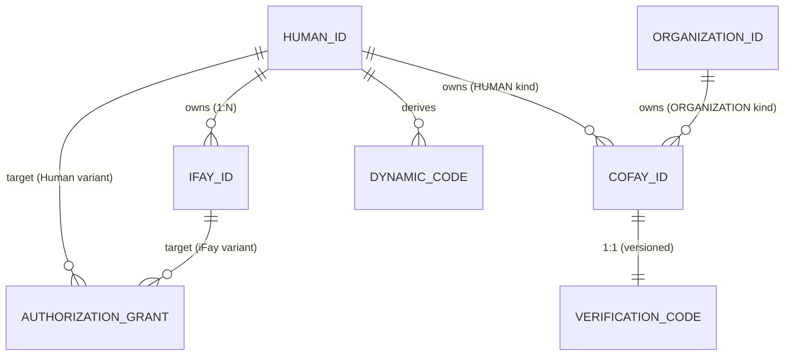

# 第 3 章 實體與關係

本章描述 FayID 體系中四類核心實體的語義、歸屬規則與相互關係。

---

## 四類核心實體

### Human ID — 自然人根身份

Human ID 是自然人在 FayID 體系中的**唯一根身份**。它具有以下特徵：

- 由金鑰對派生，對應一份助記詞（Mnemonic）
- 全域唯一，且同一份 Mnemonic 可確定性地派生出相同的 Human ID
- 是所有其他實體的「歸屬錨點」——iFay ID 繫結到它，coFay ID 可歸屬於它
- 在公開通訊中**不得以明文出現**（隱私硬約束）

> Human ID 是「根」，其他一切身份都從它生長出來。

### iFay ID — 數位人格

iFay ID 識別一個 iFay 數位人格。核心規則：

- 每個 iFay ID **必須**繫結到唯一的 Human ID（多對一）
- 同一個 Human ID 可繫結**多個** iFay ID（一人多人格）
- 同一個 iFay ID **不可**繫結到多個 Human ID（繫結不可重疊）
- 支援撤銷（不可逆）

### coFay ID — 公共角色

coFay ID 識別一個面向大眾的共享角色。核心規則：

- 每個 coFay ID 在任意時刻有且僅有**一個歸屬主體**
- 歸屬主體可以是 Human ID 或 Organization ID（二選一）
- 同一個 Human ID 或 Organization ID 可歸屬**多個** coFay ID
- 建立時同步簽發一個 Verification Code（驗證碼）
- 支援撤銷（不可逆）

### Organization ID — 組織識別

Organization ID 識別一個組織實體。核心規則：

- 以**明文字串**形式公開使用
- **不派生** Dynamic Code（無需隱私保護）
- 可同時歸屬多個 coFay ID
- Resolver 可直接根據 Organization ID 字串返回對應組織實體，無需附加憑證

---

## 歸屬與繫結關係

### 關係總覽

| 關係 | 基數 | 說明 |
| --- | --- | --- |
| Human ID → iFay ID | 一對多 | 一人可有多個數位人格 |
| iFay ID → Human ID | 多對一 | 每個人格只屬於一個人 |
| Human ID → coFay ID | 一對多 | 一人可歸屬多個公共角色 |
| Organization ID → coFay ID | 一對多 | 一個組織可歸屬多個公共角色 |
| coFay ID → 歸屬主體 | 一對一 | 每個角色在任意時刻只有一個歸屬主體 |
| Human ID → Dynamic Code | 一對多 | 每次請求生成新的動態碼 |
| coFay ID → Verification Code | 一對一（版本化） | 每次輪換產生新版本，舊版本立即失效 |

### 實體關係圖

---

## 關鍵不變量

以下不變量在系統的任意合法狀態下都必須成立：

1. **iFay ID 繫結唯一性**：任意 iFay ID 在任意時刻恰好繫結到一個 Human ID，且該繫結在 iFay ID 的整個生命週期內不可變更。

2. **coFay ID 歸屬唯一性**：任意 coFay ID 在任意時刻恰好有一個歸屬主體（Human ID 或 Organization ID），且歸屬類型（OwnerKind）與歸屬引用（ownerRef）保持一致。

3. **識別全域唯一**：Human ID、iFay ID、coFay ID、Organization ID 在各自的命名空間內全域唯一；跨類型透過類型前綴天然不衝突。

4. **撤銷單調性**：一旦 iFay ID 或 coFay ID 被標記為已撤銷，該狀態不可逆轉。

> 這些不變量對應 design 文件中的 Property P1（識別建立唯一性 + 歸屬一致性）與 Property P8（撤銷單調性）。

---

## 歸屬查詢

Resolver 提供以下歸屬查詢能力：

- 給定 iFay ID → 返回其唯一所屬的 Human ID（以 opaqueRef 形式，不暴露 Human ID 明文）
- 給定 coFay ID → 返回其歸屬主體的類型（Human / Organization）與識別
- 給定 Human ID + 所有權證明 → 返回該 Human ID 名下的 iFay ID 清單

> 注意：查詢 Human ID 名下的 iFay ID 清單**必須**透過所有權證明，未通過時 Resolver 拒絕返回。這是隱私保護的一部分。
