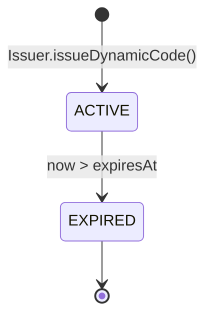
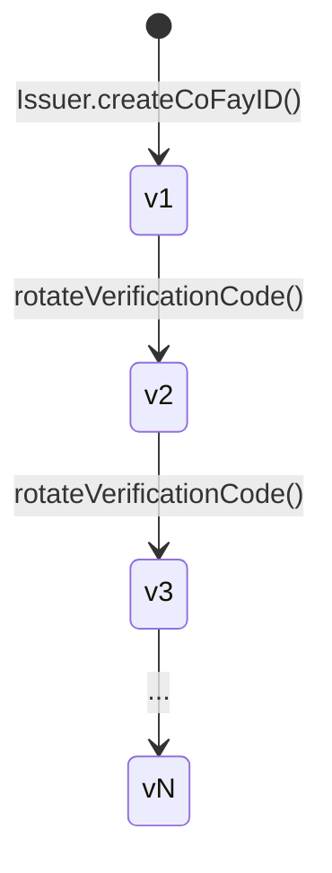
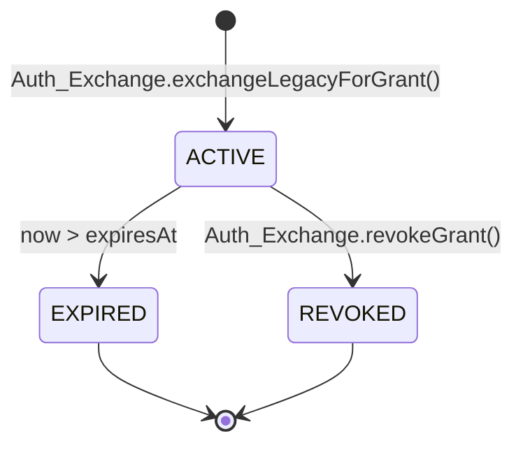
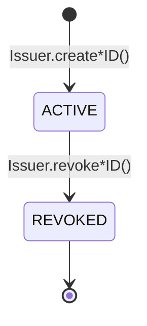

# 第 4 章 憑證與生命週期

本章描述 FayID 體系中四類憑證的產生方式、有效期規則、輪換機制與撤銷語義。

---

## 憑證概覽

FayID 體系中存在四類憑證，各自服務於不同目的：

| 憑證 | 用途 | 生命週期特徵 |
| --- | --- | --- |
| **Mnemonic** | Human ID 私鑰的人類可讀備份 | 一次性返回，永不持久化 |
| **Dynamic Code** | 代替 Human ID 明文對外出示 | 有時效，過期後輪換 |
| **Verification Code** | 校驗 coFay ID 持有者真實性 | 可被歸屬主體主動輪換 |
| **Authorization Grant** | FayID 兌換傳統鑑權後獲得的存取憑據 | 有時效，可被主動撤銷 |

---

## Mnemonic（助記詞）

### 產生

- 當自然人建立 Human ID 時，Issuer 同時生成一份 Mnemonic
- Mnemonic 僅在生成時刻返回給該自然人**一次**
- Issuer **不在任何持久化儲存中保留** Mnemonic 明文

### 確定性派生

- 同一份 Mnemonic 重新輸入時，系統必須派生出與原 Human ID 完全一致的 Human ID
- 這是 Human ID 復原的唯一途徑

### 安全約束

- Mnemonic 不得出現在任何日誌、稽核輸出或出站載荷中
- 派生 Dynamic Code 時**不要求**持有者出示 Mnemonic 明文

> Mnemonic 是 FayID 體系中安全等級最高的祕密材料。一旦遺失，Human ID 將無法復原。

---

## Dynamic Code（動態碼）

### 產生

- Human ID 持有者請求時，Issuer 基於該 Human ID 派生一個明文 Dynamic Code
- 每個 Dynamic Code 附帶一個明確的有效期截止時間（expiresAt）
- 派生過程不要求 Mnemonic 明文，僅需所有權證明

### 有效期與解析

- 在有效期內，Resolver 可將 Dynamic Code 解析回唯一對應的 Human ID
- 超過有效期後，Resolver 拒絕解析並返回 `DYNAMIC_CODE_EXPIRED`

### 輪換

- 每次生成的 Dynamic Code 與上一次**不相同**（不可碰撞）
- 不同次生成的 Dynamic Code 之間**不可關聯**——外部觀察者無法判斷兩個 Dynamic Code 是否出自同一 Human ID

### 安全性質

- 不可從 Dynamic Code 字面量反推 Human ID 的私鑰或 Mnemonic
- Dynamic Code 可在日誌中記錄（與 Human ID 明文不同）

### 狀態圖

> Dynamic Code 只有兩個狀態：有效（ACTIVE）與過期（EXPIRED）。不存在反向遷移。

---

## Verification Code（驗證碼）

### 產生

- 當 coFay ID 建立成功時，Issuer 同時簽發一個與該 coFay ID 一一對應的 Verification Code

### 校驗

- 驗證方輸入 (coFay ID, Verification Code) 對，Resolver 返回校驗通過或失敗
- 連續多次校驗失敗時，Resolver 限制該 coFay ID 的校驗請求頻率（`VERIFICATION_RATE_LIMITED`）

### 輪換

- coFay ID 的歸屬主體可請求輪換 Verification Code
- 輪換後，舊的 Verification Code **立即失效**
- 版本號單調遞增，Resolver 僅接受最新版本

### 版本演化

> 輪換是瞬時操作：新版本生效的同時，舊版本立即被 Resolver 拒絕。

---

## Authorization Grant（授權憑據）

### 產生

- 使用者向 Auth Exchange 提交傳統鑑權憑據 + 目標 FayID（iFay ID 或 Human ID）
- 傳統憑據校驗通過後，Auth Exchange 向目標 FayID 頒發一個 Authorization Grant
- Grant 攜帶明確的過期時間（expiresAt）

### 有效期

- 在有效期內，出示 Grant 等效於原始傳統鑑權憑據
- 超過過期時間後，Auth Exchange 拒絕該 Grant（`GRANT_EXPIRED`）

### 撤銷

- Grant 持有者可主動撤銷
- 撤銷後，Auth Exchange 在後續校驗中立即拒絕（`GRANT_REVOKED`）
- 撤銷是終態，不可復原

### 與已撤銷 ID 的互動

- 若目標 FayID（iFay ID 或 coFay ID）已被撤銷，Auth Exchange 拒絕為其頒發新 Grant（`IDENTITY_REVOKED`）

### 狀態圖

> EXPIRED 與 REVOKED 都是終態。一旦進入終態，Grant 永遠不會再變為 ACTIVE。

---

## Identity 生命週期（iFay ID / coFay ID）

iFay ID 與 coFay ID 共享相同的生命週期模型：

關鍵規則：

- **撤銷不可逆**：一旦標記為 REVOKED，不支援「取消撤銷」
- **撤銷後果**：Resolver 在解析時附帶返回撤銷標誌；Auth Exchange 拒絕為已撤銷 ID 頒發新 Grant
- **Human ID 不撤銷**：當前協定層 Human ID 不進入 REVOKED 狀態（Mnemonic 洩漏後的補救路徑為 Open Question）

> 撤銷是一個單調操作。任何「復原」都必須透過新簽發實體完成，而不是逆轉舊實體的狀態。
