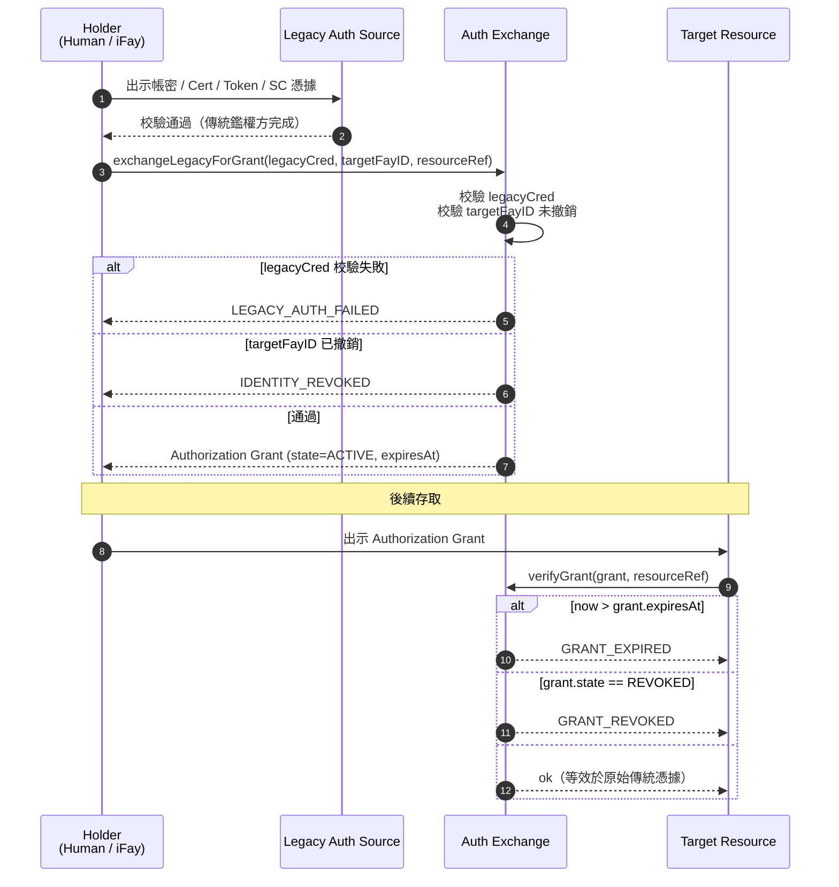
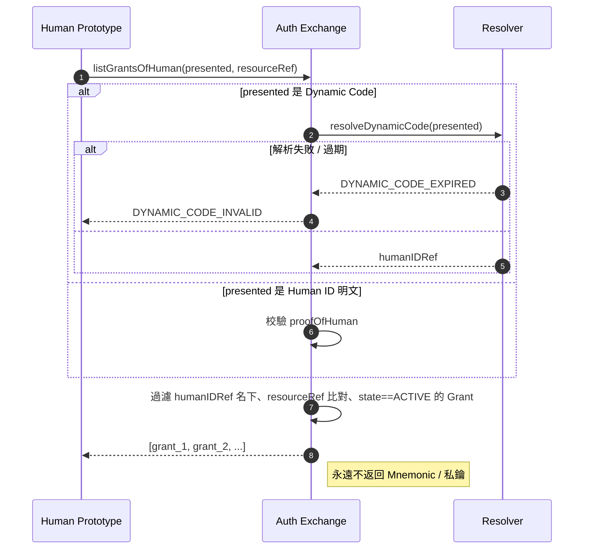
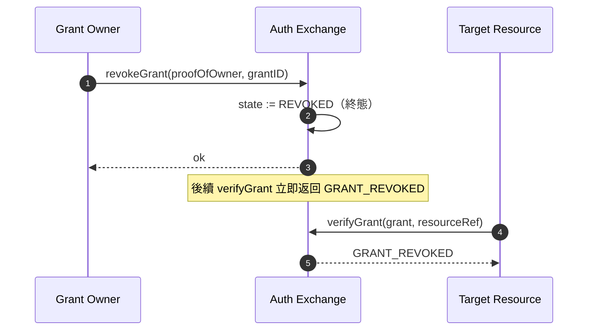

# 第 5 章 鑑權兌換

本章描述 FayID 如何與傳統鑑權方式互通：把帳密、Certificate、Authorization、Access Token、Smart Contract 等傳統憑據兌換為 Authorization Grant，從而讓使用者只需出示 FayID（或其動態碼）即可存取多種受保護資源。

---

## 設計動機

傳統網際網路中，一個人往往需要為不同系統維護大量獨立的鑑權票據。FayID 提供了一個**統一的兌換層**：使用者向 Auth Exchange 提交一次傳統鑑權憑據，即可獲得一份繫結到 FayID 的 Authorization Grant；此後存取目標資源時，只需出示 Grant 即可，不再需要每次重新走傳統鑑權。

> 一句話：FayID 是「票據聚合器」——一個 Human ID 名下可同時持有來自不同系統的多份有效 Grant。

---

## 五類傳統鑑權來源

Auth Exchange 支援以下五類傳統鑑權憑據：

| 來源類型 | 說明 |
| --- | --- |
| **PASSWORD** | 帳號 / 密碼 |
| **CERTIFICATE** | 數位憑證（如 X.509） |
| **AUTHORIZATION** | OAuth 等授權權杖 |
| **ACCESS_TOKEN** | API Access Token |
| **SMART_CONTRACT** | 智慧合約憑據 |

每份 Authorization Grant 在中繼資料中記錄其 `legacySourceKind`，標明該 Grant 是從哪類來源兌換而來。

---

## 兌換流程

### 基本流程



### 關鍵規則

- **目標 FayID 可以是 iFay ID 或 Human ID**：協定層允許兩種 target，使數位人格與自然人都能持票
- **Grant 必須攜帶過期時間**：`expiresAt` 是顯式欄位，不允許永不過期
- **撤銷支援**：Grant 可被持有者主動撤銷，撤銷後立即失效
- **等效性**：在有效期內，出示 Grant 等效於出示原始傳統鑑權憑據

---

## Human ID 單點持票

### 設計目的

讓自然人使用者只需記憶 Human ID（或其動態碼）即可換出名下所有 Grant，不再為每個系統單獨管理票據。

### 流程圖



### 關鍵規則

- **支援 Dynamic Code 出示**：使用者可用動態碼代替 Human ID 明文，避免暴露根身份
- **Dynamic Code 失敗處理**：動態碼解析失敗或過期時，返回 `DYNAMIC_CODE_INVALID`
- **永不返回敏感材料**：Auth Exchange 不向呼叫方返回任何 Human ID 的 Mnemonic 或私鑰
- **結果是過濾集**：返回該 Human ID 名下、比對 resourceRef、狀態為 ACTIVE 的 Grant 清單

---

## 撤銷協定

### 流程圖



### 關鍵規則

- **撤銷是終態**：一旦進入 REVOKED 狀態，不可復原
- **立即生效**：撤銷後，所有後續 `verifyGrant` 呼叫都立即返回 `GRANT_REVOKED`
- **需要所有權證明**：撤銷請求必須攜帶 proofOfOwner

---

## resourceRef 命名空間

每份 Authorization Grant 透過 `resourceRef` 欄位識別它保護的目標資源。

### 建議格式

```
resourceRef := "<scheme>://<authority>/<path>"
scheme      := "http" | "https" | "smartcontract" | "rpc" | "fayid" | <impl-defined>
```

### 約束

- `resourceRef` 是可比較的不透明字串
- 具體語法由實作決定，但 **不得包含** Human ID 明文
- 跨實作互通操作時，建議遵循 URI 標準

---

## 與撤銷 ID 的互動

| 場景 | Auth Exchange 行為 |
| --- | --- |
| 目標 FayID（iFay ID / coFay ID）已撤銷 | 拒絕頒發新 Grant，返回 `IDENTITY_REVOKED` |
| Grant 已撤銷 | 後續校驗返回 `GRANT_REVOKED` |
| Grant 已過期 | 後續校驗返回 `GRANT_EXPIRED` |
| 傳統鑑權憑據校驗失敗 | 拒絕頒發，返回 `LEGACY_AUTH_FAILED` |

> 詳細的錯誤碼語義見 design.md 的「Error Handling」章節。
